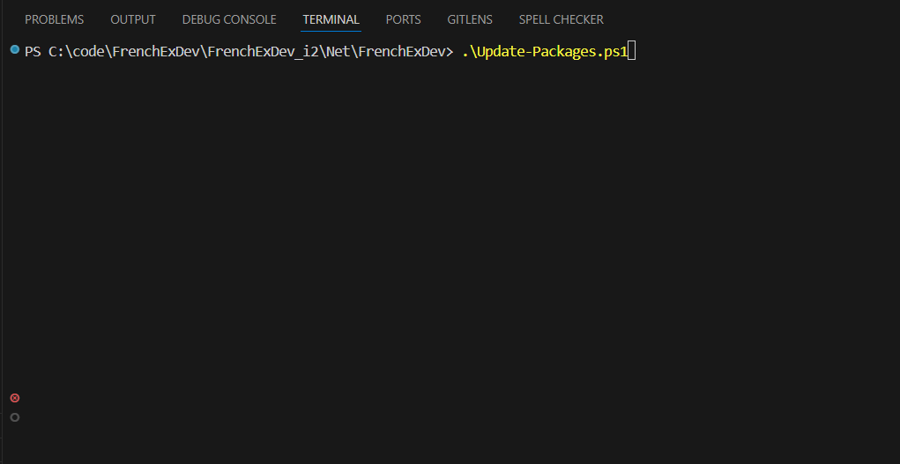

# Update-Packages.ps1

Interactive NuGet package updater for Central Package Management (`Directory.Packages.props`).

Checks all packages against the NuGet API in parallel, displays a live-updating table with animated spinners, then lets you pick which updates to apply.



## Usage

```powershell
# Interactive check -- prompts to select updates
.\Update-Packages.ps1

# Apply all available updates without prompting
.\Update-Packages.ps1 -Apply

# Include pre-release versions
.\Update-Packages.ps1 -IncludePrerelease

# Increase parallelism (default 4)
.\Update-Packages.ps1 -ParallelMax 8

# Combine flags
.\Update-Packages.ps1 -Apply -IncludePrerelease -ParallelMax 12
```

## Parameters

| Parameter | Type | Default | Description |
|-----------|------|---------|-------------|
| `-Apply` | switch | off | Apply all available updates without prompting for selection |
| `-IncludePrerelease` | switch | off | Include pre-release versions (e.g. `1.0.0-preview.1`) in the update check |
| `-ParallelMax` | int | `4` | Maximum number of concurrent NuGet API requests |

## How it works

### 1. Load packages

Reads `Directory.Packages.props` (located alongside the script) and extracts all `<PackageVersion Include="..." Version="..." />` entries.

### 2. Check versions (parallel)

Queries the [NuGet flat container API](https://api.nuget.org/v3-flatcontainer/) for each package using a `RunspacePool` capped at `-ParallelMax` concurrent requests.

Each request retries up to 5 times with exponential backoff (500ms, 1s, 1.5s, 2s) before marking a package as failed.

### 3. Live table display

A table is rendered with all packages upfront, then updated in-place as results arrive:

```
     Version         Status                  Package
  ─  ──────────────  ──────────────────────  ──────────────────────
  ⠹  4.3.1                                   Microsoft.CodeAnalysis.CSharp    (checking...)
     8.0.0           ✓                        coverlet.collector               (up to date)
     2.9.3           ↑ 2.10.0                 xunit                            (update available)
  ✗  1.0.0           fetch error              SomePackage                      (all retries failed)
```

| Symbol | Color | Meaning |
|--------|-------|---------|
| `⠋⠙⠹⠸⠼⠴⠦⠧⠇⠏` | yellow | Braille spinner -- request in flight |
| `✓` | green | Package is up to date |
| `↑ x.y.z` | yellow | Newer version available (shown alongside) |
| `✗` | red | All 5 fetch attempts failed |

### 4. Select updates (interactive mode)

When run without `-Apply`, a numbered list of available updates is shown:

```
Available updates:

  [ 1]  xunit                          2.9.3        -> 2.10.0
  [ 2]  Microsoft.CodeAnalysis.CSharp  4.3.1        -> 5.0.0

  Enter package numbers (e.g.  1,3), 'all', or 'none' (default: all)
  Selection:
```

- Type numbers separated by commas (e.g. `1,3`) to apply specific updates
- Type `all` or press Enter to apply everything
- Type `none` to exit without changes

### 5. Apply updates

Selected updates are applied via regex replacement directly in `Directory.Packages.props`, preserving the file's existing formatting and encoding (UTF-8 without BOM).

## Pre-release handling

- If a package's current version is already a pre-release (contains `-`), the script automatically considers pre-release candidates for that package regardless of the `-IncludePrerelease` flag
- Otherwise, pre-release versions are only shown when `-IncludePrerelease` is explicitly set

## Version comparison

The built-in `Compare-SemVer` function supports up to 4-segment versions (`major.minor.patch.revision`) with optional pre-release suffixes. Pre-release ordering follows SemVer rules: a version without a pre-release tag is considered newer than the same version with one (`1.0.0` > `1.0.0-preview`).

## Requirements

- PowerShell 5.1+ (Windows PowerShell) or PowerShell 7+
- Network access to `api.nuget.org`
- A `Directory.Packages.props` file in the same directory as the script
