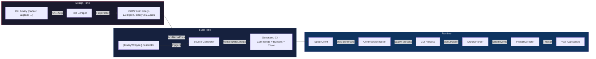
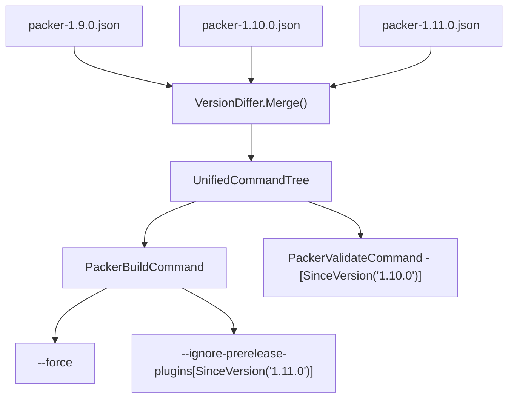

# FrenchExDev.Net.BinaryWrapper

**Type-safe .NET wrappers for CLI binaries, generated from help text.**

BinaryWrapper turns any command-line tool into a fully typed C# API. Point it at a binary, scrape its `--help` output into JSON, and a Roslyn source generator produces command classes, fluent builders, and a typed client — complete with multi-version support, runtime version guards, and structured output parsing.

---

## Reusable collection images

[Upgrade guide and complete client inventory](doc/UPGRADE-IMAGE-PIPELINES.md):
all nine CLI clients select complete `DesignImagePlan` recipes through
`IDesignImagePlanResolver`, prepare their shared dependencies, and build version
images with `UseVersionImage`. Git selects Rust dependencies from 2.55; Podman
selects its release archive at 4.4. Other clients use a single recipe. The legacy
`ImagePlan` runner property remains compatible.

## Why?

Calling CLI tools from .NET usually means building argument strings by hand, hoping you spelled the flags right, and parsing raw stdout. BinaryWrapper eliminates all of that:

- **Compile-time safety** — every command, flag, and argument is a typed property
- **IntelliSense everywhere** — discover commands and options through your IDE
- **Multi-version awareness** — options annotated with `[SinceVersion]` / `[UntilVersion]`, enforced at runtime
- **Structured output** — plug in parsers and collectors to get typed events and results instead of raw text
- **Zero runtime reflection** — everything is source-generated

## How It Works



## Packages

| Package | Target | Purpose |
|---------|--------|---------|
| `FrenchExDev.Net.BinaryWrapper` | net10.0 | Core runtime: process execution, version resolution, output parsing |
| `FrenchExDev.Net.BinaryWrapper.Attributes` | netstandard2.0 / net10.0 | `[BinaryWrapper]` attribute for descriptor classes |
| `FrenchExDev.Net.BinaryWrapper.SourceGenerator` | netstandard2.0 | Incremental Roslyn generator (Roslyn 4.3.1) |
| `FrenchExDev.Net.BinaryWrapper.Design` | net10.0 | CLI tool (`binary-wrapper`) for scraping and managing command trees |
| `FrenchExDev.Net.BinaryWrapper.Testing` | net10.0 | Fakes, CsCheck generators, and test helpers |

## Quick Start

To scaffold a complete consumer solution (runtime, Design, tests and instructions),
run this from `Net/FrenchExDev` in PowerShell 7:

```powershell
./BinaryWrapper/scripts/New-BinaryWrapperSolution.ps1 MyTool -CommandName my-tool
```

The script creates `MyTool/` beside BinaryWrapper and refuses to overwrite an
existing directory. See [scaffolding options and examples](doc/SCRIPTS.md#new-binarywrappersolutionps1).

### 1. Scrape the binary's help text

Use `ScrapePipeline` to recursively scrape help output into a JSON command tree:

```csharp
var tree = await new ScrapePipeline()
    .Binary("packer")
    .HelpFlag("-h")
    .UseParser<PackerHelpParser>()
    .OutputTo("scrape/packer-1.11.2.json")
    .ExecuteAsync(ct);
```

Or use `MultiVersionScraper` for batch scraping across many versions at once.

### 2. Create a descriptor class

```csharp
using FrenchExDev.Net.BinaryWrapper.Attributes;

namespace MyProject;

[BinaryWrapper("packer", FlagPrefix = "-", FlagValueSeparator = "=", UseBoolEqualsFormat = true)]
public partial class PackerDescriptor;
```

### 3. Reference the JSON files in your project

```xml
<Project Sdk="Microsoft.NET.Sdk">
  <PropertyGroup>
    <EmitCompilerGeneratedFiles>true</EmitCompilerGeneratedFiles>
    <CompilerGeneratedFilesOutputPath>$(BaseIntermediateOutputPath)/Generated</CompilerGeneratedFilesOutputPath>
  </PropertyGroup>

  <ItemGroup>
    <ProjectReference Include="...BinaryWrapper.csproj" />
    <ProjectReference Include="...BinaryWrapper.Attributes.csproj" />
    <ProjectReference Include="...BinaryWrapper.SourceGenerator.csproj"
                      OutputItemType="Analyzer" ReferenceOutputAssembly="false" />
  </ItemGroup>

  <ItemGroup>
    <AdditionalFiles Include="scrape\packer-*.json" />
  </ItemGroup>
</Project>
```

### 4. Use the generated API

```csharp
var binding = new BinaryBinding(
    new BinaryIdentifier("packer"),
    executablePath: "/usr/bin/packer");

var client = Packer.Create(binding);

// Build a command with full IntelliSense
var buildCmd = client.Build(b => b
    .WithForce(true)
    .WithParallelBuilds(4)
    .WithVar(["region=us-east-1", "instance_type=t2.micro"])
    .WithTemplate("template.pkr.hcl"));

// Execute it
var executor = new CommandExecutor(new SystemProcessRunner());
var output = await executor.ExecuteAsync(binding, buildCmd, ct);
```

## Multi-Version Support

When multiple JSON files are provided (e.g., `packer-1.9.0.json`, `packer-1.11.2.json`), the source generator automatically:

1. **Merges** command trees across all versions via `VersionDiffer`
2. **Annotates** each command and option with `sinceVersion` / `untilVersion`
3. **Generates** `VersionGuard` checks that throw at runtime when the detected binary version is out of range



## Output Parsing

Transform raw process output into typed domain events:

```csharp
// Stream parsed events in real-time
await foreach (var evt in executor.StreamAsync(binding, cmd, myParser, ct))
{
    switch (evt)
    {
        case BuildStarted s: Console.WriteLine($"Building {s.Name}...");
        case BuildCompleted c: Console.WriteLine($"Done: {c.ArtifactPath}");
    }
}

// Or collect into a final result
var result = await executor.ExecuteAsync(binding, cmd, myParser, myCollector, ct);
```

Implement `IOutputParser<TEvent>` and `IResultCollector<TEvent, TResult>` for your binary's output format.

## Project Structure

```
BinaryWrapper/
├── src/
│   ├── FrenchExDev.Net.BinaryWrapper/                 Core runtime library
│   ├── FrenchExDev.Net.BinaryWrapper.Attributes/      [BinaryWrapper] attribute
│   ├── FrenchExDev.Net.BinaryWrapper.SourceGenerator/  Roslyn incremental generator
│   ├── FrenchExDev.Net.BinaryWrapper.Design/           CLI scraping tool
│   └── FrenchExDev.Net.BinaryWrapper.Testing/          Test helpers & fakes
├── test/
│   ├── FrenchExDev.Net.BinaryWrapper.Tests/            Core tests (84+)
│   ├── FrenchExDev.Net.BinaryWrapper.SourceGenerator.Tests/  Generator tests (146+)
│   └── FrenchExDev.Net.BinaryWrapper.Design.Tests/     Design tests (40+)
└── doc/
    ├── ARCHITECTURE.md                                 Architecture deep-dive
    └── HOW-TO.md                                       Step-by-step guide
```

## Documentation

| Document | Description |
|----------|-------------|
| [Architecture](doc/ARCHITECTURE.md) | System design, component interactions, data flow, and mermaid diagrams |
| [How-To Guide](doc/HOW-TO.md) | End-to-end walkthrough with Vagrant as a real-world example |

## Key Concepts

| Concept | Description |
|---------|-------------|
| **Descriptor** | A partial class with `[BinaryWrapper("name")]` that triggers code generation |
| **Command Tree** | JSON representation of a binary's command hierarchy (commands, options, arguments) |
| **Command Class** | Generated sealed `ICliCommand` with typed properties and `ToArguments()` serialization |
| **Builder** | Generated `AbstractBuilder<TCommand>` with fluent `With*()` methods and validation |
| **Client** | Generated entry point with nested command groups mirroring the CLI hierarchy |
| **BinaryBinding** | Maps a binary identifier to its executable path, detected version, and overrides |
| **VersionGuard** | Runtime enforcement of version constraints on commands and options |
| **ScrapePipeline** | Fluent API for orchestrating help text scraping (local, container, or custom) |
| **MultiVersionScraper** | Parallel orchestrator that scrapes many versions using `Channel<T>` workers |

## Real-World Usage

See the [Vagrant wrapper](../Vagrant/) for a complete production example:

- Custom `VagrantHelpParser` for Vagrant's unique help format (`Common commands:` / `Available subcommands:`)
- Multi-version scraping via Docker/Podman containers with persistent images
- Typed events (`VagrantMachineOutput`, `VagrantActionCompleted`, `VagrantMachineReadableEvent`)
- Result collectors (`VagrantUpCollector` → `VagrantUpResult`)
- Edge-case handling for version-specific bugs (Vagrant 2.4.4-2.4.5 `server_mode?` crash)

## License

Proprietary. All rights reserved.
