# BinaryWrapper Architecture

BinaryWrapper is a framework for generating type-safe .NET wrappers around CLI binaries. It operates in three phases:

1. **Design time** — scrape `--help` output from multiple binary versions inside containers, producing per-version JSON command trees
2. **Build time** — a Roslyn source generator reads those JSON files and emits versioned C# commands, builders, and a typed client
3. **Runtime** — an event-driven execution pipeline streams process output through `IOutputParser<TEvent>` → `IResultCollector<TEvent, TResult>`, enabling streaming (`await foreach`), collected, or raw consumption of any CLI command

---

## System Overview

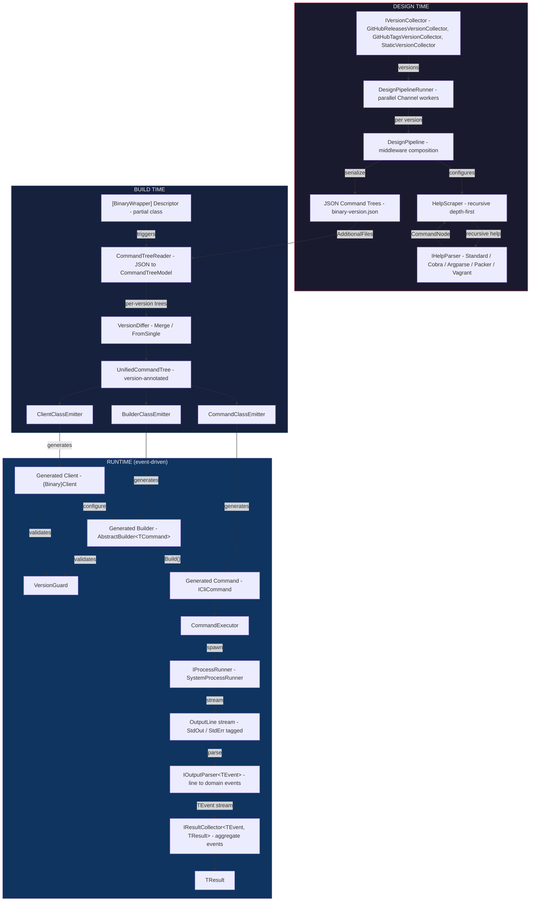

---

## Package Architecture

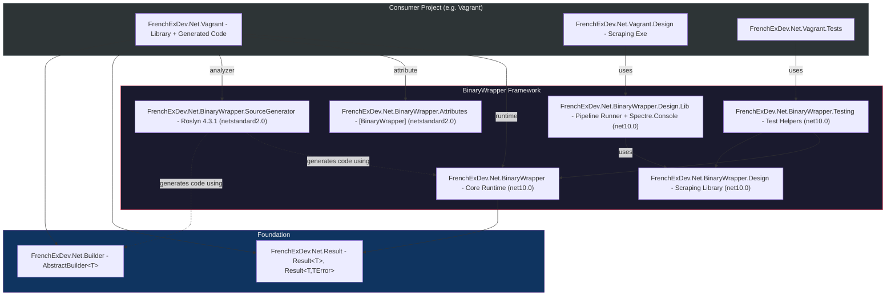

---

## Core Runtime (`FrenchExDev.Net.BinaryWrapper`)

The runtime is built around an **event-driven streaming architecture**. Process output is not buffered — it flows as a stream of `OutputLine` events through an `IOutputParser<TEvent>` that transforms raw lines into domain-specific typed events, which are then aggregated by an `IResultCollector<TEvent, TResult>` into a final result.

Three consumption modes share the same command building and resolution pipeline:

| Mode | API | Use case |
|------|-----|----------|
| **Streaming** | `await foreach (var evt in execution)` | React to events as they arrive (progress bars, live logs) |
| **Collected** | `execution.ExecuteAsync(collector)` | Aggregate events into a typed result |
| **Raw** | `executor.ExecuteAsync(binaryId, command)` | Just get `ProcessOutput` (exitCode + stdout + stderr) |

### Event-Driven Execution Pipeline

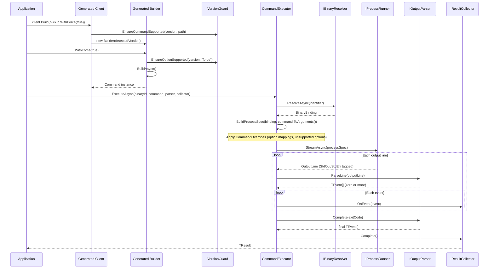

### Consumption Examples

**Streaming — react to each event as it arrives:**

```csharp
var execution = new CommandExecution<BuildEvent>(executor, binaryId, command, parser);
await foreach (var evt in execution)
{
    switch (evt)
    {
        case BuildProgress p: progressBar.Update(p.Percent); break;
        case BuildWarning w: logger.Warn(w.Message); break;
    }
}
```

**Collected — aggregate into a typed result:**

```csharp
var result = await execution.ExecuteAsync(new BuildResultCollector());
// result is Result<BuildReport, CommandError>
```

**Raw — just run and get output:**

```csharp
var result = await executor.ExecuteAsync(binaryId, command);
// result is Result<ProcessOutput, CommandError>
```

### Core Types

```mermaid
classDiagram
    class ICliCommand {
        <<interface>>
        +CommandPath IReadOnlyList~string~
        +ToArguments() IReadOnlyList~string~
    }

    class BinaryIdentifier {
        <<record>>
        +Name string
        +Version string?
        +Parse(string)$ BinaryIdentifier
    }

    class BinaryBinding {
        <<record>>
        +Identifier BinaryIdentifier
        +ExecutablePath string
        +DetectedVersion SemanticVersion?
        +EnvironmentVariables IReadOnlyDictionary~string,string~
        +Overrides IReadOnlyDictionary~string,CommandOverrides~
    }

    class CommandOverrides {
        <<record>>
        +OptionNameMappings IReadOnlyDictionary~string,string~
        +UnsupportedOptions IReadOnlySet~string~
    }

    class IBinaryResolver {
        <<interface>>
        +ResolveAsync(BinaryIdentifier) Result~BinaryBinding~
    }

    class DictionaryBinaryResolver {
        +DictionaryBinaryResolver(params IEnumerable~BinaryBinding~)
    }

    class SemanticVersion {
        <<record>>
        +Major int
        +Minor int
        +Patch int
        +PreRelease string?
        +BuildMetadata string?
        +Parse(string)$ SemanticVersion
        +TryParse(string)$ bool
        +CompareTo(SemanticVersion) int
    }

    class IVersionDetector {
        <<interface>>
        +DetectAsync(string) Result~SemanticVersion~
    }

    class VersionGuard {
        <<static>>
        +EnsureCommandSupported(version, path, since, until)$
        +EnsureOptionSupported(version, path, option, since, until)$
    }

    class CommandExecutor {
        +CommandExecutor(IBinaryResolver, IProcessRunner?)
        +ExecuteAsync(BinaryIdentifier, ICliCommand) Result~ProcessOutput~
        +StreamAsync(BinaryIdentifier, ICliCommand, IOutputParser) IAsyncEnumerable~TEvent~
        +ExecuteAsync(BinaryIdentifier, ICliCommand, IOutputParser, IResultCollector) Result~TResult~
    }

    class CommandExecution~TEvent~ {
        +GetAsyncEnumerator() IAsyncEnumerator~TEvent~
        +ExecuteAsync() Result~ProcessOutput~
        +ExecuteAsync(IResultCollector) Result~TResult~
    }

    class IProcessRunner {
        <<interface>>
        +StreamAsync(ProcessSpec) IAsyncEnumerable~OutputLine~
        +RunAsync(ProcessSpec) Task~ProcessOutput~
    }

    class IOutputParser~TEvent~ {
        <<interface>>
        +ParseLine(OutputLine) IEnumerable~TEvent~
        +Complete(int exitCode) IEnumerable~TEvent~
    }

    class IResultCollector~TEvent_TResult~ {
        <<interface>>
        +OnEvent(TEvent)
        +Complete() TResult
    }

    class OutputLine {
        <<record>>
        +Text string
        +Source OutputSource
    }

    class ProcessSpec {
        <<record>>
        +ExecutablePath string
        +Arguments IReadOnlyList~string~
        +WorkingDirectory string?
        +EnvironmentVariables IReadOnlyDictionary~string,string~
        +Timeout TimeSpan?
    }

    class ProcessOutput {
        <<record>>
        +ExitCode int
        +StandardOutput string
        +StandardError string
    }

    IBinaryResolver <|.. DictionaryBinaryResolver
    IBinaryResolver --> BinaryBinding
    BinaryBinding --> BinaryIdentifier
    BinaryBinding --> SemanticVersion
    BinaryBinding --> CommandOverrides
    CommandExecutor --> IBinaryResolver
    CommandExecutor --> IProcessRunner
    CommandExecutor --> ICliCommand
    CommandExecutor ..> CommandExecution~TEvent~
    IProcessRunner --> OutputLine
    IProcessRunner --> ProcessSpec
    CommandExecutor ..> IOutputParser~TEvent~
    CommandExecutor ..> IResultCollector~TEvent_TResult~
    IVersionDetector --> SemanticVersion
```

### Error Hierarchy

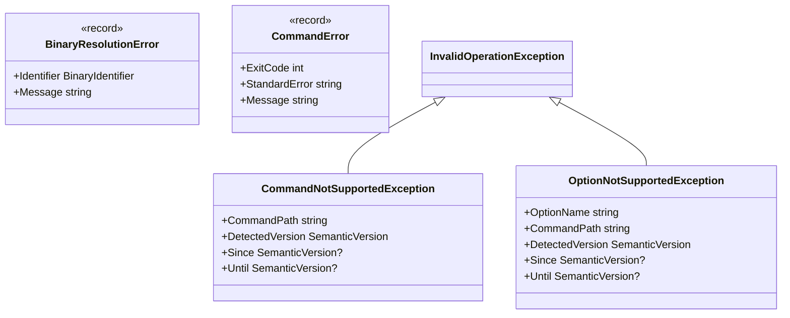

### Version Constraints

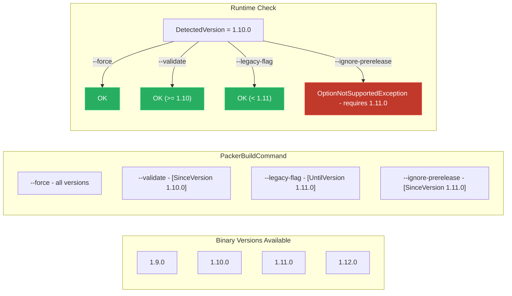

### How Version Guards Work — No Reflection

Version guards are enforced through **compile-time code generation**, not runtime reflection. The `[SinceVersion]` and `[UntilVersion]` attributes are emitted on generated members purely for documentation and IDE tooling — they are never read at runtime.

The source generator computes version ranges by diffing multiple JSON command trees via `VersionDiffer.Merge()`, then **hardcodes** the version constants directly into the generated method bodies:

**Generated client method (commands):**

```csharp
// In GlabClient.g.cs — source-generated
[global::FrenchExDev.Net.BinaryWrapper.SinceVersion("1.56.0")]  // decorative only
public CommandExecution<...> SecurefileList(Action<GlabSecurefileListCommandBuilder> configure)
{
    // Hardcoded check — no reflection, no attribute scanning
    global::FrenchExDev.Net.BinaryWrapper.VersionGuard.EnsureCommandSupported(
        _detectedVersion,
        "glab securefile list",
        new global::FrenchExDev.Net.BinaryWrapper.SemanticVersion(1, 56, 0),  // since
        null);                                                                 // until
    // ... build and return command
}
```

**Generated builder method (options):**

```csharp
// In GlabMrListCommandBuilder.g.cs — source-generated
[global::FrenchExDev.Net.BinaryWrapper.SinceVersion("1.62.0")]  // decorative only
public GlabMrListCommandBuilder WithDraft(bool value)
{
    // Hardcoded check — no reflection
    global::FrenchExDev.Net.BinaryWrapper.VersionGuard.EnsureOptionSupported(
        _detectedVersion,
        "glab mr list",
        "draft",
        new global::FrenchExDev.Net.BinaryWrapper.SemanticVersion(1, 62, 0),  // since
        null);                                                                 // until
    // ... set property
}
```

**Runtime guard implementation (simple comparison):**

```csharp
public static class VersionGuard
{
    public static void EnsureCommandSupported(
        SemanticVersion? detectedVersion, string commandPath,
        SemanticVersion? since, SemanticVersion? until)
    {
        if (detectedVersion is null) return;  // no version detected → permissive
        if (since is not null && detectedVersion < since)
            throw new CommandNotSupportedException(commandPath, detectedVersion, since, until);
        if (until is not null && detectedVersion >= until)
            throw new CommandNotSupportedException(commandPath, detectedVersion, since, until);
    }

    public static void EnsureOptionSupported(
        SemanticVersion? detectedVersion, string commandPath, string optionName,
        SemanticVersion? since, SemanticVersion? until)
    {
        if (detectedVersion is null) return;
        if (since is not null && detectedVersion < since)
            throw new OptionNotSupportedException(commandPath, optionName, detectedVersion, since, until);
        if (until is not null && detectedVersion >= until)
            throw new OptionNotSupportedException(commandPath, optionName, detectedVersion, since, until);
    }
}
```

**Key design decisions:**

| Aspect | Choice | Rationale |
|--------|--------|-----------|
| Enforcement | Hardcoded `VersionGuard` calls in generated code | Zero reflection overhead, fails at the exact call site |
| Version constants | `new SemanticVersion(major, minor, patch)` literals | No string parsing at runtime, no attribute scanning |
| `[SinceVersion]`/`[UntilVersion]` | Decorative attributes on generated members | IDE tooltips, documentation generators, static analysis |
| No detected version | Permissive (`return` early) | Allows usage without version detection; guards are opt-in via `BinaryBinding.DetectedVersion` |
| Granularity | Per-command and per-option | A command can exist in all versions while individual options come and go |

---

## Attributes (`FrenchExDev.Net.BinaryWrapper.Attributes`)

Tiny package (netstandard2.0 + net10.0) containing only the `[BinaryWrapper]` attribute:

```csharp
[BinaryWrapper("packer", FlagPrefix = "-", FlagValueSeparator = "=", UseBoolEqualsFormat = true)]
public partial class PackerDescriptor;
```

| Property | Default | Description |
|----------|---------|-------------|
| `BinaryName` | *(required)* | Binary name, used to match `{name}-*.json` AdditionalFiles |
| `FlagPrefix` | `"--"` | GNU-style: `"--"`, Go-style: `"-"` |
| `FlagValueSeparator` | `" "` | Space: `--flag value`, Equals: `--flag=value` |
| `UseBoolEqualsFormat` | `false` | `true` → `-force=true`/`-force=false`, `false` → `--force` (presence) |

---

## Source Generator (`FrenchExDev.Net.BinaryWrapper.SourceGenerator`)

Roslyn 4.3.1 incremental source generator. Triggered by `[BinaryWrapper]` on a partial class.

### Generation Pipeline

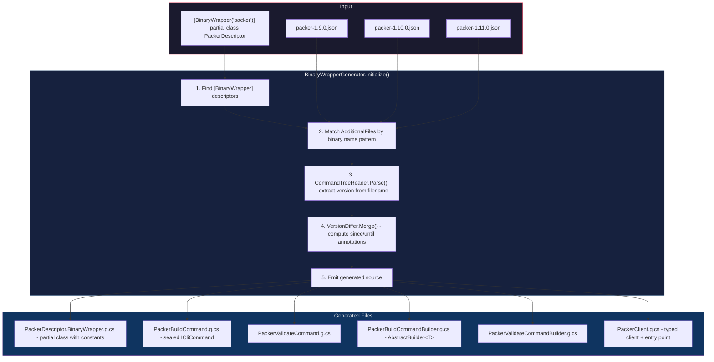

### Emitter Responsibilities

| Emitter | Output | Details |
|---------|--------|---------|
| `CommandClassEmitter` | `{Binary}{Cmd}Command.g.cs` | Sealed class implementing `ICliCommand`. Init-only properties for each option/argument. `ToArguments()` serializes using the configured flag prefix and separator. |
| `BuilderClassEmitter` | `{Binary}{Cmd}CommandBuilder.g.cs` | Extends `AbstractBuilder<T>`. Fluent `With{Option}()` methods with `VersionGuard` checks. Virtual `Validate{Option}()` for customization. Sealed `Instantiate` override. |
| `ClientClassEmitter` | `{Binary}Client.g.cs` | Static `{Binary}.Create(binding)` entry point. Nested groups for command hierarchy (e.g., `client.Container.Run(...)`). `PruneClashingLeaves` handles version-compatibility edge cases. |

### Key Source Generator Types

| Type | Purpose |
|------|---------|
| `CommandTreeReader` | Deserializes JSON, extracts version from `{binary}-{version}.json` filename |
| `NamingHelper` | kebab-case → PascalCase, CLR type mapping, `DeduplicateOptions` (same PascalCase name), `IsValidOptionNameChar` defense against malformed names |
| `VersionDiffer` | Produces `UnifiedCommandTree` with per-command and per-option version annotations (`SinceVersion`, `UntilVersion`) |

### Generated Code Shape

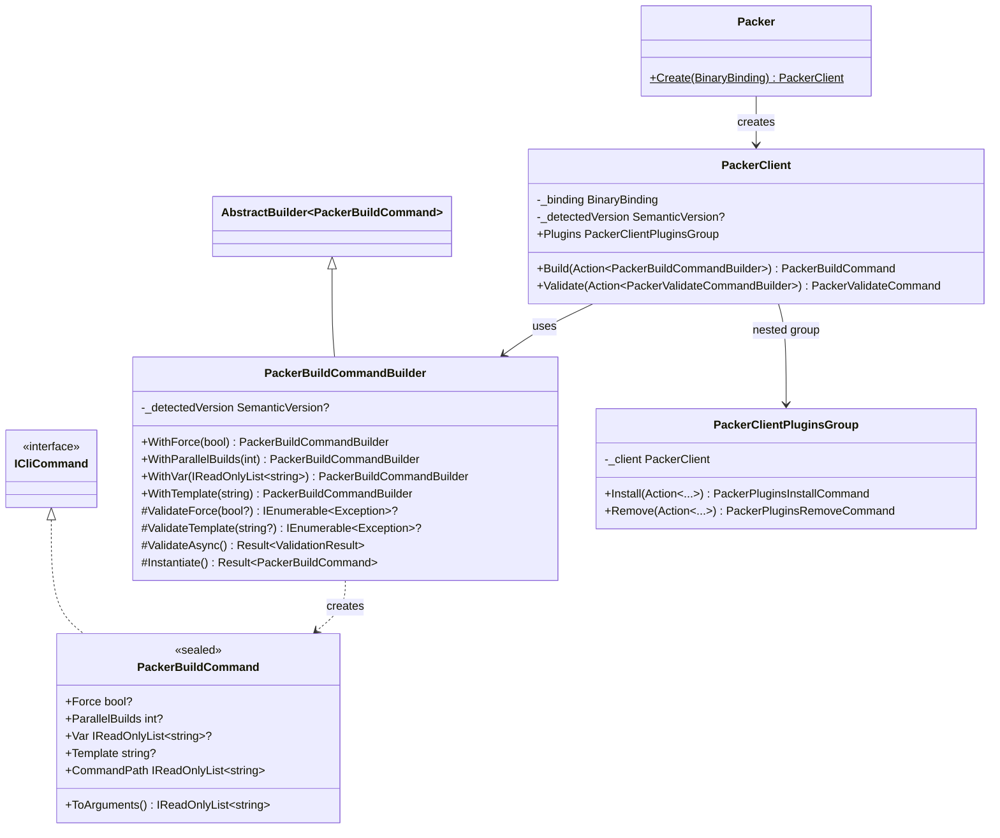

### Nested Command Groups

For CLI tools with sub-command hierarchies (e.g., `vagrant box add`, `podman container run`):

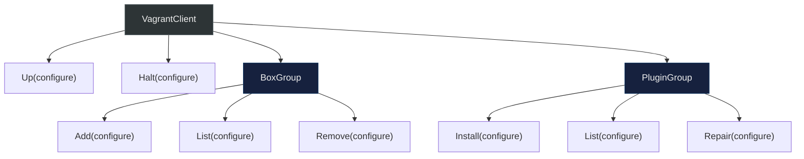

Each group is generated as a nested partial class:

```csharp
public partial class VagrantClient
{
    public VagrantClientBoxGroup Box => new(_client: this);

    public partial class VagrantClientBoxGroup
    {
        private readonly VagrantClient _client;

        public VagrantBoxAddCommand Add(Action<VagrantBoxAddCommandBuilder> configure) { ... }
        public VagrantBoxListCommand List(Action<VagrantBoxListCommandBuilder> configure) { ... }
    }
}
```

### Diagnostics

| Code | Severity | Description |
|------|----------|-------------|
| `BW001` | Warning | No JSON help files found matching binary name |
| `BW002` | Warning | JSON parse error in AdditionalFile |
| `BW004` | Error | Descriptor class is not partial |

---

## Design Library (`FrenchExDev.Net.BinaryWrapper.Design`)

Scraping library containing help parsers, version collectors, container runtime abstractions, and the data model.

### Data Model

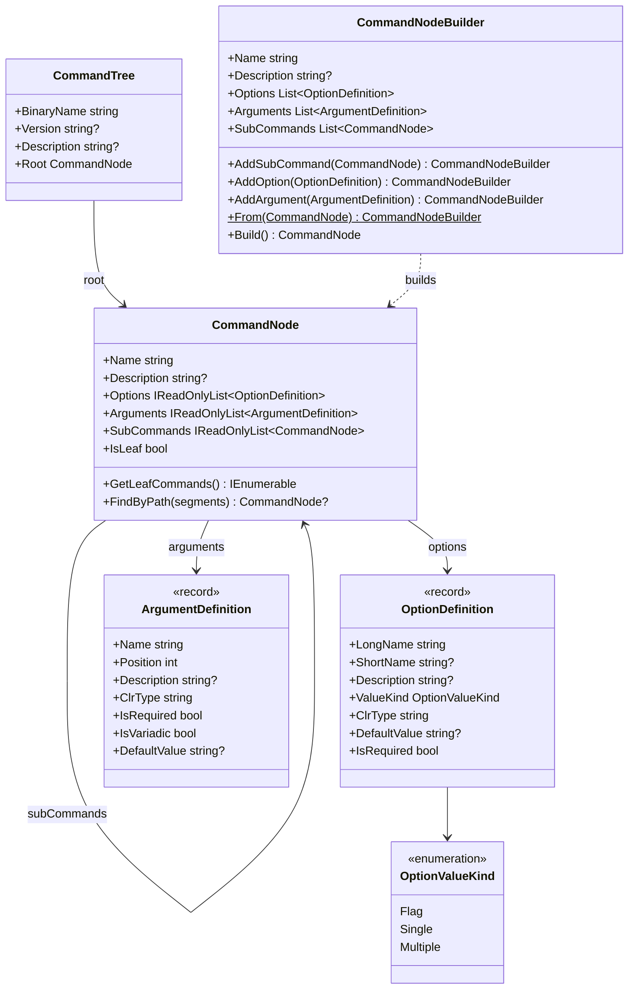

### Option Types and CLI Serialization

| `OptionValueKind` | C# Type | CLI Serialization (GNU `--`) | CLI Serialization (Go `-`) |
|----|----|----|----|
| `Flag` | `bool?` | `--verbose` (presence = true) | `-verbose=true` / `-verbose=false` |
| `Single` | `string?`, `int?`, etc. | `--output value` or `--output=value` | `-output=value` |
| `Multiple` | `IReadOnlyList<T>?` | `--var val1 --var val2` (repeated) | `-var=val1 -var=val2` |

### Help Parsers

| Parser | Style | Headers | Use Case |
|--------|-------|---------|----------|
| `StandardHelpParser` | GNU | `Commands:`, `Options:`, `Arguments:` | Generic CLIs (git) |
| `CobraHelpParser` | Go/cobra | `Available Commands:`, `Flags:` with type hints (`string`, `int`, `stringArray`, etc.) | Docker, Podman, DockerCompose |
| `ArgparseHelpParser` | Python argparse | `{cmd1,cmd2,...}` subcommand notation, `options:`/`optional arguments:` | PodmanCompose |
| `PackerHelpParser` | Go/HashiCorp | `Available commands:`, `Options:`, `Flags:` | Packer |
| `VagrantHelpParser` | Custom | `Common commands:`, `Available subcommands:` | Vagrant |

`HelpParsers.Create("standard" | "cobra" | "argparse" | "packer")` — factory for built-in parsers. `Register(name, factory)` for custom parsers.

Both `StandardHelpParser` and `CobraHelpParser` use `IsValidOptionNameChar(char)` (`a-zA-Z0-9-_[]`) to defend against malformed option names in help text.

### ScrapePipeline Fluent API

```csharp
new ScrapePipeline()
    .Binary("vagrant")                              // binary name
    .HelpFlag("-h")                                 // flag to trigger help (default: --help)
    .UseParser<VagrantHelpParser>()                  // or UseParser(instance) or UseParser("cobra")
    .MaxDepth(5)                                    // max recursion depth
    .ScrapeParallelism(8)                           // concurrent subcommand scraping
    .WithRunHelp(async helpArgs => { ... })          // how to execute help commands
    .DumpHelpTo("scrape/help/2.4.3")                // dump raw help text to disk
    .OnCommandScraped(() => progress.Increment())   // callback per command scraped
    .TransformRoot(root => { ... })                 // post-scrape root transform
    .TransformCommand("box.add", node => { ... })   // transform specific command
    .UseTransformer(new MyTransformer())            // custom ICommandTreeTransformer
    .OutputTo("scrape/vagrant-2.4.3.json");         // output path
```

### Version Collectors

| Collector | Source | Notes |
|-----------|--------|-------|
| `GitHubReleasesVersionCollector(owner, repo)` | GitHub Releases API | Skips pre-releases, paginated, strips `v` prefix |
| `GitHubTagsVersionCollector(owner, repo)` | GitHub Tags API | Excludes pre-release tags (contains `-`), paginated |
| `StaticVersionCollector(versions)` | Fixed list | For testing or known version sets |

`CompareVersionStrings(a, b)` — semantic version comparison utility on `GitHubReleasesVersionCollector`.

### Container Runtime

| Type | Runtime binary | Notes |
|------|---------------|-------|
| `IContainerRuntime` | — | Interface: `BuildAsync`, `RunAsync`, `RemoveImageAsync` |
| `ProcessRunnerContainerRuntime` | configurable | Base class, default `RunProcessAsync` via `System.Diagnostics.Process` |
| `PodmanContainerRuntime` | `podman` | Sealed, extends `ProcessRunnerContainerRuntime` |
| `DockerContainerRuntime` | `docker` | Sealed, extends `ProcessRunnerContainerRuntime` |

### JSON Schema

```json
{
  "binaryName": "vagrant",
  "version": "2.4.3",
  "description": "Vagrant manages development environments",
  "root": {
    "name": "vagrant",
    "description": "...",
    "options": [],
    "arguments": [],
    "subCommands": [
      {
        "name": "box",
        "description": "Manage boxes",
        "options": [],
        "arguments": [],
        "subCommands": [
          {
            "name": "add",
            "description": "Add a box",
            "options": [
              {
                "longName": "force",
                "shortName": "f",
                "description": "Overwrite existing box",
                "valueKind": "flag",
                "clrType": "bool",
                "defaultValue": null,
                "isRequired": false
              }
            ],
            "arguments": [
              {
                "name": "name",
                "position": 0,
                "description": "Name or URL of the box",
                "clrType": "string",
                "isRequired": true,
                "isVariadic": false,
                "defaultValue": null
              }
            ],
            "subCommands": []
          }
        ]
      }
    ]
  }
}
```

---

## Design.Lib Middleware Pipeline (`FrenchExDev.Net.BinaryWrapper.Design.Lib`)

Orchestration layer that composes scraping steps as middleware and runs them in parallel across versions. Consumers build a `DesignPipeline` and hand it to `DesignPipelineRunner`.

### Architecture

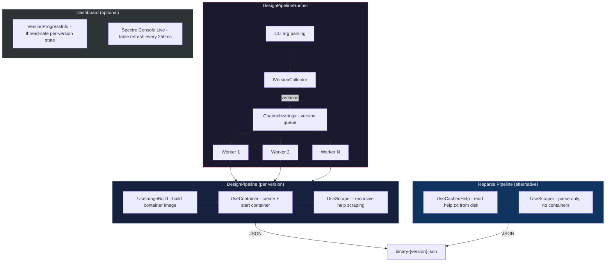

### Middleware Composition

```csharp
// Normal: build image → create container → scrape help
var pipeline = new DesignPipeline()
    .UseImageBuild(imageTagPrefix: "docker-scrape", baseImage: "alpine:3.19",
        installScript: v => $"curl ... docker-{v}.tgz ...")
    .UseContainer()
    .UseScraper("docker", parser)
    .Build();

// Reparse: read cached help text → parse only (no containers, no network)
var reparsePipeline = new DesignPipeline()
    .UseCachedHelp()
    .UseScraper("docker", parser)
    .Build();
```

### Middleware Reference

| Middleware | Sets on `VersionContext` | Purpose |
|------------|------------------------|---------|
| `UseImageBuild(prefix, base, script, shell?)` | `ImageTag` | Builds container image; eagerly removes after inner pipeline completes |
| `UseContainer()` | `ContainerId`, `RunHelp`, `HelpDumpDir` | Creates container from image; sets `RunHelp` to exec inside container |
| `UseInlineContainer(base, script, shell?)` | `ContainerId`, `RunHelp`, `HelpDumpDir` | Container + inline install (no separate image build) |
| `UseCachedHelp()` | `RunHelp` | Reads previously-dumped `.help.txt` from disk; `HelpDumpDir` stays null (no IO) |
| `UseScraper(binary, parser, helpFlag?, pattern?)` | `Result` | Runs `HelpScraper` via `ctx.RunHelp`; dumps help text if `ctx.HelpDumpDir` set |

### VersionContext

| Property | Type | Set by |
|----------|------|--------|
| `Version` | `string` (required) | Runner |
| `RuntimeBinary` | `string` (required) | Runner |
| `Logger` | `ILogger` (required) | Runner |
| `OutputDir` | `string` (required) | Runner |
| `RunProcess` | `Func<string[], Task<string>>` (required) | Runner |
| `ScrapeParallelism` | `int` (default 4) | Runner |
| `ImageTag` | `string?` | `UseImageBuild` |
| `ContainerId` | `string?` | `UseContainer` / `UseInlineContainer` |
| `RunHelp` | `Func<string[], Task<string>>?` | `UseContainer` / `UseCachedHelp` |
| `HelpDumpDir` | `string?` | `UseContainer` / `UseInlineContainer` (null for reparse) |
| `Result` | `CommandTree?` | `UseScraper` |
| `Progress` | `VersionProgressInfo?` | Runner (when `--dashboard`) |
| `ActiveContainers` | `ConcurrentBag<string>` (shared) | Runner (crash recovery) |
| `ActiveImages` | `ConcurrentDictionary<string, byte>` (shared) | Runner (crash recovery) |

### DesignPipelineRunner CLI

| Flag | Description |
|------|-------------|
| `--parallel N` | Number of concurrent version workers (default 4) |
| `--scrape-parallel N` | Maximum active help calls across the entire command tree of each version (default 4) |
| `--output DIR` | Output directory override |
| `--min-version VER` | Filter versions >= VER |
| `--runtime BIN` | Container runtime binary (default `podman`) |
| `--list` | List versions and exit |
| `--missing` | Only process versions without existing JSON files |
| `--add-known-missing V1,V2` | Mark versions as known-missing (skip in `--missing`) |
| `--remove-known-missing V1,V2` | Unmark known-missing versions |
| `--list-known-missing` | Show known-missing versions |
| `--dashboard` | Live Spectre.Console progress table |
| `--reparse` | Use `ReparsePipeline` to regenerate JSON from cached help text |

### Dashboard Stages

| Stage | Color | Meaning |
|-------|-------|---------|
| Pending | grey | Not yet started |
| Building | yellow | Building container image |
| Starting | yellow | Creating container |
| Installing | yellow | Installing binary in container |
| Loading | blue | Reading cached help from disk (reparse) |
| Scraping | cyan | Recursive help scraping in progress |
| Done | green | Completed successfully |
| Failed | red | Error occurred |

---

## Testing (`FrenchExDev.Net.BinaryWrapper.Testing`)

Test helpers for consumers building binary wrappers.

```mermaid
classDiagram
    class FakeProcessRunner {
        +FakeProcessRunner(IEnumerable~OutputLine~, int exitCode)
        +FakeProcessRunner(string stdout, string stderr, int exitCode)
        +LastSpec ProcessSpec?
        +StreamAsync(spec) IAsyncEnumerable~OutputLine~
        +RunAsync(spec) Task~ProcessOutput~
    }

    class FakeCommand {
        +CommandPath IReadOnlyList~string~
        +Args IReadOnlyList~string~
        +ToArguments() IReadOnlyList~string~
    }

    class TestOutputParser {
        +ParseLine(OutputLine) IEnumerable~TestEvent~
        +Complete(int exitCode) IEnumerable~TestEvent~
    }

    class EmptyCompleteParser {
        +ParseLine(OutputLine) IEnumerable~TestEvent~
        +Complete(int exitCode) IEnumerable~TestEvent~
    }

    class TestCollector {
        +OnEvent(TestEvent)
        +Complete() string
    }

    class TestBindings {
        +Create(name)$ BinaryBinding
        +Create(name, version)$ BinaryBinding
        +ResolverFor(name)$ DictionaryBinaryResolver
        +ResolverFor(params BinaryBinding[])$ DictionaryBinaryResolver
    }

    class Gens {
        +NonEmpty Gen~string~$
        +AnyBinaryId Gen~BinaryIdentifier~$
        +AnyOutputLine Gen~OutputLine~$
        +AnyVersion Gen~SemanticVersion~$
    }

    class MockContainerRuntime {
        +MockContainerRuntime(onBuild, onRun, onRemove)
        +WithHelpText(string)$ MockContainerRuntime
        +NoOp$ MockContainerRuntime
    }

    class FakeHttpHandler {
        +FakeHttpHandler(string json, string? linkHeader)
    }

    IProcessRunner <|.. FakeProcessRunner
    ICliCommand <|.. FakeCommand
    IOutputParser <|.. TestOutputParser
    IOutputParser <|.. EmptyCompleteParser
    IResultCollector <|.. TestCollector
    IContainerRuntime <|.. MockContainerRuntime
```

---

## Consumer Architecture

All 6 consumers follow the same pattern:

```csharp
Func<string, ILogger, IHelpParser> parser = (_, _) => HelpParsers.Create("cobra");

var pipeline = new DesignPipeline()
    .UseImageBuild(imageTagPrefix: "docker-scrape", baseImage: "alpine:3.19",
        installScript: v => ...)
    .UseContainer()
    .UseScraper("docker", parser)
    .Build();

var reparsePipeline = new DesignPipeline()
    .UseCachedHelp()
    .UseScraper("docker", parser)
    .Build();

return await new DesignPipelineRunner
{
    VersionCollector = new GitHubTagsVersionCollector("docker", "cli"),
    Pipeline = pipeline,
    ReparsePipeline = reparsePipeline,
    DefaultMinVersion = "23.0.0",
    OutputFilePattern = "docker-{version}.json",
    OutputDir = Path.GetFullPath(Path.Combine(
        AppContext.BaseDirectory, "..", "..", "..", "..", "FrenchExDev.Net.Docker", "scrape")),
}.RunAsync(args);
```

| Consumer | Parser | Version Collector | Base Image | Notes |
|----------|--------|-------------------|------------|-------|
| Docker | `CobraHelpParser` | `GitHubTagsVersionCollector("docker", "cli")` | alpine:3.19 | Static binary from download.docker.com |
| DockerCompose | `CobraHelpParser` | `GitHubReleasesVersionCollector("docker", "compose")` | alpine:3.19 | Static binary from GitHub releases |
| Podman | `CobraHelpParser` | `GitHubReleasesVersionCollector("containers", "podman")` | alpine:3.19 | Asset name changed at 4.4.0 |
| PodmanCompose | `ArgparseHelpParser` | `GitHubReleasesVersionCollector("containers", "podman-compose")` | alpine:3.19 | pip install |
| Packer | `PackerHelpParser` (`-h`) | `PackerVersionCollector` | alpine:3.19 | `UseInlineContainer`, HashiCorp releases |
| Vagrant | `VagrantHelpParser` + `LoggingHelpParser` (`-h`) | `VagrantVersionCollector` | debian:bookworm | WSL patch, `LogLevel.Debug` |

---

## Version Compatibility Flow

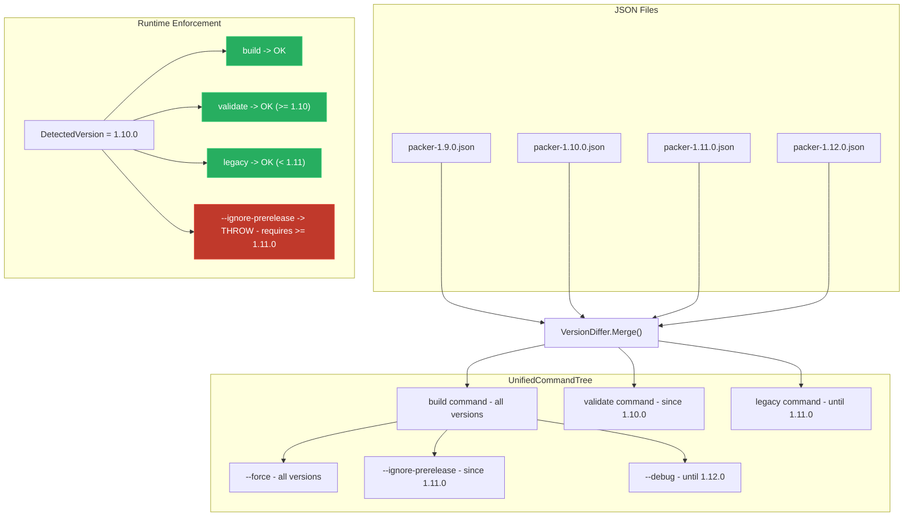

---

## Data Flow Summary

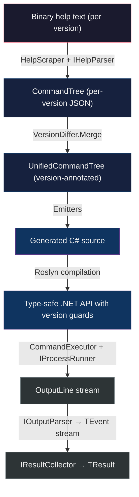

---

## Test Coverage

| Project | Tests | Focus |
|---------|-------|-------|
| `BinaryWrapper.Tests` | 118 | BinaryIdentifier, SemanticVersion, ProcessRunner, CommandExecutor, VersionGuard |
| `BinaryWrapper.SourceGenerator.Tests` | 77 | CommandTreeReader, NamingHelper, VersionDiffer, all emitters |
| `BinaryWrapper.Design.Tests` | 165 | CommandNode, CommandTree serialization, help parsing, scraping |
| `BinaryWrapper.Design.Lib.Tests` | 65 | Pipeline runner, middleware, dashboard |
| `Packer.Tests` | 146 | End-to-end Packer wrapper |
| **Total** | **571** | |

All tests use xUnit with CsCheck for property-based testing of core abstractions.


## Reusable image pipelines

See [UPGRADE-IMAGE-PIPELINES.md](UPGRADE-IMAGE-PIPELINES.md) for `DesignImagePlan`,
`UseVersionImage`, `--build-base`, `--build-images`, `--clean-images`,
and the complete list of CLI clients to migrate.
