# BinaryWrapper Architecture

BinaryWrapper is a framework for generating type-safe .NET wrappers around CLI binaries. It scrapes `--help` output across multiple versions, generates versioned C# code via Roslyn source generators, and provides a runtime execution pipeline with structured output parsing.

---

## System Overview

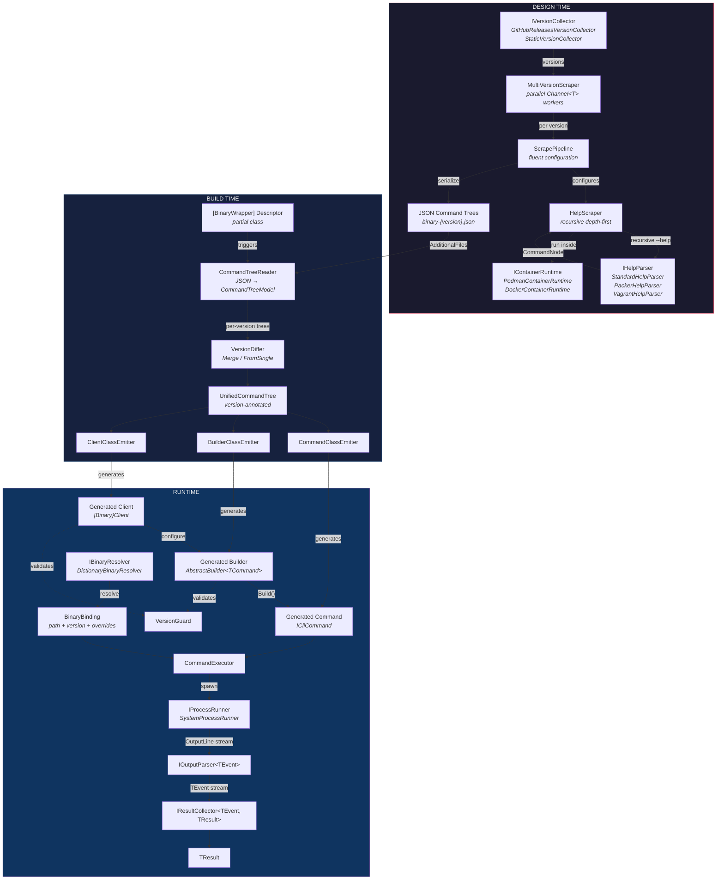

---

## Package Architecture

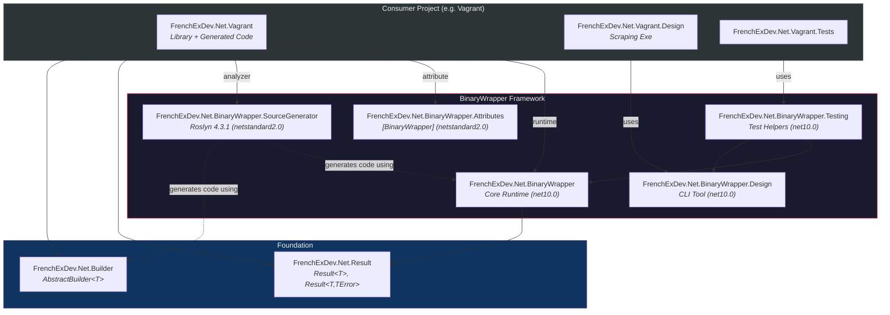

---

## Package Details

### FrenchExDev.Net.BinaryWrapper (Core Runtime)

The runtime library that consumers depend on. Contains all abstractions for command execution, binary resolution, version management, and output parsing.

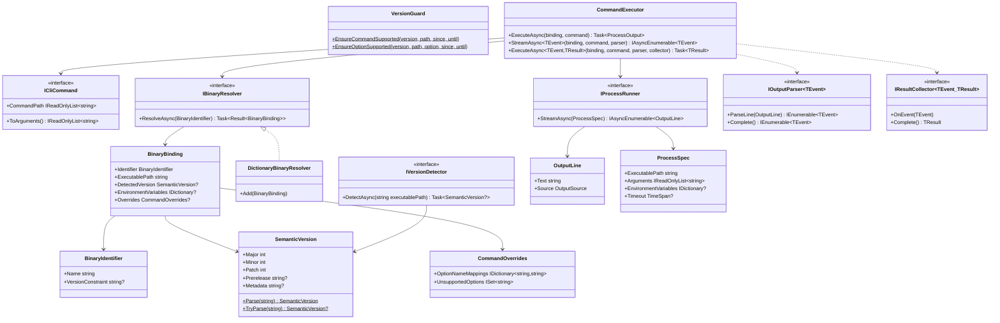

#### Command Execution Pipeline

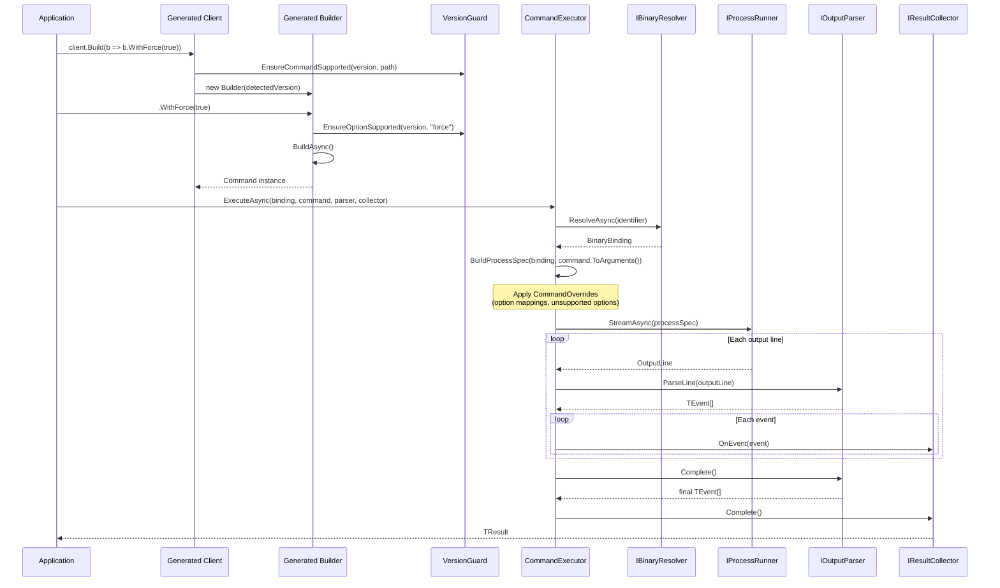

#### Error Hierarchy

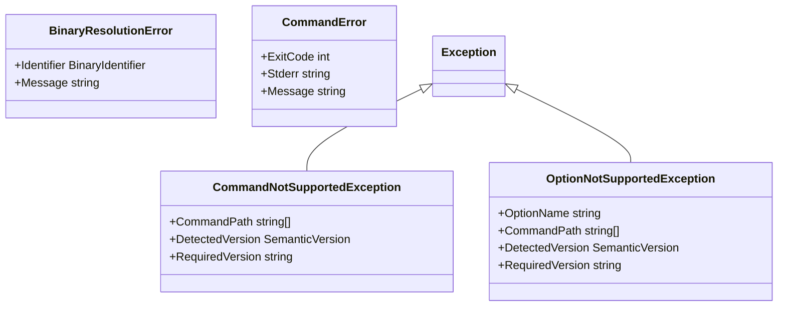

#### Version Constraints

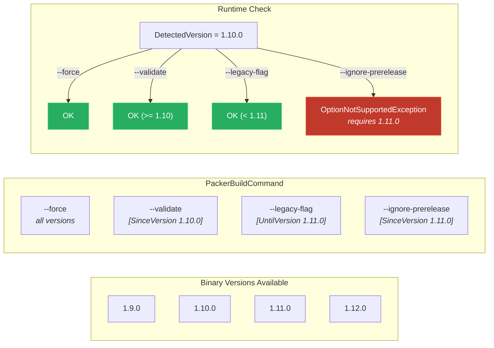

---

### FrenchExDev.Net.BinaryWrapper.Attributes

Tiny package (netstandard2.0 + net10.0) containing only the `[BinaryWrapper]` attribute:

```csharp
[BinaryWrapper("packer", FlagPrefix = "-", FlagValueSeparator = "=", UseBoolEqualsFormat = true)]
public partial class PackerDescriptor;
```

| Property | Default | Description |
|----------|---------|-------------|
| `BinaryName` | *(required)* | Binary name, used to match `{name}-*.json` AdditionalFiles |
| `FlagPrefix` | `"--"` | GNU-style: `"--"`, Go-style: `"-"` |
| `FlagValueSeparator` | `" "` | Space: `--flag value`, Equals: `--flag=value` |
| `UseBoolEqualsFormat` | `false` | `true` → `-force=true`/`-force=false`, `false` → `--force` (presence) |

---

### FrenchExDev.Net.BinaryWrapper.SourceGenerator

Roslyn 4.3.1 incremental source generator. Triggered by `[BinaryWrapper]` on a partial class.

#### Generation Pipeline


#### Emitter Responsibilities

| Emitter | Output | Details |
|---------|--------|---------|
| `CommandClassEmitter` | `{Binary}{Cmd}Command.g.cs` | Sealed class implementing `ICliCommand`. Init-only properties for each option/argument. `ToArguments()` serializes using the configured flag prefix and separator. |
| `BuilderClassEmitter` | `{Binary}{Cmd}CommandBuilder.g.cs` | Extends `AbstractBuilder<T>`. Fluent `With{Option}()` methods with `VersionGuard` checks. Virtual `Validate{Option}()` for customization. Sealed `Instantiate` override. |
| `ClientClassEmitter` | `{Binary}Client.g.cs` | Static `{Binary}.Create(binding)` entry point. Nested groups for command hierarchy (e.g., `client.Container.Run(...)`). `PruneClashingLeaves` handles version-compatibility edge cases. |

#### Key Source Generator Types

| Type | Purpose |
|------|---------|
| `CommandTreeReader` | Deserializes JSON, extracts version from `{binary}-{version}.json` filename |
| `NamingHelper` | kebab-case → PascalCase, CLR type mapping, deduplication of options with same PascalCase name |
| `VersionDiffer` | Produces `UnifiedCommandTree` with per-command and per-option version annotations |

#### Generated Code Shape

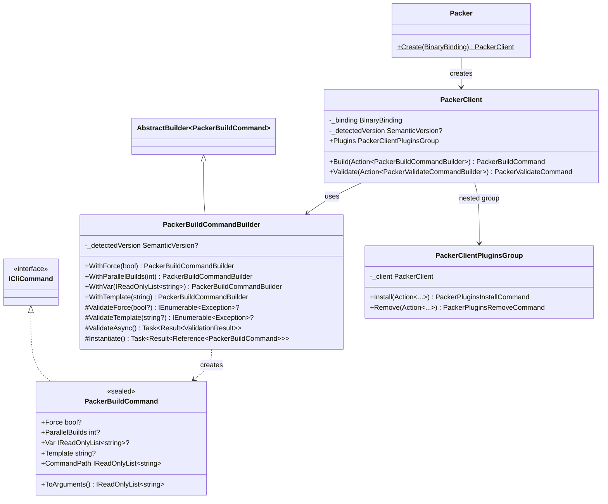

#### Nested Command Groups

For CLI tools with sub-command hierarchies (e.g., `vagrant box add`, `podman container run`):

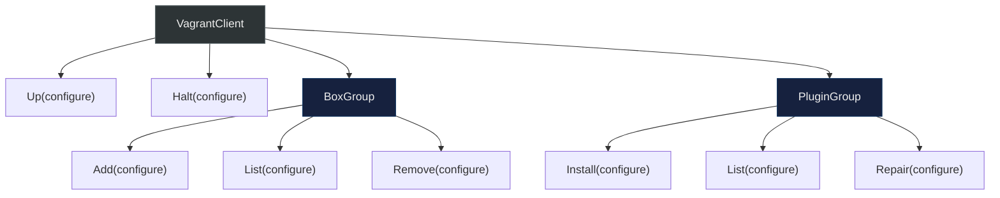

Each group is generated as a nested partial class:

```csharp
public partial class VagrantClient
{
    public VagrantClientBoxGroup Box => new(_client: this);

    public partial class VagrantClientBoxGroup
    {
        private readonly VagrantClient _client;

        public VagrantBoxAddCommand Add(Action<VagrantBoxAddCommandBuilder> configure) { ... }
        public VagrantBoxListCommand List(Action<VagrantBoxListCommandBuilder> configure) { ... }
    }
}
```

#### Diagnostics

| Code | Severity | Description |
|------|----------|-------------|
| `BW001` | Warning | No JSON help files found matching binary name |
| `BW002` | Warning | JSON parse error in AdditionalFile |
| `BW004` | Error | Descriptor class is not partial |

---

### FrenchExDev.Net.BinaryWrapper.Design

Design-time CLI tool packaged as a NuGet tool (`ToolCommandName: binary-wrapper`).

#### Scraping Architecture

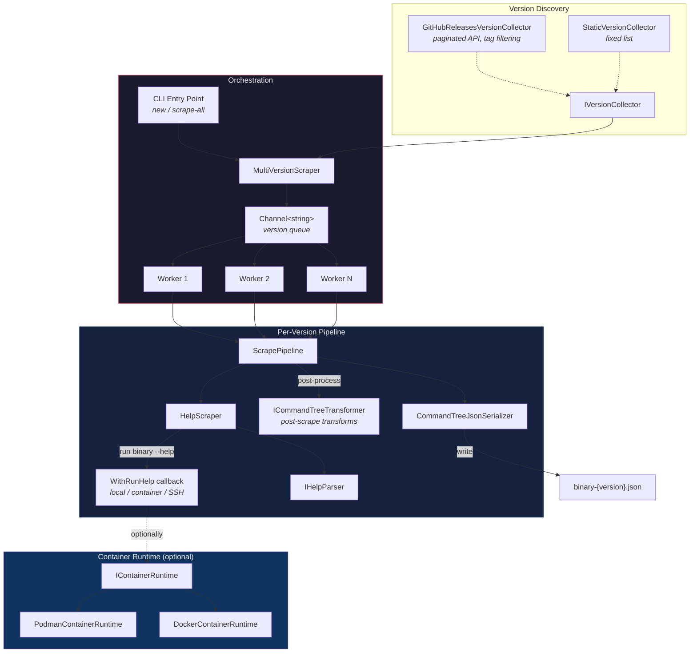

#### Data Model

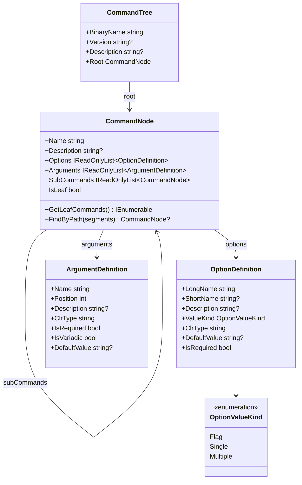

#### Option Types and CLI Serialization

| `OptionValueKind` | C# Type | CLI Serialization (GNU `--`) | CLI Serialization (Go `-`) |
|----|----|----|----|
| `Flag` | `bool?` | `--verbose` (presence = true) | `-verbose=true` / `-verbose=false` |
| `Single` | `string?`, `int?`, etc. | `--output value` or `--output=value` | `-output=value` |
| `Multiple` | `IReadOnlyList<T>?` | `--var val1 --var val2` (repeated) | `-var=val1 -var=val2` |

#### Help Parser Comparison

| Parser | Style | Headers | Flag Syntax | Use Case |
|--------|-------|---------|-------------|----------|
| `StandardHelpParser` | GNU | `Commands:`, `Options:`, `Arguments:` | `--flag`, `-f, --flag VALUE` | Most CLIs (podman, docker, git) |
| `PackerHelpParser` | Go | `Available commands:`, `Options:`, `Flags:` | `-flag`, `-flag=value` | HashiCorp tools (packer, terraform) |
| Custom (`VagrantHelpParser`) | Mixed | `Common commands:`, `Available subcommands:` | Varies | Any binary with non-standard help |

#### ScrapePipeline Fluent API

```csharp
new ScrapePipeline()
    .Binary("vagrant")                              // binary name
    .HelpFlag("-h")                                 // flag to trigger help
    .UseParser<VagrantHelpParser>()                  // or UseParser(instance)
    .MaxDepth(5)                                    // max recursion depth
    .WithRunHelp(async helpArgs => { ... })          // how to execute help
    .WithRuntime(new PodmanContainerRuntime())       // optional container runtime
    .FromImage("debian:bookworm")                   // base image for containers
    .Install("apt-get install -y vagrant")          // install command in container
    .TransformRoot(root => { ... })                 // post-scrape root transform
    .TransformCommand("box.add", node => { ... })   // transform specific command
    .UseTransformer(new MyTransformer())            // custom transformer
    .OutputTo("scrape/vagrant-2.4.3.json");         // output path
```

#### JSON Schema

```json
{
  "binaryName": "vagrant",
  "version": "2.4.3",
  "description": "Vagrant manages development environments",
  "root": {
    "name": "vagrant",
    "description": "...",
    "options": [],
    "arguments": [],
    "subCommands": [
      {
        "name": "box",
        "description": "Manage boxes",
        "options": [],
        "arguments": [],
        "subCommands": [
          {
            "name": "add",
            "description": "Add a box",
            "options": [
              {
                "longName": "force",
                "shortName": "f",
                "description": "Overwrite existing box",
                "valueKind": "flag",
                "clrType": "bool",
                "defaultValue": null,
                "isRequired": false
              },
              {
                "longName": "provider",
                "shortName": null,
                "description": "Provider for the box",
                "valueKind": "single",
                "clrType": "string",
                "defaultValue": null,
                "isRequired": false
              }
            ],
            "arguments": [
              {
                "name": "name",
                "position": 0,
                "description": "Name or URL of the box",
                "clrType": "string",
                "isRequired": true,
                "isVariadic": false,
                "defaultValue": null
              }
            ],
            "subCommands": []
          }
        ]
      }
    ]
  }
}
```

---

### FrenchExDev.Net.BinaryWrapper.Testing

Test helpers for consumers building binary wrappers.

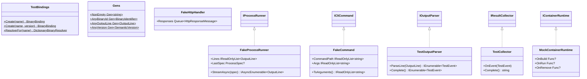

---

## Consumer Architecture

A consumer wraps a specific CLI binary. It consists of two main projects:

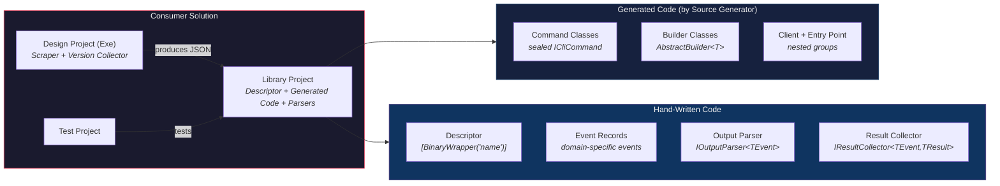

---

## Version Compatibility Flow

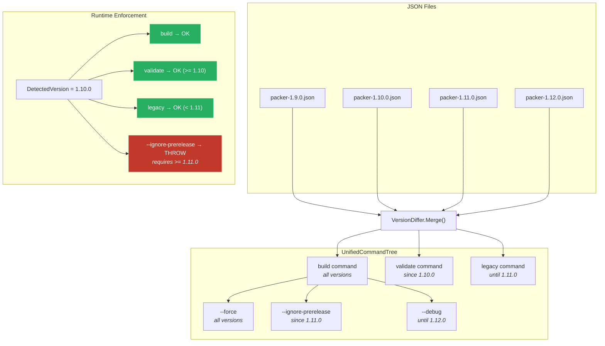

---

## Data Flow Summary

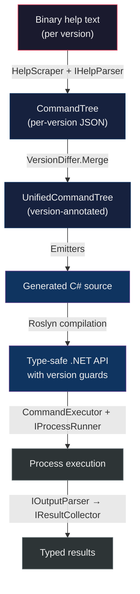

---

## Test Coverage

| Project | Tests | Focus |
|---------|-------|-------|
| `BinaryWrapper.Tests` | 84+ | BinaryIdentifier, SemanticVersion, ProcessRunner, CommandExecutor, VersionGuard |
| `BinaryWrapper.SourceGenerator.Tests` | 146+ | CommandTreeReader, NamingHelper, VersionDiffer, all emitters |
| `BinaryWrapper.Design.Tests` | 40+ | CommandNode, CommandTree serialization, help parsing, scraping |

All tests use xUnit with CsCheck for property-based testing of core abstractions.
