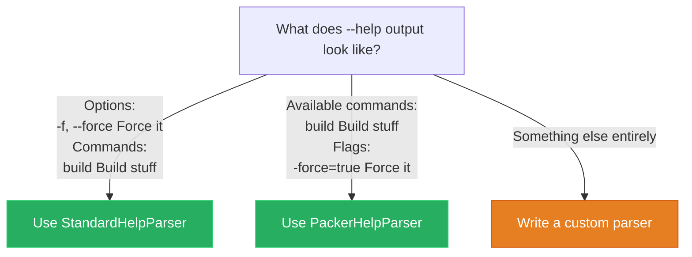
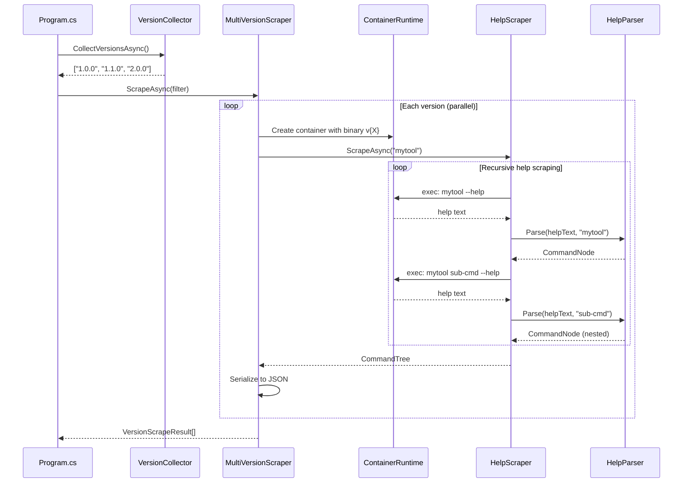
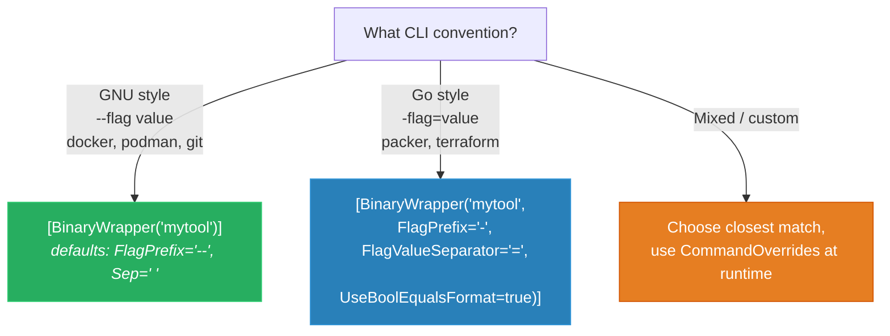
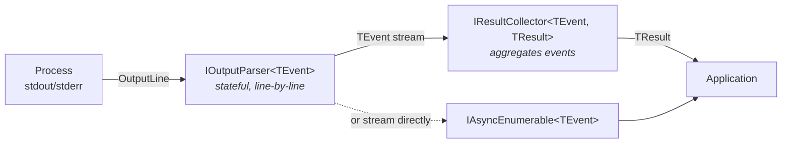
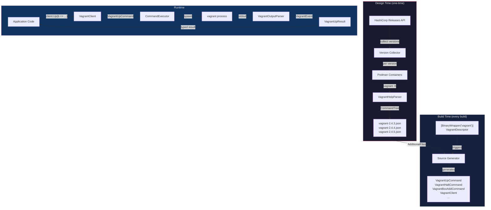

# How To: Create a BinaryWrapper Consumer

This guide walks through every step of wrapping a CLI binary with BinaryWrapper, using **Vagrant** as the real-world reference implementation.

---

## Overview

```mermaid
flowchart LR
    A["1. Create projects"] --> B["2. Implement version collector"]
    B --> C["3. Write help parser<br/>(if needed)"]
    C --> D["4. Build scraper"]
    D --> E["5. Run scraper"]
    E --> F["6. Create descriptor"]
    F --> G["7. Configure project"]
    G --> H["8. Build & use API"]
    H --> I["9. Add output parsing<br/>(optional)"]
    I --> J["10. Write tests"]
```



---

## Step 1: Create the Project Structure

Every consumer follows a standard layout:

```
MyTool/
├── src/
│   ├── FrenchExDev.Net.MyTool/                  # Library — descriptor + generated code
│   │   ├── scrape/                              # Scraped JSON files
│   │   │   ├── mytool-1.0.0.json
│   │   │   └── mytool-2.0.0.json
│   │   ├── MyToolDescriptor.cs                  # [BinaryWrapper] descriptor
│   │   ├── MyToolEvents.cs                      # Output events (optional)
│   │   ├── MyToolOutputParser.cs                # Parser (optional)
│   │   └── FrenchExDev.Net.MyTool.csproj
│   └── FrenchExDev.Net.MyTool.Design/           # Exe — scraper tooling
│       ├── Program.cs
│       ├── MyToolVersionCollector.cs
│       ├── MyToolHelpParser.cs                  # Custom parser (if needed)
│       └── FrenchExDev.Net.MyTool.Design.csproj
├── test/
│   └── FrenchExDev.Net.MyTool.Tests/
│       └── FrenchExDev.Net.MyTool.Tests.csproj
└── MyTool.slnx
```

> **Vagrant reference:** See `Vagrant/src/FrenchExDev.Net.Vagrant/` and `Vagrant/src/FrenchExDev.Net.Vagrant.Design/`

---

## Step 2: Implement a Version Collector

The version collector discovers which versions of the binary are available for scraping.

### Option A: GitHub Releases (built-in)

```csharp
using FrenchExDev.Net.BinaryWrapper.Design;

public sealed class MyToolVersionCollector : IVersionCollector
{
    public async Task<IReadOnlyList<string>> CollectVersionsAsync(
        CancellationToken ct = default)
    {
        var gh = new GitHubReleasesVersionCollector("owner", "repo");
        return await gh.CollectVersionsAsync(ct);
    }
}
```

`GitHubReleasesVersionCollector` handles pagination, tag-to-version parsing, and pre-release filtering automatically.

### Option B: Custom API

```csharp
public sealed class MyToolVersionCollector : IVersionCollector
{
    private readonly HttpClient _http = new();

    public async Task<IReadOnlyList<string>> CollectVersionsAsync(
        CancellationToken ct = default)
    {
        // e.g., HashiCorp releases API
        var json = await _http.GetStringAsync(
            "https://releases.example.com/mytool/versions", ct);
        var versions = JsonSerializer.Deserialize<List<string>>(json)!;
        return versions.Order().ToList();
    }
}
```

### Option C: Static list (testing/development)

```csharp
var collector = new StaticVersionCollector(["1.0.0", "1.1.0", "2.0.0"]);
```

> **Vagrant reference:** The Vagrant Design project collects versions from HashiCorp's releases and builds Docker images for each version.

---

## Step 3: Write a Custom Help Parser (If Needed)

Most CLIs work with `StandardHelpParser` (GNU-style) or `PackerHelpParser` (Go-style). Only write a custom parser if your binary has a unique help format.

### When to use which parser



### Custom parser example (Vagrant)

Vagrant uses `Common commands:` and `Available subcommands:` headers instead of the standard `Commands:`:

```csharp
using FrenchExDev.Net.BinaryWrapper.Design;

public sealed class VagrantHelpParser : IHelpParser
{
    private static readonly HashSet<string> SkippedCommands = ["help", "list-commands", "serve"];

    public CommandNode? Parse(string helpText, string commandName)
    {
        var builder = new CommandNodeBuilder(commandName);
        var section = Section.None;

        foreach (var rawLine in helpText.Split('\n'))
        {
            var trimmed = rawLine.TrimEnd('\r').Trim();

            // Detect section headers
            if (trimmed.StartsWith("Common commands", StringComparison.OrdinalIgnoreCase)
                || trimmed.StartsWith("Available subcommands", StringComparison.OrdinalIgnoreCase))
            {
                section = Section.Commands;
                continue;
            }

            if (IsOptionsHeader(trimmed))
            {
                section = Section.Options;
                continue;
            }

            switch (section)
            {
                case Section.Commands:
                    ParseCommandLine(trimmed, builder);
                    break;
                case Section.Options:
                    // Reuse the standard option line parser
                    StandardHelpParser.ParseOptionLine(trimmed, builder);
                    break;
            }
        }

        return builder.Build();
    }

    private static void ParseCommandLine(string line, CommandNodeBuilder builder)
    {
        // "  box           manages boxes"
        var parts = line.Split([' '], 2, StringSplitOptions.RemoveEmptyEntries);
        if (parts.Length == 0) return;

        var name = parts[0].Trim();
        if (SkippedCommands.Contains(name)) return;

        var description = parts.Length > 1 ? parts[1].Trim() : null;
        builder.AddSubCommand(name, description);
    }

    private enum Section { None, Commands, Options }
}
```

Key decisions:
- **Skip problematic commands**: `help` (infinite recursion), `list-commands` (infinite recursion), `serve` (starts a server, hangs)
- **Reuse `StandardHelpParser.ParseOptionLine`** for option parsing when the format matches
- **Handle multiple header variants**: Vagrant uses different headers at different nesting levels

> **Tip:** Use `LoggingHelpParser` (decorator) to log parsed output during development.

---

## Step 4: Build the Scraper (Program.cs)

The scraper orchestrates multi-version help scraping, typically using containers for isolation.



### Full scraper template

```csharp
using System.Collections.Concurrent;
using FrenchExDev.Net.BinaryWrapper.Design;

// ── CLI Arguments ──
var parallel = 4;
var outputDir = Path.GetFullPath(
    Path.Combine("..", "FrenchExDev.Net.MyTool", "scrape"));
string? minVersion = null;
var runtimeBinary = "podman"; // or "docker"

for (var i = 0; i < args.Length; i++)
{
    switch (args[i])
    {
        case "--parallel": parallel = int.Parse(args[++i]); break;
        case "--output":   outputDir = args[++i]; break;
        case "--min-version": minVersion = args[++i]; break;
        case "--runtime":  runtimeBinary = args[++i]; break;
    }
}

// ── Version Collection ──
var collector = new MyToolVersionCollector();
Func<string, bool> filter = minVersion is not null
    ? v => GitHubReleasesVersionCollector.CompareVersionStrings(v, minVersion) >= 0
    : _ => true;

// ── Container Management ──
var runProcess = ProcessRunnerContainerRuntime.RunProcessAsync;
var containerIds = new ConcurrentBag<string>();

// ── Scraper Configuration ──
var scraper = new MultiVersionScraper(
    versionCollector: collector,
    pipelineFactory: version =>
    {
        string? containerId = null;

        return new ScrapePipeline()
            .Binary("mytool")
            .UseParser<StandardHelpParser>()    // or custom parser
            .HelpFlag("--help")                 // or "-h" for Go-style
            .WithRunHelp(async helpArgs =>
            {
                // Lazy container creation (one per version)
                if (containerId is null)
                {
                    containerId = (await runProcess([
                        runtimeBinary, "run", "-d",
                        "alpine:3.19", "sleep", "infinity"
                    ])).Trim();
                    containerIds.Add(containerId);

                    // Install the binary inside the container
                    await runProcess([
                        runtimeBinary, "exec", containerId, "sh", "-c",
                        $"apk add --no-cache curl && " +
                        $"curl -fsSL https://releases.example.com/{version}/mytool " +
                        "-o /usr/local/bin/mytool && " +
                        "chmod +x /usr/local/bin/mytool"
                    ]);
                }

                // Execute help command inside container
                var execArgs = new List<string>
                    { runtimeBinary, "exec", containerId };
                execArgs.AddRange(helpArgs);
                return await runProcess(execArgs.ToArray());
            })
            .OutputTo(Path.Combine(outputDir, $"mytool-{version}.json"));
    },
    maxParallelism: parallel);

// ── Progress Reporting ──
scraper.Progress += (result, done, total) =>
{
    var status = result.Success ? "OK" : $"FAILED: {result.ErrorMessage}";
    Console.WriteLine($"[{done}/{total}] {result.Version}: {status}");
};

// ── Execute ──
Directory.CreateDirectory(outputDir);

try
{
    var results = await scraper.ScrapeAsync(filter);
    var failed = results.Count(r => !r.Success);
    Console.WriteLine($"\nDone. {results.Count - failed} succeeded, {failed} failed.");
    return failed > 0 ? 1 : 0;
}
finally
{
    // Cleanup containers
    foreach (var id in containerIds)
    {
        try { await runProcess([runtimeBinary, "rm", "-f", id]); }
        catch { /* best-effort cleanup */ }
    }
}
```

### Using pre-built images (Vagrant approach)

For binaries that are slow to install, pre-build container images:

```csharp
// Pre-build phase: create reusable images
var imageTag = $"vagrant-scrape:{version}";
var containerId = (await runProcess([
    runtimeBinary, "run", "-d", "debian:bookworm", "sleep", "infinity"
])).Trim();

await runProcess([runtimeBinary, "exec", containerId, "sh", "-c",
    $"apt-get update && apt-get install -y wget && " +
    $"wget https://releases.hashicorp.com/vagrant/{version}/vagrant_{version}-1_amd64.deb && " +
    $"dpkg -i vagrant_{version}-1_amd64.deb"]);

// Apply WSL fix (Vagrant-specific)
await runProcess([runtimeBinary, "exec", containerId, "sh", "-c",
    "sed -i 's/@_wsl = true/@_wsl = false/' " +
    "/opt/vagrant/embedded/gems/gems/vagrant-*/lib/vagrant/util/platform.rb"]);

await runProcess([runtimeBinary, "commit", containerId, imageTag]);
await runProcess([runtimeBinary, "rm", "-f", containerId]);

// Scrape phase: reuse pre-built image
.WithRunHelp(async helpArgs =>
{
    if (containerId is null)
    {
        containerId = (await runProcess([
            runtimeBinary, "run", "-d", imageTag, "sleep", "infinity"
        ])).Trim();
    }
    var execArgs = new List<string> { runtimeBinary, "exec", containerId };
    execArgs.AddRange(helpArgs);
    return await runProcess(execArgs.ToArray());
})
```

---

## Step 5: Run the Scraper

```bash
cd MyTool/src/FrenchExDev.Net.MyTool.Design
dotnet run -- --min-version 1.0.0 --parallel 4

# Output:
# [1/12] 1.0.0: OK
# [2/12] 1.1.0: OK
# [3/12] 1.2.0: OK
# ...
# Done. 12 succeeded, 0 failed.
```

JSON files are written to the sibling library's `scrape/` folder:

```
FrenchExDev.Net.MyTool/scrape/
├── mytool-1.0.0.json
├── mytool-1.1.0.json
├── mytool-1.2.0.json
└── ...
```

---

## Step 6: Create the Descriptor

The descriptor is a minimal partial class that tells the source generator what to generate:

```csharp
using FrenchExDev.Net.BinaryWrapper.Attributes;

namespace FrenchExDev.Net.MyTool;

[BinaryWrapper("mytool")]
public partial class MyToolDescriptor;
```

> **Vagrant reference** (`VagrantDescriptor.cs`):
> ```csharp
> [BinaryWrapper("vagrant")]
> public partial class VagrantDescriptor;
> ```

### Attribute configuration by CLI style



| CLI Style | `FlagPrefix` | `FlagValueSeparator` | `UseBoolEqualsFormat` | Example |
|-----------|------------|-------------------|---------------------|---------|
| GNU (default) | `"--"` | `" "` | `false` | `--force --output value` |
| Go/HashiCorp | `"-"` | `"="` | `true` | `-force=true -output=value` |

---

## Step 7: Configure the Library Project

```xml
<Project Sdk="Microsoft.NET.Sdk">

  <PropertyGroup>
    <TargetFramework>net10.0</TargetFramework>
    <ImplicitUsings>enable</ImplicitUsings>
    <Nullable>enable</Nullable>
    <RootNamespace>FrenchExDev.Net.MyTool</RootNamespace>

    <!-- Emit generated files for debugging / IntelliSense -->
    <EmitCompilerGeneratedFiles>true</EmitCompilerGeneratedFiles>
    <CompilerGeneratedFilesOutputPath>$(BaseIntermediateOutputPath)/Generated</CompilerGeneratedFilesOutputPath>
  </PropertyGroup>

  <ItemGroup>
    <!-- Runtime library -->
    <ProjectReference Include="...BinaryWrapper/FrenchExDev.Net.BinaryWrapper.csproj" />

    <!-- Attribute (compile-time only, needed for [BinaryWrapper]) -->
    <ProjectReference Include="...BinaryWrapper.Attributes/FrenchExDev.Net.BinaryWrapper.Attributes.csproj" />

    <!-- Source generator (analyzer, not referenced at runtime) -->
    <ProjectReference Include="...BinaryWrapper.SourceGenerator/FrenchExDev.Net.BinaryWrapper.SourceGenerator.csproj"
                      OutputItemType="Analyzer"
                      ReferenceOutputAssembly="false" />

    <!-- Foundation packages -->
    <ProjectReference Include="...Builder/FrenchExDev.Net.Builder.csproj" />
    <ProjectReference Include="...Result/FrenchExDev.Net.Result.csproj" />
  </ItemGroup>

  <!-- The source generator reads these JSON files to generate code -->
  <ItemGroup>
    <AdditionalFiles Include="scrape\mytool-*.json" />
  </ItemGroup>

</Project>
```

After building, the source generator produces files in `obj/Generated/`:

```
obj/Generated/FrenchExDev.Net.BinaryWrapper.SourceGenerator/
├── MyToolDescriptor.BinaryWrapper.g.cs
├── MyToolBuildCommand.g.cs
├── MyToolBuildCommandBuilder.g.cs
├── MyToolValidateCommand.g.cs
├── MyToolValidateCommandBuilder.g.cs
├── MyToolClient.g.cs
└── ...
```

---

## Step 8: Build and Use the Generated API

### Building a command

```csharp
using FrenchExDev.Net.BinaryWrapper;
using FrenchExDev.Net.MyTool;

// 1. Create a binding (maps binary name to executable path)
var binding = new BinaryBinding(
    new BinaryIdentifier("mytool"),
    executablePath: "/usr/local/bin/mytool",
    detectedVersion: SemanticVersion.Parse("2.0.0"));

// 2. Create the typed client
var client = MyTool.Create(binding);

// 3. Build a command with full IntelliSense
var cmd = client.Build(b => b
    .WithForce(true)
    .WithOutput("/tmp/output")
    .WithTemplate("my-template.json"));
```

### Executing a command (raw output)

```csharp
var executor = new CommandExecutor(new SystemProcessRunner());
var output = await executor.ExecuteAsync(binding, cmd, ct);

Console.WriteLine($"Exit code: {output.ExitCode}");
Console.WriteLine($"Stdout: {string.Join('\n', output.StdOut)}");
Console.WriteLine($"Stderr: {string.Join('\n', output.StdErr)}");
```

### Executing with version guards

If a command or option isn't available in the detected version, you get a clear exception:

```csharp
try
{
    var cmd = client.NewFeature(b => b
        .WithExperimentalFlag(true));
}
catch (CommandNotSupportedException ex)
{
    // "Command 'new-feature' requires version 2.1.0,
    //  but detected version is 2.0.0"
    Console.WriteLine(ex.Message);
}
catch (OptionNotSupportedException ex)
{
    // "Option '--experimental-flag' on command 'new-feature'
    //  requires version 2.2.0, but detected version is 2.0.0"
    Console.WriteLine(ex.Message);
}
```

### Using nested command groups

For binaries with sub-command hierarchies:

```csharp
// vagrant box add hashicorp/bionic64 --force
var addCmd = client.Box.Add(b => b
    .WithName("hashicorp/bionic64")
    .WithForce(true));

// vagrant plugin install vagrant-vbguest
var installCmd = client.Plugin.Install(b => b
    .WithName("vagrant-vbguest"));
```

---

## Step 9: Add Output Parsing (Optional)

For structured interaction with the binary's output, implement parsers and collectors.

### Architecture



### Define domain events

```csharp
namespace FrenchExDev.Net.MyTool;

// Base event type
public abstract record MyToolEvent;

// Specific events
public sealed record MyToolBuildStarted(string TargetName) : MyToolEvent;
public sealed record MyToolBuildProgress(string TargetName, string Message) : MyToolEvent;
public sealed record MyToolBuildCompleted(
    string TargetName, bool Success, string? ArtifactPath) : MyToolEvent;
public sealed record MyToolOutputLine(
    string Text, OutputSource Source) : MyToolEvent;
```

> **Vagrant reference** (`VagrantEvents.cs`):
> ```csharp
> public abstract record VagrantEvent;
> public sealed record VagrantMachineOutput(string MachineName, string Message) : VagrantEvent;
> public sealed record VagrantMachineError(string MachineName, string Message) : VagrantEvent;
> public sealed record VagrantActionCompleted(string MachineName, bool Success) : VagrantEvent;
> public sealed record VagrantMachineReadableEvent(
>     long Timestamp, string Target, string EventType, string[] Data) : VagrantEvent;
> ```

### Implement the parser

```csharp
public sealed class MyToolBuildParser : IOutputParser<MyToolEvent>
{
    public IEnumerable<MyToolEvent> ParseLine(OutputLine line)
    {
        var text = line.Text;

        // "==> target: Starting build..."
        if (text.StartsWith("==>") && text.Contains("Starting build"))
        {
            var target = ExtractTarget(text);
            yield return new MyToolBuildStarted(target);
            yield break;
        }

        // "==> target: Build complete! Artifact: /path/to/output"
        if (text.Contains("Build complete"))
        {
            var target = ExtractTarget(text);
            var artifact = ExtractArtifact(text);
            yield return new MyToolBuildCompleted(target, true, artifact);
            yield break;
        }

        // Forward all other lines as generic output
        yield return new MyToolOutputLine(text, line.Source);
    }

    public IEnumerable<MyToolEvent> Complete()
    {
        // Emit any final events if needed
        yield break;
    }

    private static string ExtractTarget(string text) => /* ... */;
    private static string? ExtractArtifact(string text) => /* ... */;
}
```

### Implement the result collector

```csharp
public sealed record MyToolBuildResult(
    IReadOnlyList<string> Artifacts,
    IReadOnlyList<string> Errors,
    bool Success);

public sealed class MyToolBuildCollector : IResultCollector<MyToolEvent, MyToolBuildResult>
{
    private readonly List<string> _artifacts = [];
    private readonly List<string> _errors = [];
    private bool _hasFailure;

    public void OnEvent(MyToolEvent @event)
    {
        switch (@event)
        {
            case MyToolBuildCompleted { Success: true } c:
                if (c.ArtifactPath is not null)
                    _artifacts.Add(c.ArtifactPath);
                break;
            case MyToolBuildCompleted { Success: false }:
                _hasFailure = true;
                break;
            case MyToolOutputLine { Source: OutputSource.StdErr } err:
                _errors.Add(err.Text);
                break;
        }
    }

    public MyToolBuildResult Complete() =>
        new(_artifacts.AsReadOnly(), _errors.AsReadOnly(), !_hasFailure);
}
```

### Use streaming or collection

```csharp
var parser = new MyToolBuildParser();
var collector = new MyToolBuildCollector();

// Option A: Stream events in real-time
await foreach (var evt in executor.StreamAsync(binding, cmd, parser, ct))
{
    switch (evt)
    {
        case MyToolBuildStarted s:
            Console.WriteLine($"Building {s.TargetName}...");
            break;
        case MyToolBuildProgress p:
            Console.WriteLine($"  {p.Message}");
            break;
        case MyToolBuildCompleted c:
            Console.WriteLine($"  {(c.Success ? "OK" : "FAILED")}: {c.ArtifactPath}");
            break;
    }
}

// Option B: Collect into a result
var result = await executor.ExecuteAsync(binding, cmd, parser, collector, ct);
Console.WriteLine($"Artifacts: {result.Artifacts.Count}");
Console.WriteLine($"Errors: {result.Errors.Count}");
Console.WriteLine($"Success: {result.Success}");
```

> **Vagrant reference** (`VagrantUpCollector.cs`):
> ```csharp
> public sealed class VagrantUpCollector : IResultCollector<VagrantEvent, VagrantUpResult>
> {
>     public void OnEvent(VagrantEvent @event)
>     {
>         switch (@event)
>         {
>             case VagrantActionCompleted { Success: true } completed:
>                 _machinesReady.Add(completed.MachineName);
>                 break;
>             case VagrantMachineError error:
>                 _errors.Add($"{error.MachineName}: {error.Message}");
>                 break;
>         }
>     }
>
>     public VagrantUpResult Complete() =>
>         new(_machinesReady.AsReadOnly(), _errors.AsReadOnly(), !_hasFailure);
> }
> ```

---

## Step 10: Write Tests

### Using the Testing package

```xml
<!-- Test project .csproj -->
<ItemGroup>
  <ProjectReference Include="...BinaryWrapper.Testing/FrenchExDev.Net.BinaryWrapper.Testing.csproj" />
  <ProjectReference Include="...FrenchExDev.Net.MyTool/FrenchExDev.Net.MyTool.csproj" />
</ItemGroup>
```

### Test command serialization

```csharp
[Fact]
public void BuildCommand_SerializesCorrectly()
{
    var binding = TestBindings.Create("mytool", SemanticVersion.Parse("2.0.0"));
    var client = MyTool.Create(binding);

    var cmd = client.Build(b => b
        .WithForce(true)
        .WithOutput("/tmp/out")
        .WithTemplate("tmpl.json"));

    var args = cmd.ToArguments();

    args.Should().ContainInOrder("--force", "--output", "/tmp/out", "tmpl.json");
    cmd.CommandPath.Should().Equal("build");
}
```

### Test output parsing with FakeProcessRunner

```csharp
[Fact]
public async Task BuildParser_ParsesEvents_Correctly()
{
    var runner = new FakeProcessRunner(
    [
        new OutputLine("==> default: Starting build...", OutputSource.StdOut),
        new OutputLine("==> default: Build progress 50%", OutputSource.StdOut),
        new OutputLine("==> default: Build complete! Artifact: /output/image.qcow2", OutputSource.StdOut),
    ]);

    var binding = TestBindings.Create("mytool");
    var cmd = new FakeCommand { CommandPath = ["build"], Args = ["template.json"] };
    var parser = new MyToolBuildParser();
    var collector = new MyToolBuildCollector();

    var executor = new CommandExecutor(runner);
    var result = await executor.ExecuteAsync(binding, cmd, parser, collector);

    result.Success.Should().BeTrue();
    result.Artifacts.Should().Contain("/output/image.qcow2");
}
```

### Test version guards

```csharp
[Fact]
public void NewCommand_ThrowsOnOldVersion()
{
    var binding = TestBindings.Create("mytool", SemanticVersion.Parse("1.0.0"));
    var client = MyTool.Create(binding);

    // Assuming 'new-feature' was added in v2.0.0
    Assert.Throws<CommandNotSupportedException>(() =>
        client.NewFeature(b => b.WithName("test")));
}
```

### Property-based testing with CsCheck

```csharp
using FrenchExDev.Net.BinaryWrapper.Testing;

[Fact]
public void SemanticVersion_RoundTrips()
{
    Gens.AnyVersion.Sample(version =>
    {
        var parsed = SemanticVersion.Parse(version.ToString());
        Assert.Equal(version, parsed);
    });
}
```

---

## Post-Scrape Transforms

Sometimes the parser can't infer the correct CLR type or you need to fix scraped data.

### Inline transforms

```csharp
new ScrapePipeline()
    .Binary("mytool")
    .UseParser<StandardHelpParser>()
    .TransformRoot(root =>
    {
        // Fix a global option type
        var builder = CommandNodeBuilder.From(root);
        builder.SetOptionType("parallel", "int");
        return builder.Build();
    })
    .TransformCommand("build", node =>
    {
        // Add a missing argument
        var builder = CommandNodeBuilder.From(node);
        builder.AddArgument("template", position: 0, clrType: "string", isRequired: true);
        return builder.Build();
    })
    .OutputTo("scrape/mytool-1.0.0.json");
```

### Custom transformer

```csharp
public sealed class MyToolTransformer : ICommandTreeTransformer
{
    public CommandTree Transform(CommandTree tree)
    {
        // Modify the tree as needed
        return tree with
        {
            Root = TransformNode(tree.Root)
        };
    }

    private CommandNode TransformNode(CommandNode node)
    {
        // Recursive transformation logic
        return node with
        {
            SubCommands = node.SubCommands
                .Select(TransformNode)
                .ToList()
        };
    }
}

// Usage:
new ScrapePipeline()
    .Binary("mytool")
    .UseTransformer(new MyToolTransformer())
    ...
```

---

## Runtime Command Overrides

For version-specific quirks where option names change or are removed:

```csharp
var overrides = new CommandOverrides
{
    OptionNameMappings = new Dictionary<string, string>
    {
        // v1.x used --output-dir, v2.x uses --output
        ["--output-dir"] = "--output"
    },
    UnsupportedOptions = new HashSet<string>
    {
        // --legacy-mode was removed in v2.0
        "--legacy-mode"
    }
};

var binding = new BinaryBinding(
    new BinaryIdentifier("mytool"),
    executablePath: "/usr/local/bin/mytool",
    detectedVersion: SemanticVersion.Parse("2.0.0"),
    overrides: overrides);
```

---

## Complete Example: End-to-End Vagrant Wrapper



### Descriptor

```csharp
// VagrantDescriptor.cs — that's it, one line!
[BinaryWrapper("vagrant")]
public partial class VagrantDescriptor;
```

### Usage

```csharp
var binding = new BinaryBinding(
    new BinaryIdentifier("vagrant"),
    executablePath: "/usr/bin/vagrant",
    detectedVersion: SemanticVersion.Parse("2.4.3"));

var client = Vagrant.Create(binding);

// vagrant up --provider virtualbox
var upCmd = client.Up(b => b
    .WithProvider("virtualbox"));

// vagrant box add hashicorp/bionic64 --force
var boxAddCmd = client.Box.Add(b => b
    .WithName("hashicorp/bionic64")
    .WithForce(true));

// Execute with streaming
var executor = new CommandExecutor(new SystemProcessRunner());
await foreach (var evt in executor.StreamAsync(binding, upCmd, new VagrantOutputParser(), ct))
{
    Console.WriteLine(evt);
}
```

---

## Troubleshooting

### No generated code appears

1. Verify the `.csproj` has `<AdditionalFiles Include="scrape\mytool-*.json" />`
2. Verify JSON files exist in the `scrape/` directory
3. Verify the file naming matches `{binaryName}-{version}.json`
4. Check build output for `BW001` (no files) or `BW002` (parse error) warnings
5. Enable `<EmitCompilerGeneratedFiles>true</EmitCompilerGeneratedFiles>` and check `obj/Generated/`

### Descriptor class error

Ensure the class is `partial`:

```csharp
// BW004 error — class must be partial
[BinaryWrapper("mytool")]
public partial class MyToolDescriptor;
//     ^^^^^^^
```

### Version guard throws unexpectedly

Check that `BinaryBinding.DetectedVersion` is set correctly. If not set (null), version guards are skipped.

### Duplicate option names after generation

The generator deduplicates options with the same PascalCase name (e.g., `--no-tty` and `--[no-]tty` both become `NoTty`). If you see duplicates, check the scraped JSON for overlapping option names.

---

## Quick Reference

| Task | Command / API |
|------|--------------|
| Scaffold new consumer | `dotnet run --project BinaryWrapper.Design -- new my-tool` |
| Scrape all versions | `dotnet run --project MyTool.Design -- --parallel 4` |
| Scrape with version filter | `dotnet run -- --min-version 2.0.0` |
| Build library | `dotnet build MyTool/src/FrenchExDev.Net.MyTool/` |
| Run tests | `dotnet test MyTool/test/FrenchExDev.Net.MyTool.Tests/` |
| Inspect generated code | Check `obj/Generated/` after build |

## Further Reading

- [Architecture](ARCHITECTURE.md) — deep dive into system design and component interactions
- [Vagrant wrapper](../../Vagrant/) — complete production implementation
