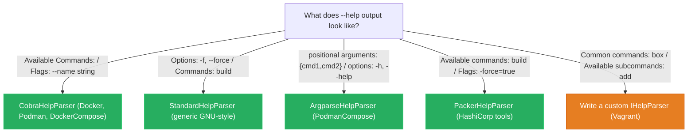
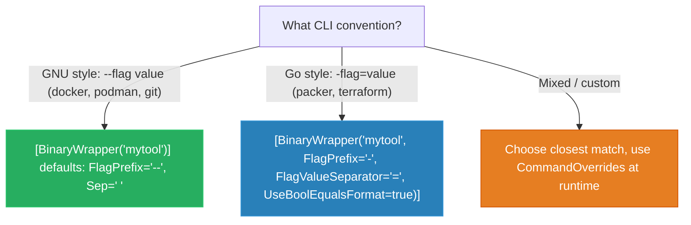
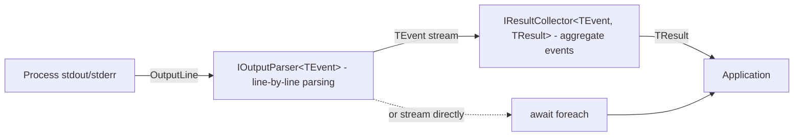
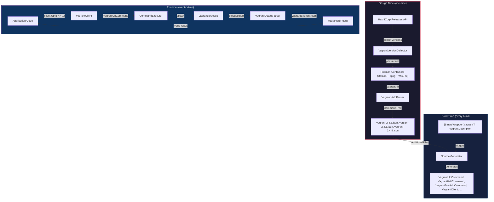

# How To: Create a BinaryWrapper Consumer

This guide walks through every step of wrapping a CLI binary with BinaryWrapper, using real consumer implementations as reference.

---

## Overview

```mermaid
flowchart LR
    A["1. Create projects"] --> B["2. Implement version collector"]
    B --> C["3. Choose help parser"]
    C --> D["4. Build design pipeline"]
    D --> E["5. Run scraper"]
    E --> F["6. Create descriptor"]
    F --> G["7. Configure project"]
    G --> H["8. Build and use API"]
    H --> I["9. Add output parsing (optional)"]
    I --> J["10. Write tests"]
```



---

## Step 1: Create the Project Structure

Every consumer follows a standard layout:

```
MyTool/
├── src/
│   ├── FrenchExDev.Net.MyTool/                  # Library — descriptor + generated code
│   │   ├── scrape/                              # Scraped JSON files
│   │   │   ├── mytool-1.0.0.json
│   │   │   └── mytool-2.0.0.json
│   │   ├── MyToolDescriptor.cs                  # [BinaryWrapper] descriptor
│   │   ├── MyToolEvents.cs                      # Output events (optional)
│   │   ├── MyToolOutputParser.cs                # IOutputParser (optional)
│   │   ├── MyToolResultCollector.cs             # IResultCollector (optional)
│   │   └── FrenchExDev.Net.MyTool.csproj
│   └── FrenchExDev.Net.MyTool.Design/           # Exe — scraper tooling
│       ├── Program.cs
│       ├── MyToolVersionCollector.cs             # Custom collector (if needed)
│       ├── MyToolHelpParser.cs                  # Custom parser (if needed)
│       └── FrenchExDev.Net.MyTool.Design.csproj
├── test/
│   └── FrenchExDev.Net.MyTool.Tests/
│       └── FrenchExDev.Net.MyTool.Tests.csproj
└── MyTool.slnx
```

The Design project references `FrenchExDev.Net.BinaryWrapper.Design.Lib` (which itself references `Design`). The Library project references the core runtime, attributes, and source generator.

> **Reference:** See `Docker/`, `Podman/`, `Packer/`, `Vagrant/` for real examples.

---

## Step 2: Implement a Version Collector

The version collector discovers which versions of the binary are available for scraping.

### Option A: GitHub Releases (most common)

```csharp
// Used by: Podman, PodmanCompose, DockerCompose
var collector = new GitHubReleasesVersionCollector("containers", "podman");
```

Handles pagination, tag-to-version parsing, and pre-release filtering automatically.

### Option B: GitHub Tags

```csharp
// Used by: Docker (releases don't match CLI versions)
var collector = new GitHubTagsVersionCollector("docker", "cli");
```

### Option C: Custom API

For non-GitHub sources (e.g., HashiCorp releases):

```csharp
public sealed class PackerVersionCollector : IVersionCollector
{
    private readonly HttpClient _http = new();

    public async Task<IReadOnlyList<string>> CollectVersionsAsync(
        CancellationToken ct = default)
    {
        var json = await _http.GetStringAsync(
            "https://releases.hashicorp.com/packer/index.json", ct);
        // Parse and filter versions...
        return versions.Order().ToList();
    }
}
```

> **Reference:** `PackerVersionCollector` and `VagrantVersionCollector` use the HashiCorp releases API.

### Option D: Static list (testing/development)

```csharp
var collector = new StaticVersionCollector(["1.0.0", "1.1.0", "2.0.0"]);
```

---

## Step 3: Choose a Help Parser

Five built-in parsers handle different CLI frameworks:



### Using a built-in parser

```csharp
// Factory method — returns IHelpParser
var parser = HelpParsers.Create("cobra");     // or "standard", "argparse", "packer"
```

### Using LoggingHelpParser (debugging)

```csharp
// Wraps any parser with structured logging
Func<string, ILogger, IHelpParser> parser = (version, logger) =>
    new LoggingHelpParser(HelpParsers.Create("cobra"), logger, LogLevel.Debug);
```

> **Reference:** Vagrant uses `LoggingHelpParser` to debug its custom parser:
> ```csharp
> Func<string, ILogger, IHelpParser> parser = (_, logger) =>
>     new LoggingHelpParser(new VagrantHelpParser(), logger, LogLevel.Debug);
> ```

### Writing a custom parser

Only write a custom `IHelpParser` if none of the built-in parsers handle your binary's help format:

```csharp
public sealed class MyToolHelpParser : IHelpParser
{
    private static readonly HashSet<string> SkippedCommands = ["help", "completion"];

    public CommandNode? Parse(string helpText, string commandName)
    {
        var builder = new CommandNodeBuilder(commandName);

        foreach (var rawLine in helpText.Split('\n'))
        {
            var trimmed = rawLine.TrimEnd('\r').Trim();
            // Parse commands, options, arguments into builder...
        }

        return builder.Build();
    }
}
```

Key decisions for custom parsers:
- **Skip problematic commands**: `help` (infinite recursion), `completion` (no useful output), `serve` (starts a server, hangs)
- **Reuse `StandardHelpParser.ParseOptionLine`** when the option format matches GNU conventions
- **Handle multiple header variants** if the help format changes at different nesting levels

---

## Step 4: Build the Design Pipeline (Program.cs)

The Design project's `Program.cs` composes middleware into a `DesignPipeline` and hands it to `DesignPipelineRunner` for parallel version processing.

### Pattern A: UseImageBuild + UseContainer (most consumers)

Pre-builds a container image per version, then scrapes from it. Best for binaries with slow or complex installation.

```csharp
using FrenchExDev.Net.BinaryWrapper.Design;
using FrenchExDev.Net.BinaryWrapper.Design.Lib;
using Microsoft.Extensions.Logging;

Func<string, ILogger, IHelpParser> parser = (_, _) => HelpParsers.Create("cobra");

var pipeline = new DesignPipeline()
    .UseImageBuild(
        imageTagPrefix: "docker-scrape",
        baseImage: "alpine:3.19",
        installScript: v =>
            "apk add --no-cache curl tar > /dev/null 2>&1 && " +
            $"curl -fsSL https://example.com/mytool-{v}.tgz -o /tmp/mytool.tgz && " +
            "tar xzf /tmp/mytool.tgz -C /usr/local/bin && " +
            "chmod +x /usr/local/bin/mytool && rm /tmp/mytool.tgz")
    .UseContainer()
    .UseScraper("mytool", parser)
    .Build();

var reparsePipeline = new DesignPipeline()
    .UseCachedHelp()
    .UseScraper("mytool", parser)
    .Build();

return await new DesignPipelineRunner
{
    VersionCollector = new GitHubReleasesVersionCollector("owner", "repo"),
    Pipeline = pipeline,
    ReparsePipeline = reparsePipeline,
    DefaultMinVersion = "1.0.0",
    OutputFilePattern = "mytool-{version}.json",
    OutputDir = Path.GetFullPath(Path.Combine(
        AppContext.BaseDirectory, "..", "..", "..", "..", "FrenchExDev.Net.MyTool", "scrape")),
}.RunAsync(args);
```

> **Reference:** Docker, DockerCompose, Podman, PodmanCompose, and Vagrant all use this pattern.

### Pattern B: UseInlineContainer (simpler, no cached image)

Creates a container, installs the binary inline, scrapes, and cleans up. Good when installation is fast (e.g., downloading a single ZIP).

```csharp
Func<string, ILogger, IHelpParser> parser = (_, _) => new PackerHelpParser();

var pipeline = new DesignPipeline()
    .UseInlineContainer(
        baseImage: "alpine:3.19",
        installScript: v =>
            "apk add --no-cache curl unzip && " +
            $"curl -fsSL https://releases.hashicorp.com/packer/{v}/packer_{v}_linux_amd64.zip -o /tmp/p.zip && " +
            "unzip /tmp/p.zip -d /usr/local/bin && rm /tmp/p.zip")
    .UseScraper("packer", parser, helpFlag: "-h")
    .Build();

var reparsePipeline = new DesignPipeline()
    .UseCachedHelp()
    .UseScraper("packer", parser, helpFlag: "-h")
    .Build();

return await new DesignPipelineRunner
{
    VersionCollector = new PackerVersionCollector(),
    Pipeline = pipeline,
    ReparsePipeline = reparsePipeline,
    OutputFilePattern = "packer-{version}.json",
    OutputDir = Path.GetFullPath(Path.Combine("..", "FrenchExDev.Net.Packer", "scrape")),
}.RunAsync(args);
```

> **Reference:** Packer uses this pattern.

### Middleware reference

| Middleware | Sets on `VersionContext` | Purpose |
|-----------|------------------------|---------|
| `UseImageBuild(prefix, base, script, shell?)` | `ImageTag` | Builds container image; eagerly removes after inner pipeline |
| `UseContainer()` | `ContainerId`, `RunHelp`, `HelpDumpDir` | Creates container; sets `RunHelp` to exec inside container |
| `UseInlineContainer(base, script, shell?)` | `ContainerId`, `RunHelp`, `HelpDumpDir` | Container + inline install (no image build step) |
| `UseCachedHelp()` | `RunHelp` | Reads `.help.txt` from disk; `HelpDumpDir` stays null |
| `UseScraper(binary, parser, helpFlag?, pattern?)` | `Result` | Runs HelpScraper via `ctx.RunHelp`; writes JSON output |

### ReparsePipeline

The `ReparsePipeline` uses `UseCachedHelp()` instead of containers. It reads previously-dumped `.help.txt` files from the `help/{version}/` directory, allowing you to re-scrape with updated parsers without re-downloading binaries or running containers.

### Special cases

**Vagrant** uses `bash` shell (Debian base) and a WSL fix:

```csharp
.UseImageBuild(
    imageTagPrefix: "vagrant-scrape",
    baseImage: "debian:bookworm",
    installScript: v =>
        "apt-get update -qq && apt-get install -y -qq wget > /dev/null 2>&1 && " +
        $"wget -q https://releases.hashicorp.com/vagrant/{v}/vagrant_{v}-1_amd64.deb && " +
        $"dpkg -i vagrant_{v}-1_amd64.deb > /dev/null 2>&1 && " +
        $"rm vagrant_{v}-1_amd64.deb && " +
        "sed -i 's/@_wsl = true/@_wsl = false/' /opt/vagrant/embedded/gems/gems/vagrant-*/lib/vagrant/util/platform.rb",
    shell: "bash")
```

---

## Step 5: Run the Scraper

```bash
cd MyTool/src/FrenchExDev.Net.MyTool.Design
dotnet run -- --parallel 8 --scrape-parallel 4

# Output:
# [1/42] 1.0.0: OK
# [2/42] 1.1.0: OK
# ...
# Done. 42 succeeded, 0 failed out of 42 versions.
```

### CLI reference

| Flag | Description |
|------|-------------|
| `--parallel N` | Number of concurrent version workers (default 4) |
| `--scrape-parallel N` | Concurrent subcommand scraping within a version (default 4) |
| `--output DIR` | Output directory override |
| `--min-version VER` | Filter versions >= VER |
| `--runtime BIN` | Container runtime binary (default `podman`) |
| `--list` | List matching versions and exit |
| `--missing` | Only process versions without existing JSON files |
| `--dashboard` | Live Spectre.Console progress table |
| `--reparse` | Use ReparsePipeline to regenerate JSON from cached help text |
| `--add-known-missing V1,V2` | Mark versions as known-missing (skipped by `--missing`) |
| `--remove-known-missing V1,V2` | Unmark known-missing versions |
| `--list-known-missing` | Show all known-missing versions |

### Common workflows

```bash
# First scrape — all versions
dotnet run -- --parallel 8

# Incremental — only new versions
dotnet run -- --missing --parallel 8

# Re-scrape with updated parser (no containers needed)
dotnet run -- --reparse --parallel 10 --scrape-parallel 8

# Live dashboard
dotnet run -- --missing --parallel 8 --dashboard

# Mark broken versions that will never work
dotnet run -- --add-known-missing 0.1.0,0.2.0,0.3.0
```

JSON files are written to the sibling library's `scrape/` folder:

```
FrenchExDev.Net.MyTool/scrape/
├── mytool-1.0.0.json
├── mytool-1.1.0.json
├── mytool-1.2.0.json
└── ...
```

---

## Step 6: Create the Descriptor

The descriptor is a minimal partial class that tells the source generator what to generate:

```csharp
using FrenchExDev.Net.BinaryWrapper.Attributes;

namespace FrenchExDev.Net.MyTool;

[BinaryWrapper("mytool")]
public partial class MyToolDescriptor;
```

### Attribute configuration by CLI style



| CLI Style | `FlagPrefix` | `FlagValueSeparator` | `UseBoolEqualsFormat` | Example |
|-----------|------------|-------------------|---------------------|---------|
| GNU (default) | `"--"` | `" "` | `false` | `--force --output value` |
| Go/HashiCorp | `"-"` | `"="` | `true` | `-force=true -output=value` |

---

## Step 7: Configure the Library Project

```xml
<Project Sdk="Microsoft.NET.Sdk">

  <PropertyGroup>
    <TargetFramework>net10.0</TargetFramework>
    <ImplicitUsings>enable</ImplicitUsings>
    <Nullable>enable</Nullable>
    <RootNamespace>FrenchExDev.Net.MyTool</RootNamespace>

    <!-- Emit generated files for debugging / IntelliSense -->
    <EmitCompilerGeneratedFiles>true</EmitCompilerGeneratedFiles>
    <CompilerGeneratedFilesOutputPath>$(BaseIntermediateOutputPath)/Generated</CompilerGeneratedFilesOutputPath>
  </PropertyGroup>

  <ItemGroup>
    <!-- Runtime library -->
    <ProjectReference Include="...BinaryWrapper/FrenchExDev.Net.BinaryWrapper.csproj" />

    <!-- Attribute (compile-time only, needed for [BinaryWrapper]) -->
    <ProjectReference Include="...BinaryWrapper.Attributes/FrenchExDev.Net.BinaryWrapper.Attributes.csproj" />

    <!-- Source generator (analyzer, not referenced at runtime) -->
    <ProjectReference Include="...BinaryWrapper.SourceGenerator/FrenchExDev.Net.BinaryWrapper.SourceGenerator.csproj"
                      OutputItemType="Analyzer"
                      ReferenceOutputAssembly="false" />

    <!-- Foundation packages -->
    <ProjectReference Include="...Builder/FrenchExDev.Net.Builder.csproj" />
    <ProjectReference Include="...Result/FrenchExDev.Net.Result.csproj" />
  </ItemGroup>

  <!-- The source generator reads these JSON files to generate code -->
  <ItemGroup>
    <AdditionalFiles Include="scrape\mytool-*.json" />
  </ItemGroup>

</Project>
```

After building, the source generator produces files in `obj/Generated/`:

```
obj/Generated/FrenchExDev.Net.BinaryWrapper.SourceGenerator/
├── MyToolDescriptor.BinaryWrapper.g.cs
├── MyToolBuildCommand.g.cs
├── MyToolBuildCommandBuilder.g.cs
├── MyToolValidateCommand.g.cs
├── MyToolValidateCommandBuilder.g.cs
├── MyToolClient.g.cs
└── ...
```

---

## Step 8: Build and Use the Generated API

### Create a binding and client

```csharp
using FrenchExDev.Net.BinaryWrapper;
using FrenchExDev.Net.MyTool;

// 1. Create a binding (maps binary name to executable path)
var binding = new BinaryBinding
{
    Identifier = new BinaryIdentifier("mytool"),
    ExecutablePath = "/usr/local/bin/mytool",
    DetectedVersion = SemanticVersion.Parse("2.0.0"),
};

// 2. Create the typed client
var client = MyTool.Create(binding);

// 3. Build a command with full IntelliSense
var cmd = client.Build(b => b
    .WithForce(true)
    .WithOutput("/tmp/output")
    .WithTemplate("my-template.json"));
```

### Execute a command (raw output)

```csharp
var resolver = new DictionaryBinaryResolver(binding);
var executor = new CommandExecutor(resolver);

var result = await executor.ExecuteAsync(
    new BinaryIdentifier("mytool"), cmd);

result.Match(
    success: output => Console.WriteLine($"Exit {output.ExitCode}: {output.StandardOutput}"),
    failure: error => Console.Error.WriteLine($"Error: {error.Message}"));
```

### Version guards

If a command or option isn't available in the detected version, you get a clear exception:

```csharp
try
{
    var cmd = client.NewFeature(b => b
        .WithExperimentalFlag(true));
}
catch (CommandNotSupportedException ex)
{
    // "Command 'new-feature' requires version 2.1.0 or later (detected: 2.0.0)."
}
catch (OptionNotSupportedException ex)
{
    // "Option 'experimental-flag' on command 'new-feature' requires version 2.2.0 or later (detected: 2.0.0)."
}
```

If `BinaryBinding.DetectedVersion` is null, version guards are skipped entirely.

### Nested command groups

For binaries with sub-command hierarchies:

```csharp
// vagrant box add hashicorp/bionic64 --force
var addCmd = client.Box.Add(b => b
    .WithName("hashicorp/bionic64")
    .WithForce(true));

// podman container run --rm alpine echo hello
var runCmd = client.Container.Run(b => b
    .WithRm(true)
    .WithImage("alpine")
    .WithCommand("echo hello"));
```

---

## Step 9: Add Output Parsing (Optional)

For structured interaction with the binary's output, implement the event-driven parsing pipeline.

### Architecture



### Define domain events

```csharp
namespace FrenchExDev.Net.MyTool;

public abstract record MyToolEvent;

public sealed record MyToolBuildStarted(string TargetName) : MyToolEvent;
public sealed record MyToolBuildProgress(string TargetName, string Message) : MyToolEvent;
public sealed record MyToolBuildCompleted(
    string TargetName, bool Success, string? ArtifactPath) : MyToolEvent;
public sealed record MyToolOutputLine(
    string Text, OutputSource Source) : MyToolEvent;
```

### Implement the output parser

```csharp
public sealed class MyToolBuildParser : IOutputParser<MyToolEvent>
{
    public IEnumerable<MyToolEvent> ParseLine(OutputLine line)
    {
        var text = line.Text;

        if (text.StartsWith("==>") && text.Contains("Starting build"))
        {
            yield return new MyToolBuildStarted(ExtractTarget(text));
            yield break;
        }

        if (text.Contains("Build complete"))
        {
            yield return new MyToolBuildCompleted(
                ExtractTarget(text), true, ExtractArtifact(text));
            yield break;
        }

        yield return new MyToolOutputLine(text, line.Source);
    }

    // Called when the process exits — yield final events based on exit state
    public IEnumerable<MyToolEvent> Complete(int exitCode)
    {
        if (exitCode != 0)
            yield return new MyToolBuildCompleted("unknown", false, null);
    }

    private static string ExtractTarget(string text) => /* ... */;
    private static string? ExtractArtifact(string text) => /* ... */;
}
```

### Implement the result collector

```csharp
public sealed record MyToolBuildResult(
    IReadOnlyList<string> Artifacts,
    IReadOnlyList<string> Errors,
    bool Success);

public sealed class MyToolBuildCollector : IResultCollector<MyToolEvent, MyToolBuildResult>
{
    private readonly List<string> _artifacts = [];
    private readonly List<string> _errors = [];
    private bool _hasFailure;

    public void OnEvent(MyToolEvent @event)
    {
        switch (@event)
        {
            case MyToolBuildCompleted { Success: true } c:
                if (c.ArtifactPath is not null)
                    _artifacts.Add(c.ArtifactPath);
                break;
            case MyToolBuildCompleted { Success: false }:
                _hasFailure = true;
                break;
            case MyToolOutputLine { Source: OutputSource.StdErr } err:
                _errors.Add(err.Text);
                break;
        }
    }

    public MyToolBuildResult Complete() =>
        new(_artifacts.AsReadOnly(), _errors.AsReadOnly(), !_hasFailure);
}
```

### Three consumption modes

**Streaming — react to events as they arrive:**

```csharp
var execution = new CommandExecution<MyToolEvent>(executor, binaryId, cmd, parser);
await foreach (var evt in execution)
{
    switch (evt)
    {
        case MyToolBuildStarted s: Console.WriteLine($"Building {s.TargetName}..."); break;
        case MyToolBuildProgress p: Console.WriteLine($"  {p.Message}"); break;
        case MyToolBuildCompleted c: Console.WriteLine($"  {(c.Success ? "OK" : "FAILED")}"); break;
    }
}
```

**Collected — aggregate events into a typed result:**

```csharp
var result = await execution.ExecuteAsync(new MyToolBuildCollector());
// result is Result<MyToolBuildResult, CommandError>
result.Match(
    success: r => Console.WriteLine($"Artifacts: {r.Artifacts.Count}, Success: {r.Success}"),
    failure: e => Console.Error.WriteLine(e.Message));
```

**Raw — just run and get output:**

```csharp
var result = await execution.ExecuteAsync();
// result is Result<ProcessOutput, CommandError>
```

> **Reference:** Packer has `PackerBuildParser` + `PackerBuildCollector`, Vagrant has `VagrantOutputParser` + `VagrantUpCollector`.

---

## Step 10: Write Tests

### Using the Testing package

```xml
<!-- Test project .csproj -->
<ItemGroup>
  <ProjectReference Include="...BinaryWrapper.Testing/FrenchExDev.Net.BinaryWrapper.Testing.csproj" />
  <ProjectReference Include="...FrenchExDev.Net.MyTool/FrenchExDev.Net.MyTool.csproj" />
</ItemGroup>
```

### Test command serialization

```csharp
[Fact]
public void BuildCommand_SerializesCorrectly()
{
    var binding = TestBindings.Create("mytool", SemanticVersion.Parse("2.0.0"));
    var client = MyTool.Create(binding);

    var cmd = client.Build(b => b
        .WithForce(true)
        .WithOutput("/tmp/out")
        .WithTemplate("tmpl.json"));

    var args = cmd.ToArguments();

    args.Should().ContainInOrder("--force", "--output", "/tmp/out", "tmpl.json");
    cmd.CommandPath.Should().Equal("build");
}
```

### Test output parsing with FakeProcessRunner

```csharp
[Fact]
public async Task BuildParser_ParsesEvents_Correctly()
{
    var runner = new FakeProcessRunner(
    [
        new OutputLine("==> default: Starting build...", OutputSource.StdOut),
        new OutputLine("==> default: Build complete! Artifact: /output/image.qcow2", OutputSource.StdOut),
    ]);

    var binding = TestBindings.Create("mytool");
    var resolver = TestBindings.ResolverFor(binding);
    var cmd = new FakeCommand { CommandPath = ["build"], Args = ["template.json"] };
    var parser = new MyToolBuildParser();
    var collector = new MyToolBuildCollector();

    var executor = new CommandExecutor(resolver, runner);
    var result = await executor.ExecuteAsync(
        binding.Identifier, cmd, parser, collector);

    result.IsSuccess.Should().BeTrue();
    result.Value!.Artifacts.Should().Contain("/output/image.qcow2");
}
```

### Test version guards

```csharp
[Fact]
public void NewCommand_ThrowsOnOldVersion()
{
    var binding = TestBindings.Create("mytool", SemanticVersion.Parse("1.0.0"));
    var client = MyTool.Create(binding);

    // Assuming 'new-feature' was added in v2.0.0
    Assert.Throws<CommandNotSupportedException>(() =>
        client.NewFeature(b => b.WithName("test")));
}
```

### Property-based testing with CsCheck

```csharp
using FrenchExDev.Net.BinaryWrapper.Testing;

[Fact]
public void SemanticVersion_RoundTrips()
{
    Gens.AnyVersion.Sample(version =>
    {
        var parsed = SemanticVersion.Parse(version.ToString());
        Assert.Equal(version, parsed);
    });
}
```

---

## Post-Scrape Transforms

Sometimes the parser can't infer the correct CLR type or you need to fix scraped data.

### Inline transforms

```csharp
new ScrapePipeline()
    .Binary("mytool")
    .UseParser(HelpParsers.Create("standard"))
    .TransformRoot(root =>
    {
        // Fix a global option type
        var builder = CommandNodeBuilder.From(root);
        builder.SetOptionType("parallel", "int");
        return builder.Build();
    })
    .TransformCommand("build", node =>
    {
        // Add a missing argument
        var builder = CommandNodeBuilder.From(node);
        builder.AddArgument("template", position: 0, clrType: "string", isRequired: true);
        return builder.Build();
    })
    .OutputTo("scrape/mytool-1.0.0.json");
```

### Custom transformer

```csharp
public sealed class MyToolTransformer : ICommandTreeTransformer
{
    public CommandTree Transform(CommandTree tree) =>
        tree with { Root = TransformNode(tree.Root) };

    private CommandNode TransformNode(CommandNode node) =>
        node with
        {
            SubCommands = node.SubCommands
                .Select(TransformNode)
                .ToList()
        };
}

// Usage in ScrapePipeline:
.UseTransformer(new MyToolTransformer())
```

---

## Runtime Command Overrides

For version-specific quirks where option names change or are removed:

```csharp
var binding = new BinaryBinding
{
    Identifier = new BinaryIdentifier("mytool"),
    ExecutablePath = "/usr/local/bin/mytool",
    DetectedVersion = SemanticVersion.Parse("2.0.0"),
    Overrides = new Dictionary<string, CommandOverrides>
    {
        ["build"] = new CommandOverrides
        {
            OptionNameMappings = new Dictionary<string, string>
            {
                // v1.x used --output-dir, v2.x uses --output
                ["output-dir"] = "output"
            },
            UnsupportedOptions = new HashSet<string>
            {
                // --legacy-mode was removed in v2.0
                "legacy-mode"
            }
        }
    }
};
```

---

## Complete Example: End-to-End Vagrant Wrapper



### Descriptor

```csharp
[BinaryWrapper("vagrant")]
public partial class VagrantDescriptor;
```

### Usage

```csharp
var binding = new BinaryBinding
{
    Identifier = new BinaryIdentifier("vagrant"),
    ExecutablePath = "/usr/bin/vagrant",
    DetectedVersion = SemanticVersion.Parse("2.4.3"),
};

var resolver = new DictionaryBinaryResolver(binding);
var client = Vagrant.Create(binding);
var executor = new CommandExecutor(resolver);

// vagrant up --provider virtualbox
var upCmd = client.Up(b => b.WithProvider("virtualbox"));

// Streaming execution
await foreach (var evt in executor.StreamAsync(
    binding.Identifier, upCmd, new VagrantOutputParser()))
{
    Console.WriteLine(evt);
}

// Or collected execution
var result = await executor.ExecuteAsync(
    binding.Identifier, upCmd, new VagrantOutputParser(), new VagrantUpCollector());
```

---

## Troubleshooting

### No generated code appears

1. Verify the `.csproj` has `<AdditionalFiles Include="scrape\mytool-*.json" />`
2. Verify JSON files exist in the `scrape/` directory
3. Verify the file naming matches `{binaryName}-{version}.json`
4. Check build output for `BW001` (no files) or `BW002` (parse error) warnings
5. Enable `<EmitCompilerGeneratedFiles>true</EmitCompilerGeneratedFiles>` and check `obj/Generated/`

### Descriptor class error (BW004)

Ensure the class is `partial`:

```csharp
[BinaryWrapper("mytool")]
public partial class MyToolDescriptor;
//     ^^^^^^^
```

### Version guard throws unexpectedly

Check that `BinaryBinding.DetectedVersion` is set correctly. If not set (null), version guards are skipped.

### Duplicate option names after generation

The generator deduplicates options with the same PascalCase name (e.g., `--no-tty` and `--[no-]tty` both become `NoTty`). If you see duplicates, check the scraped JSON for overlapping option names.

### "No versions to process" with --reparse

`--reparse` discovers versions from `{outputDir}/help/{version}/` directories. If help dumping wasn't enabled when the versions were originally scraped, there are no cached help files to reparse. Re-scrape with the normal pipeline first — it automatically dumps help text.

---

## Quick Reference

| Task | Command |
|------|---------|
| Scrape all versions | `dotnet run -- --parallel 8` |
| Scrape with version filter | `dotnet run -- --min-version 2.0.0` |
| Only scrape missing versions | `dotnet run -- --missing --parallel 8` |
| Re-scrape with updated parser | `dotnet run -- --reparse --parallel 10` |
| Live progress dashboard | `dotnet run -- --missing --parallel 8 --dashboard` |
| List available versions | `dotnet run -- --list` |
| Mark broken versions | `dotnet run -- --add-known-missing 0.1.0,0.2.0` |
| Build library | `dotnet build MyTool/src/FrenchExDev.Net.MyTool/` |
| Run tests | `dotnet test MyTool/test/FrenchExDev.Net.MyTool.Tests/` |
| Inspect generated code | Check `obj/Generated/` after build |

## Further Reading

- [Architecture](ARCHITECTURE.md) — deep dive into system design and component interactions
- [Comparison Table](COMPARISON-TABLE.md) — side-by-side comparison of all 6 consumers
