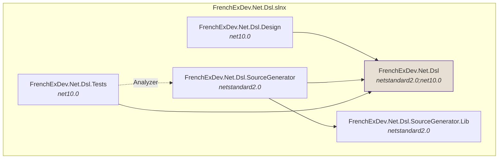
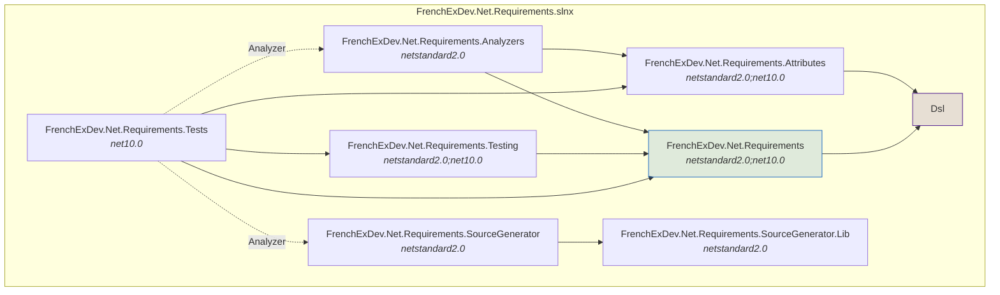
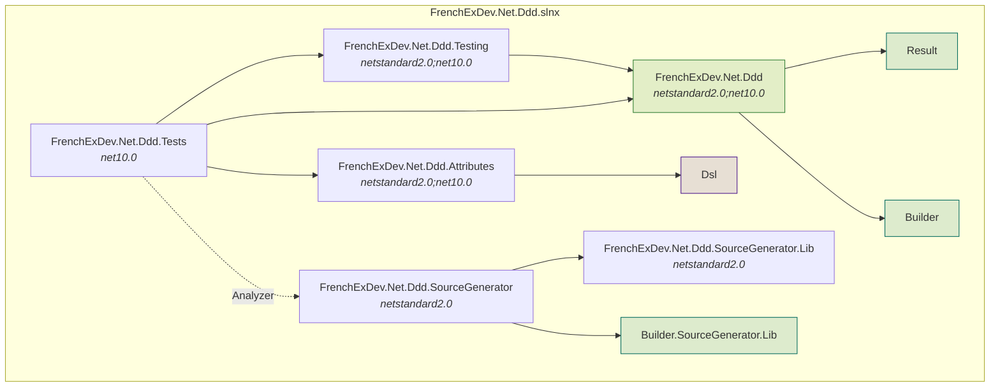
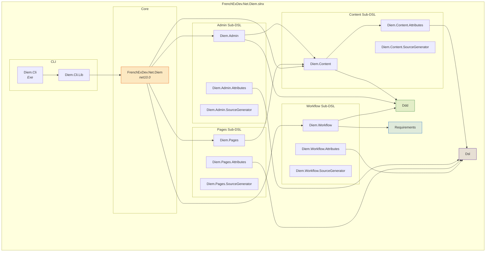
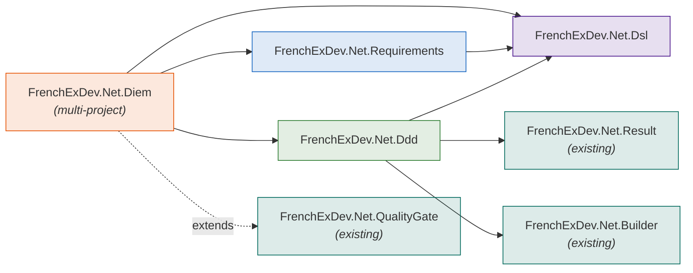

# Diem CMF — Implementation Plan

## Context

Recreate the Diem Content Management Framework in C# / .NET 10, based on the design specification in `C:\Users\serard\Documents\StephaneErard_FrenchExDev_Cv\content\blog\cmf\*.md`.

The original Diem (PHP/Symfony 1.4, 2010) was a CMF where `schema.yml` defined data models, `modules.yml` declared modules with components, and `dm:setup` generated everything: admin CRUD, front-end components, page tree. Pages = Layout → Areas → Zones → Widgets. Content, Admin, Pages, Workflow are all intrinsic to what a CMF is — they are **Diem's sub-DSLs**, not standalone concerns.

Independently reusable concerns become their own `FrenchExDev.Net` projects. Diem-specific sub-DSLs live inside the Diem solution.

---

## Project Map

All under `Net/FrenchExDev/`:

### Standalone Projects (own solution, own dir)

| Project | Solution Dir | What it is | Depends on |
|---------|-------------|------------|------------|
| **FrenchExDev.Net.Dsl** | `Dsl/` | DSL framework: M3 meta-metamodel + stage pipeline + constraint evaluation + .Design patterns | nothing |
| **FrenchExDev.Net.Requirements** | `Requirements/` | Feature tracking / Requirements DSL | Dsl |
| **FrenchExDev.Net.Ddd** | `Ddd/` | DDD DSL (aggregates, entities, CQRS, EF Core) | Dsl, Result, Builder |

### Diem CMF (multi-project solution with sub-DSLs)

| Project | Path in `Diem/src/` | What it is | Depends on |
|---------|-------------------|------------|------------|
| **FrenchExDev.Net.Diem** | `FrenchExDev.Net.Diem/` | CMF Lib — composition, DI, pipeline orchestration | Dsl, Ddd, Requirements |
| | **Content — Parts sub-DSL** | | |
| `Diem.Content.Parts` | `...Content.Parts/` | Parts runtime: ContentPartBase, part composition | Dsl, Ddd |
| `Diem.Content.Parts.Attributes` | `...Content.Parts.Attributes/` | [ContentPart], [PartField], [HasPart] | Dsl |
| `Diem.Content.Parts.SourceGenerator` | `...Content.Parts.SourceGenerator/` | Part → EF owned types, admin fields, API DTOs | — |
| `Diem.Content.Parts.Design` | `...Content.Parts.Design/` | `cmf new part` scaffolding | — |
| | **Content — Blocks sub-DSL** | | |
| `Diem.Content.Blocks` | `...Content.Blocks/` | Blocks runtime: IContentBlock, block base | Dsl |
| `Diem.Content.Blocks.Attributes` | `...Content.Blocks.Attributes/` | [StructBlock], [BlockField], [ListBlock], [StreamBlock] | Dsl |
| `Diem.Content.Blocks.SourceGenerator` | `...Content.Blocks.SourceGenerator/` | Block → JSON converter, Blazor renderer | — |
| `Diem.Content.Blocks.Design` | `...Content.Blocks.Design/` | `cmf new block` scaffolding | — |
| | **Content — StreamFields sub-DSL** | | |
| `Diem.Content.StreamFields` | `...Content.StreamFields/` | StreamField runtime: composition, ordering | Blocks |
| `Diem.Content.StreamFields.Attributes` | `...Content.StreamFields.Attributes/` | [StreamField(AllowedBlockTypes)] | Dsl, Blocks |
| `Diem.Content.StreamFields.SourceGenerator` | `...Content.StreamFields.SourceGenerator/` | JSON array column, type-discriminated converter | — |
| | **Admin — Lists sub-DSL** | | |
| `Diem.Admin.Lists` | `...Admin.Lists/` | List runtime: paging, sorting, filtering | Dsl, Ddd |
| `Diem.Admin.Lists.Attributes` | `...Admin.Lists.Attributes/` | [AdminModule], [AdminFilter] | Dsl |
| `Diem.Admin.Lists.SourceGenerator` | `...Admin.Lists.SourceGenerator/` | Blazor list page generation | — |
| | **Admin — Forms sub-DSL** | | |
| `Diem.Admin.Forms` | `...Admin.Forms/` | Form runtime: validation, nested editing | Dsl, Ddd, Parts |
| `Diem.Admin.Forms.Attributes` | `...Admin.Forms.Attributes/` | [AdminField] | Dsl |
| `Diem.Admin.Forms.SourceGenerator` | `...Admin.Forms.SourceGenerator/` | Blazor form page generation | — |
| | **Admin — Actions sub-DSL** | | |
| `Diem.Admin.Actions` | `...Admin.Actions/` | Batch action runtime | Dsl, Ddd |
| `Diem.Admin.Actions.Attributes` | `...Admin.Actions.Attributes/` | [AdminAction] | Dsl |
| `Diem.Admin.Actions.SourceGenerator` | `...Admin.Actions.SourceGenerator/` | Blazor batch action handlers | — |
| `Diem.Admin.Design` | `...Admin.Design/` | `cmf new admin-module` scaffolding | — |
| | **Pages — Widgets sub-DSL** | | |
| `Diem.Pages.Widgets` | `...Pages.Widgets/` | Widget runtime: catalog, config | Dsl |
| `Diem.Pages.Widgets.Attributes` | `...Pages.Widgets.Attributes/` | [PageWidget], [WidgetConfig] | Dsl |
| `Diem.Pages.Widgets.SourceGenerator` | `...Pages.Widgets.SourceGenerator/` | WidgetCatalog, config forms | — |
| `Diem.Pages.Widgets.Design` | `...Pages.Widgets.Design/` | `cmf new widget` scaffolding | — |
| | **Pages — Layouts sub-DSL** | | |
| `Diem.Pages.Layouts` | `...Pages.Layouts/` | Layout, Area, Zone entities + composition | Dsl |
| `Diem.Pages.Layouts.Attributes` | `...Pages.Layouts.Attributes/` | [Layout], [Area], [Zone] | Dsl |
| | **Pages — Routing sub-DSL** | | |
| `Diem.Pages.Routing` | `...Pages.Routing/` | PageRouter, materialized paths, SEO | Layouts |
| `Diem.Pages.Routing.Attributes` | `...Pages.Routing.Attributes/` | [BoundEntity], page binding | Dsl |
| `Diem.Pages.Design` | `...Pages.Design/` | `cmf new page` scaffolding | — |
| | **Workflow — StateMachine sub-DSL** | | |
| `Diem.Workflow.StateMachine` | `...Workflow.StateMachine/` | Stages, transitions, engine | Dsl, Ddd |
| `Diem.Workflow.StateMachine.Attributes` | `...Workflow.StateMachine.Attributes/` | [Workflow], [Stage], [Transition], [HasWorkflow] | Dsl |
| `Diem.Workflow.StateMachine.SourceGenerator` | `...Workflow.StateMachine.SourceGenerator/` | Stage enum, transition validator, engine | — |
| | **Workflow — Gates sub-DSL** | | |
| `Diem.Workflow.Gates` | `...Workflow.Gates/` | Gate evaluation runtime | Dsl, StateMachine |
| `Diem.Workflow.Gates.Attributes` | `...Workflow.Gates.Attributes/` | [Gate], [RequiresRole], [RequiresApproval] | Dsl |
| `Diem.Workflow.Gates.SourceGenerator` | `...Workflow.Gates.SourceGenerator/` | Gate evaluator generation | — |
| | **Workflow — Scheduling sub-DSL** | | |
| `Diem.Workflow.Scheduling` | `...Workflow.Scheduling/` | Timed transitions, BackgroundService | StateMachine |
| `Diem.Workflow.Scheduling.Attributes` | `...Workflow.Scheduling.Attributes/` | [ScheduledTransition] | Dsl |
| | **Workflow — Locales sub-DSL** | | |
| `Diem.Workflow.Locales` | `...Workflow.Locales/` | Per-locale progress tracking | StateMachine |
| `Diem.Workflow.Locales.Attributes` | `...Workflow.Locales.Attributes/` | [ForEachLocale] | Dsl |
| `Diem.Workflow.Design` | `...Workflow.Design/` | `cmf new workflow` scaffolding | — |
| **FrenchExDev.Net.Diem.Cli** | `FrenchExDev.Net.Diem.Cli/` | `cmf` CLI entry point (Exe, PackAsTool) | Cli.Lib |
| **FrenchExDev.Net.Diem.Cli.Lib** | `FrenchExDev.Net.Diem.Cli.Lib/` | CLI reusable features: TUI, scaffolding, templates | all Diem sub-DSLs |

### Existing Infrastructure (reused, not modified)

| Project | Solution Dir | Reused for |
|---------|-------------|------------|
| **FrenchExDev.Net.Result** | `Result/` | `[Invariant]` methods return `Result` |
| **FrenchExDev.Net.Builder** | `Builder/` | `AbstractBuilder<T>` + `BuilderEmitter` for entity builders |
| **FrenchExDev.Net.QualityGate** | `QualityGate/` | Extend with REQ4xx gates |

---

## Standard Standalone Project Structure

Each standalone project follows this pattern:

```
Net/FrenchExDev/{Name}/
  FrenchExDev.Net.{Name}.slnx
  README.md
  doc/
  src/
    FrenchExDev.Net.{Name}/                    ← runtime lib (netstandard2.0;net10.0)
    FrenchExDev.Net.{Name}.Attributes/         ← DSL attributes (netstandard2.0;net10.0)
    FrenchExDev.Net.{Name}.Design/             ← design-time helpers (optional)
    FrenchExDev.Net.{Name}.SourceGenerator/    ← Roslyn SG (netstandard2.0, IsRoslynComponent)
    FrenchExDev.Net.{Name}.SourceGenerator.Lib/← emission logic, no Roslyn dep (netstandard2.0)
    FrenchExDev.Net.{Name}.Testing/            ← test helpers (optional)
  test/
    FrenchExDev.Net.{Name}.Tests/              ← xUnit tests (net10.0)
```

## Diem Solution Structure

The Diem CMF is a multi-project solution with its own sub-DSLs:

```
Net/FrenchExDev/Diem/
  FrenchExDev.Net.Diem.slnx
  README.md
  doc/
  src/
    FrenchExDev.Net.Diem/                          ← CMF Lib (composition, DI, pipeline)
    FrenchExDev.Net.Diem.Content/                  ← Content sub-DSL runtime
    FrenchExDev.Net.Diem.Content.Attributes/       ← Content DSL attributes
    FrenchExDev.Net.Diem.Content.SourceGenerator/  ← Content SG
    FrenchExDev.Net.Diem.Admin/                    ← Admin sub-DSL runtime
    FrenchExDev.Net.Diem.Admin.Attributes/         ← Admin DSL attributes
    FrenchExDev.Net.Diem.Admin.SourceGenerator/    ← Admin SG
    FrenchExDev.Net.Diem.Pages/                    ← Pages sub-DSL runtime
    FrenchExDev.Net.Diem.Pages.Attributes/         ← Pages DSL attributes
    FrenchExDev.Net.Diem.Pages.SourceGenerator/    ← Pages SG
    FrenchExDev.Net.Diem.Workflow/                 ← Workflow sub-DSL runtime
    FrenchExDev.Net.Diem.Workflow.Attributes/      ← Workflow DSL attributes
    FrenchExDev.Net.Diem.Workflow.SourceGenerator/ ← Workflow SG
    FrenchExDev.Net.Diem.Cli/                      ← CLI entry point (Exe, PackAsTool)
    FrenchExDev.Net.Diem.Cli.Lib/                  ← CLI reusable features
  test/
    FrenchExDev.Net.Diem.Tests/                    ← Integration tests
    FrenchExDev.Net.Diem.Content.Tests/
    FrenchExDev.Net.Diem.Admin.Tests/
    FrenchExDev.Net.Diem.Pages.Tests/
    FrenchExDev.Net.Diem.Workflow.Tests/
    FrenchExDev.Net.Diem.Cli.Tests/
```

---

## Phase 0: Scaffolding

**Goal**: Create all project directories, .csproj files, .slnx files. `dotnet build` succeeds on each.

Create 4 solution directories: Dsl, Requirements, Ddd, Diem (Diem includes its sub-DSLs).

All inherit `Directory.Build.props` and `Directory.Packages.props` from `Net/FrenchExDev/`.

---

## Concrete Examples: M3 → M2 → M1 → M0 Through Every Layer

### Layer M3: `FrenchExDev.Net.Dsl` — The 5 Primitives (written once, never changes)

```csharp
// src/FrenchExDev.Net.Dsl/MetaConceptAttribute.cs
// M3 describes itself — this IS the fixed point
[AttributeUsage(AttributeTargets.Class, AllowMultiple = false)]
[MetaConcept("MetaConcept")] // ← I am a MetaConcept that describes MetaConcepts
public sealed class MetaConceptAttribute : Attribute
{
    public string Name { get; }
    public string? Description { get; set; }
    public MetaConceptAttribute(string name) => Name = name;
}
```

```csharp
// src/FrenchExDev.Net.Dsl/MetaPropertyAttribute.cs
[AttributeUsage(AttributeTargets.Property, AllowMultiple = false)]
[MetaConcept("MetaProperty")]
public sealed class MetaPropertyAttribute : Attribute
{
    public string Name { get; }
    public string Type { get; }
    public bool Required { get; set; }
    public MetaPropertyAttribute(string name, string type) { Name = name; Type = type; }
}
```

```csharp
// src/FrenchExDev.Net.Dsl/MetaConstraintAttribute.cs
// Constraints reference REAL C# methods — not string expressions
[AttributeUsage(AttributeTargets.Class, AllowMultiple = true)]
[MetaConcept("MetaConstraint")]
public sealed class MetaConstraintAttribute : Attribute
{
    public string Name { get; }
    public string ConstraintMethodName { get; }  // nameof(MyConstraint) — compiler-checked
    public string? Message { get; set; }
    public MetaConstraintAttribute(string name, string constraintMethodName) { Name = name; ConstraintMethodName = constraintMethodName; }
}
```

```csharp
// src/FrenchExDev.Net.Dsl/ConceptValidationContext.cs
// The model a constraint method receives — filled from Roslyn symbols (compile-time)
// or from reflection (design-time)
public sealed class ConceptValidationContext
{
    public string ConceptName { get; init; }
    public IReadOnlyList<ConceptPropertyInfo> Properties { get; init; }
    public IReadOnlyList<ConceptMethodInfo> Methods { get; init; }
    public IReadOnlyList<ConceptReferenceInfo> References { get; init; }
    public IReadOnlyList<string> SuperTypes { get; init; }
}

public sealed record ConceptPropertyInfo(string Name, string TypeName, IReadOnlyList<string> AttributeNames);
public sealed record ConceptMethodInfo(string Name, string ReturnTypeName, IReadOnlyList<string> AttributeNames);
public sealed record ConceptReferenceInfo(string Name, string TargetConcept, bool IsContainment);
```

```csharp
// src/FrenchExDev.Net.Dsl/ConstraintResult.cs
public readonly record struct ConstraintResult
{
    public bool IsSatisfied { get; }
    public string? Message { get; }
    private ConstraintResult(bool satisfied, string? message) { IsSatisfied = satisfied; Message = message; }
    public static ConstraintResult Satisfied() => new(true, null);
    public static ConstraintResult Failed(string message) => new(false, message);
}
```

```csharp
// src/FrenchExDev.Net.Dsl/MetaReferenceAttribute.cs
[AttributeUsage(AttributeTargets.Property, AllowMultiple = false)]
[MetaConcept("MetaReference")]
public sealed class MetaReferenceAttribute : Attribute
{
    public string Name { get; }
    public string TargetConcept { get; }
    public string Multiplicity { get; set; } = "0..*"; // "1", "0..1", "1..*", "0..*"
    public bool IsContainment { get; set; }
    public MetaReferenceAttribute(string name, string targetConcept) { Name = name; TargetConcept = targetConcept; }
}
```

```csharp
// src/FrenchExDev.Net.Dsl/MetaInheritsAttribute.cs
[AttributeUsage(AttributeTargets.Class, AllowMultiple = true)]
[MetaConcept("MetaInherits")]
public sealed class MetaInheritsAttribute : Attribute
{
    public string ParentConcept { get; }
    public MetaInheritsAttribute(string parentConcept) => ParentConcept = parentConcept;
}
```

#### Behavioral Metamodeling — Companion Concept Classes

An attribute is passive metadata. A companion class IS the concept with behavior. The attribute decorates M1 classes; the companion class participates in the pipeline.

```csharp
// src/FrenchExDev.Net.Dsl/MetaConcept.cs — THE behavioral base
// Every DSL concept inherits this. It's the Ecore EClass equivalent — a living object.
public abstract class MetaConcept
{
    public abstract string Name { get; }
    public abstract Type AttributeType { get; }  // links back to the attribute

    // ── Structural (derived from M3 attributes, overridable) ──
    public virtual IReadOnlyList<MetaPropertyDescriptor> Properties => [];
    public virtual IReadOnlyList<MetaReferenceDescriptor> References => [];
    public virtual IReadOnlyList<Type> SuperTypes => [];

    // ── Behavioral — what Ecore has that plain attributes lack ──
    public virtual bool IsSuperTypeOf(MetaConcept other) { /* walks inheritance */ }
    public virtual bool CanContain(MetaConcept child) { /* containment rules */ }

    // ── Validation (replaces static constraint methods) ──
    public virtual ConstraintResult Validate(ConceptValidationContext ctx)
    {
        // Default: runs all [MetaConstraint] methods via reflection
        // Override to add behavioral validation beyond declarative constraints
    }

    // ── Lifecycle gates — hooks into the SG pipeline ──
    public virtual void OnDiscovered(ConceptDiscoveryContext ctx) { }
    public virtual void OnBeforeValidation(ConceptValidationContext ctx) { }
    public virtual void OnAfterValidation(ConceptValidationContext ctx, ConstraintResult result) { }
    public virtual void OnBeforeEmit(EmitContext ctx) { }
    public virtual void OnAfterEmit(EmitContext ctx) { }
}
```

```csharp
// src/FrenchExDev.Net.Dsl/MetaConceptAttribute.cs — updated to link to companion
[AttributeUsage(AttributeTargets.Class, AllowMultiple = false)]
[MetaConcept(typeof(MetaConceptConcept))]  // ← typeof() links attribute to companion
public sealed class MetaConceptAttribute : Attribute
{
    public Type ConceptType { get; }       // the companion class
    public string? Description { get; set; }
    public MetaConceptAttribute(Type conceptType) => ConceptType = conceptType;
}
```

Now a DSL author creates BOTH an attribute AND a companion:

```csharp
// src/FrenchExDev.Net.Ddd.Attributes/AggregateRootAttribute.cs
[MetaConcept(typeof(AggregateRootConcept))]          // ← links to companion
[MetaInherits(typeof(EntityConcept))]                 // ← typeof, not string!
public sealed class AggregateRootAttribute : Attribute
{
    [MetaProperty("Name", "string", Required = true)]
    public string Name { get; set; }

    [MetaProperty("BoundedContext", "string")]
    public string? BoundedContext { get; set; }
}

// src/FrenchExDev.Net.Ddd.Attributes/AggregateRootConcept.cs — THE COMPANION
public sealed class AggregateRootConcept : MetaConcept
{
    public override string Name => "AggregateRoot";
    public override Type AttributeType => typeof(AggregateRootAttribute);
    public override IReadOnlyList<Type> SuperTypes => [typeof(EntityConcept)];

    // ── Behavioral validation — real C# logic, debuggable, testable ──
    public override ConstraintResult Validate(ConceptValidationContext ctx)
    {
        var results = new List<ConstraintResult>();

        // Must have [EntityId]
        if (!ctx.Properties.Any(p => p.AttributeNames.Contains("EntityId")))
            results.Add(ConstraintResult.Failed("Aggregate root must have an [EntityId] property"));

        // Should have at least one [Invariant]
        if (!ctx.Methods.Any(m => m.AttributeNames.Contains("Invariant")))
            results.Add(ConstraintResult.Failed("Aggregate should have at least one [Invariant]"));

        return ConstraintResult.Aggregate(results);
    }

    // ── Containment rules — what can live inside this aggregate ──
    public override bool CanContain(MetaConcept child)
        => child is EntityConcept or ValueObjectConcept;  // only entities and VOs

    // ── Lifecycle gates — hook into the SG pipeline ──
    public override void OnDiscovered(ConceptDiscoveryContext ctx)
    {
        // Called when the SG finds [AggregateRoot] on a class
        // Can register the aggregate in a cross-cutting context
        ctx.RegisterAggregate(ctx.TypeName, ctx.BoundedContext);
    }

    public override void OnBeforeEmit(EmitContext ctx)
    {
        // Called before code generation. Can modify the emit plan.
        // E.g., inject domain event collection if not already present
        if (!ctx.HasField("_domainEvents"))
            ctx.AddField("private readonly List<IDomainEvent> _domainEvents = new();");
    }
}
```

**The same pattern for every DSL concept:**

```csharp
// Content sub-DSL
[MetaConcept(typeof(ContentPartConcept))]
public sealed class ContentPartAttribute : Attribute { ... }

public sealed class ContentPartConcept : MetaConcept
{
    public override ConstraintResult Validate(ConceptValidationContext ctx)
        => ctx.Properties.Any(p => p.AttributeNames.Contains("PartField"))
            ? ConstraintResult.Satisfied()
            : ConstraintResult.Failed("Content part must have at least one [PartField]");

    public override void OnBeforeEmit(EmitContext ctx)
    {
        // Auto-inject JSON serialization attributes on the part class
        ctx.AddClassAttribute("[JsonDerivedType(typeof({TypeName}), \"{Name}\")]");
    }
}
```

```csharp
// Workflow sub-DSL
[MetaConcept(typeof(WorkflowConcept))]
public sealed class WorkflowAttribute : Attribute { ... }

public sealed class WorkflowConcept : MetaConcept
{
    public override ConstraintResult Validate(ConceptValidationContext ctx)
    {
        var stages = ctx.ClassAttributes.Where(a => a.Name == "Stage").ToList();
        if (stages.Count < 2)
            return ConstraintResult.Failed("Workflow must have at least two stages");

        var hasInitial = stages.Any(s => s.Properties.GetValueOrDefault("IsInitial") == "true");
        if (!hasInitial)
            return ConstraintResult.Failed("Workflow must have exactly one initial stage");

        return ConstraintResult.Satisfied();
    }

    public override void OnAfterValidation(ConceptValidationContext ctx, ConstraintResult result)
    {
        if (result.IsSatisfied)
        {
            // Register workflow in the pipeline for Stage 3 cross-cutting generation
            ctx.Pipeline.RegisterWorkflow(ctx.TypeName, ctx.GetStages(), ctx.GetTransitions());
        }
    }
}
```

**What this changes:**

| Before (attribute-only) | After (attribute + companion) |
|---|---|
| `[MetaConcept("AggregateRoot")]` — string name | `[MetaConcept(typeof(AggregateRootConcept))]` — typeof, compiler-checked |
| `[MetaInherits("Entity")]` — string reference | `[MetaInherits(typeof(EntityConcept))]` — typeof, refactor-safe |
| Static constraint methods on attribute class | `Validate()` override on companion — full OOP |
| No lifecycle hooks | `OnDiscovered`, `OnBeforeValidation`, `OnBeforeEmit`, `OnAfterEmit` |
| No containment rules | `CanContain(MetaConcept child)` — behavioral |
| MetamodelRegistry stores descriptors | MetamodelRegistry stores **live MetaConcept instances** |

**The MetamodelRegistry becomes behavioral:**

```csharp
// Generated: MetamodelRegistry.g.cs
public static class MetamodelRegistry
{
    // Live concept instances — not just data, they have behavior
    public static IReadOnlyDictionary<string, MetaConcept> Concepts { get; } =
        new Dictionary<string, MetaConcept>
        {
            ["AggregateRoot"] = new AggregateRootConcept(),
            ["Entity"] = new EntityConcept(),
            ["ValueObject"] = new ValueObjectConcept(),
            ["ContentPart"] = new ContentPartConcept(),
            ["Workflow"] = new WorkflowConcept(),
            // ...
        };

    // Behavioral queries — powered by the live objects
    public static bool IsSuperTypeOf(string concept, string other)
        => Concepts[concept].IsSuperTypeOf(Concepts[other]);

    public static bool CanContain(string parent, string child)
        => Concepts[parent].CanContain(Concepts[child]);
}
```

**The SG pipeline uses lifecycle gates:**

```
Stage 0: Discovery
  → For each [MetaConcept]-decorated class found by SG:
    → Instantiate companion: new AggregateRootConcept()
    → Call concept.OnDiscovered(ctx)
    → Register in MetamodelRegistry

Stage 1: Validation
  → For each M1 class with DSL attributes:
    → concept.OnBeforeValidation(ctx)
    → result = concept.Validate(ctx)
    → concept.OnAfterValidation(ctx, result)
    → If failed: emit Roslyn diagnostic

Stage 2-3: Generation
  → concept.OnBeforeEmit(ctx)
  → SG generates entity/builder/EF/etc.
  → concept.OnAfterEmit(ctx)
```

This is the **Ecore EClass equivalent**: MetaConcept instances are live objects in the MetamodelRegistry, carrying validation behavior, containment rules, and lifecycle hooks. The SG pipeline invokes them at each stage.

---

#### Ecore Compatibility — Proving Our M3 Equals EMOF

Ecore (Eclipse Modeling Framework, Java) implements OMG's Essential MOF. Our Dsl M3 maps 1:1:

| Ecore (Java/EMOF) | Dsl M3 (C#) | Role |
|---|---|---|
| `EClass` | `[MetaConcept]` | Declares a modeling concept |
| `EAttribute` (name, type, required, defaultValue) | `[MetaProperty]` | Typed data slot on a concept |
| `EReference` (containment, multiplicity, opposite) | `[MetaReference]` | Directed association between concepts |
| OCL constraints / `EAnnotation` | `[MetaConstraint]` | Validation rules |
| `eSuperTypes` | `[MetaInherits]` | Metamodel inheritance |
| `EPackage` | C# namespace | Grouping/namespace |
| `EEnum` / `EEnumLiteral` | C# `enum` | Enumeration (native) |
| `EOperation` / `EParameter` | C# methods | Behavioral (native) |
| `EDataType` | C# types (`string`, `int`, `bool`) | Primitive types (native) |

We can **describe Ecore itself** as a DSL using our M3:

```csharp
// FrenchExDev.Net.Dsl.Ecore — Ecore described using our M3 (validation exercise)
// This proves our M3 is at least as expressive as EMOF

[MetaConcept("EModelElement")]
public sealed class EModelElementAttribute : Attribute { }

[MetaConcept("ENamedElement")]
[MetaInherits("EModelElement")]
public sealed class ENamedElementAttribute : Attribute
{
    [MetaProperty("Name", "string", Required = true)]
    public string Name { get; set; }
}

[MetaConcept("EClassifier")]
[MetaInherits("ENamedElement")]
public sealed class EClassifierAttribute : Attribute
{
    [MetaProperty("InstanceTypeName", "string")]
    public string? InstanceTypeName { get; set; }
}

[MetaConcept("EClass")]
[MetaInherits("EClassifier")]
public sealed class EClassAttribute : Attribute
{
    [MetaProperty("Abstract", "bool")]
    public bool Abstract { get; set; }

    [MetaProperty("Interface", "bool")]
    public bool Interface { get; set; }

    [MetaReference("ESuperTypes", "EClass", Multiplicity = "0..*")]
    public Type[]? ESuperTypes { get; set; }

    [MetaReference("EStructuralFeatures", "EStructuralFeature", Multiplicity = "0..*", IsContainment = true)]
    public Type[]? EStructuralFeatures { get; set; }

    [MetaReference("EOperations", "EOperation", Multiplicity = "0..*", IsContainment = true)]
    public Type[]? EOperations { get; set; }
}

[MetaConcept("EStructuralFeature")]
[MetaInherits("ETypedElement")]
public sealed class EStructuralFeatureAttribute : Attribute
{
    [MetaProperty("Changeable", "bool")]
    public bool Changeable { get; set; } = true;

    [MetaProperty("Derived", "bool")]
    public bool Derived { get; set; }
}

[MetaConcept("EAttribute")]
[MetaInherits("EStructuralFeature")]
public sealed class EAttributeAttribute : Attribute
{
    [MetaProperty("ID", "bool")]
    public bool ID { get; set; }
}

[MetaConcept("EReference")]
[MetaInherits("EStructuralFeature")]
public sealed class EReferenceAttribute : Attribute
{
    [MetaProperty("Containment", "bool")]
    public bool Containment { get; set; }

    [MetaProperty("ResolveProxies", "bool")]
    public bool ResolveProxies { get; set; } = true;

    [MetaReference("EOpposite", "EReference", Multiplicity = "0..1")]
    public Type? EOpposite { get; set; }
}
```

This means:
- **Our M3 can describe Ecore** → validates expressiveness
- **Ecore models could be imported** → potential XMI/Ecore interop
- The MetamodelRegistry auto-discovers Ecore concepts just like any other DSL

Whether to ship this as `FrenchExDev.Net.Dsl.Ecore` (interop package) or keep it as a validation test in `Dsl.Tests` is a decision for later. The key insight: **our 5 M3 primitives are equivalent to EMOF**.

**Generated by Dsl.SourceGenerator (Stage 0):**

```csharp
// Generated: MetamodelRegistry.g.cs — auto-discovers all [MetaConcept]-decorated classes
public static class MetamodelRegistry
{
    public static IReadOnlyDictionary<string, ConceptDescriptor> Concepts { get; } = new Dictionary<string, ConceptDescriptor>
    {
        ["MetaConcept"] = new("MetaConcept", typeof(MetaConceptAttribute), ...),
        ["MetaProperty"] = new("MetaProperty", typeof(MetaPropertyAttribute), ...),
        // + every M2 concept from every DSL that references Dsl
    };
}
```

---

### Layer M2: DSL Authors Use M3 to Define Their Concepts

#### M2 in `FrenchExDev.Net.Ddd.Attributes` — DDD DSL defines its concepts

```csharp
// src/FrenchExDev.Net.Ddd.Attributes/AggregateRootAttribute.cs
// This IS M2: a new concept defined using M3 primitives
[MetaConcept("AggregateRoot")]                                          // ← M3: I am a concept
[MetaInherits("Entity")]                                                 // ← M3: I inherit from Entity
[MetaConstraint("MustHaveId", nameof(MustHaveIdConstraint),              // ← M3: constraint = real method
    Message = "Aggregate root must have an [EntityId] property")]
[MetaConstraint("MustHaveInvariant", nameof(MustHaveInvariantConstraint),
    Message = "Aggregate should have at least one [Invariant]")]
public sealed class AggregateRootAttribute : Attribute
{
    [MetaProperty("Name", "string", Required = true)]                    // ← M3: typed property
    public string Name { get; set; }

    [MetaProperty("BoundedContext", "string")]
    public string? BoundedContext { get; set; }

    // Constraint methods — real C#, debuggable, testable, IDE-navigable
    public static ConstraintResult MustHaveIdConstraint(ConceptValidationContext ctx)
        => ctx.Properties.Any(p => p.AttributeNames.Contains("EntityId"))
            ? ConstraintResult.Satisfied()
            : ConstraintResult.Failed("Aggregate root must have an [EntityId] property");

    public static ConstraintResult MustHaveInvariantConstraint(ConceptValidationContext ctx)
        => ctx.Methods.Any(m => m.AttributeNames.Contains("Invariant"))
            ? ConstraintResult.Satisfied()
            : ConstraintResult.Failed("Aggregate should have at least one [Invariant] method");
}
```

```csharp
// src/FrenchExDev.Net.Ddd.Attributes/CompositionAttribute.cs
[MetaConcept("Composition")]
[MetaReference("Target", "Entity", IsContainment = true)]          // ← M3: directed association
public sealed class CompositionAttribute : Attribute { }
```

```csharp
// src/FrenchExDev.Net.Ddd.Attributes/InvariantAttribute.cs
[MetaConcept("Invariant")]
public sealed class InvariantAttribute : Attribute
{
    [MetaProperty("Description", "string", Required = true)]
    public string Description { get; }
    public InvariantAttribute(string description) => Description = description;
}
```

#### M2 in `FrenchExDev.Net.Requirements.Attributes` — Requirements DSL

```csharp
// src/FrenchExDev.Net.Requirements.Attributes/ForRequirementAttribute.cs
[MetaConcept("ForRequirement")]
public sealed class ForRequirementAttribute : Attribute
{
    [MetaProperty("RequirementType", "Type", Required = true)]
    public Type RequirementType { get; }

    [MetaProperty("AcceptanceCriterion", "string")]
    public string? AcceptanceCriterion { get; }

    public ForRequirementAttribute(Type requirementType, string? acceptanceCriterion = null)
    { RequirementType = requirementType; AcceptanceCriterion = acceptanceCriterion; }
}
```

#### M2 in `FrenchExDev.Net.Diem.Content.Attributes` — Diem Content sub-DSL

```csharp
// src/FrenchExDev.Net.Diem.Content.Attributes/ContentPartAttribute.cs
[MetaConcept("ContentPart")]
[MetaConstraint("MustHaveField", nameof(MustHaveFieldConstraint),
    Message = "Content part must have at least one [PartField]")]
public sealed class ContentPartAttribute : Attribute
{
    [MetaProperty("Name", "string", Required = true)]
    public string Name { get; set; }

    public static ConstraintResult MustHaveFieldConstraint(ConceptValidationContext ctx)
        => ctx.Properties.Any(p => p.AttributeNames.Contains("PartField"))
            ? ConstraintResult.Satisfied()
            : ConstraintResult.Failed("Content part must have at least one [PartField]");
}
```

```csharp
// src/FrenchExDev.Net.Diem.Workflow.Attributes/WorkflowAttribute.cs
[MetaConcept("Workflow")]
[MetaConstraint("MustHaveTwoStages", nameof(MustHaveTwoStagesConstraint),
    Message = "Workflow must have at least two stages")]
public sealed class WorkflowAttribute : Attribute
{
    [MetaProperty("Name", "string", Required = true)]
    public string Name { get; }
    public WorkflowAttribute(string name) => Name = name;

    public static ConstraintResult MustHaveTwoStagesConstraint(ConceptValidationContext ctx)
        => ctx.Properties.Count(p => p.AttributeNames.Contains("Stage")) >= 2
            ? ConstraintResult.Satisfied()
            : ConstraintResult.Failed("Workflow must have at least two stages");
}
```

**At this point, MetamodelRegistry auto-discovers ALL concepts from ALL DSLs:**

```csharp
// Generated: MetamodelRegistry.g.cs (updated with every new DSL)
MetamodelRegistry.Concepts = {
    // M3 (self)
    ["MetaConcept"] = ..., ["MetaProperty"] = ..., ["MetaConstraint"] = ...,
    // DDD DSL (M2)
    ["AggregateRoot"] = ..., ["Entity"] = ..., ["ValueObject"] = ...,
    ["Composition"] = ..., ["Invariant"] = ..., ["Command"] = ...,
    // Requirements DSL (M2)
    ["ForRequirement"] = ..., ["Verifies"] = ..., ["TestsFor"] = ...,
    // Diem Content sub-DSL (M2)
    ["ContentPart"] = ..., ["StructBlock"] = ..., ["StreamField"] = ...,
    // Diem Workflow sub-DSL (M2)
    ["Workflow"] = ..., ["Stage"] = ..., ["Transition"] = ..., ["Gate"] = ...,
    // ... all concepts from all DSLs
};
```

---

### Layer M1: Application Developer Uses M2 DSL Attributes on Their Classes

This is what a developer writes when building their e-commerce store using Diem.

#### M1 — Domain model (`MyStore.Lib/Ordering/Order.cs`)

```csharp
// ~120 lines written by the developer. Uses DDD DSL (M2) attributes.
[AggregateRoot("Order", BoundedContext = "Ordering")]      // ← M2: DDD DSL
public partial class Order
{
    [EntityId]                                               // ← M2
    public partial OrderId Id { get; }

    [Property("OrderDate", Required = true)]                 // ← M2
    public partial DateTime OrderDate { get; }

    [Composition]                                            // ← M2
    public partial IReadOnlyList<OrderLine> Lines { get; }

    [Composition]                                            // ← M2
    public partial ShippingAddress ShippingAddress { get; }

    [Invariant("Order must have at least one line")]         // ← M2
    private Result HasLines()
        => Lines.Count > 0 ? Result.Success() : Result.Failure("Need at least one line");
}
```

**Generated by Ddd.SourceGenerator (Stages 1-2) — ~1,000 lines:**

```csharp
// Generated: Order.g.cs — entity implementation
public partial class Order
{
    private OrderId _id;
    private DateTime _orderDate;
    private readonly List<OrderLine> _lines = new();
    private ShippingAddress? _shippingAddress;
    public partial OrderId Id => _id;
    public partial IReadOnlyList<OrderLine> Lines => _lines.AsReadOnly();
    // ...
}

// Generated: Order.Invariants.g.cs
public partial class Order
{
    public Result EnsureInvariants() => Result.Aggregate(HasLines());
}

// Generated: OrderBuilder.g.cs — via BuilderEmitter.Emit()
public class OrderBuilder : AbstractBuilder<Order> { /* With*() methods, validation, build */ }

// Generated: OrderConfiguration.g.cs — EF Core
public class OrderEntityTypeConfiguration : IEntityTypeConfiguration<Order> { /* keys, owned types */ }

// Generated: IOrderRepository.g.cs + OrderRepository.g.cs
```

#### M1 — Content model (`MyStore.Lib/Content/BlogPost.cs`)

```csharp
// Uses DDD DSL + Diem Content sub-DSL + Diem Workflow sub-DSL
[AggregateRoot("BlogPost", BoundedContext = "Content")]
[HasPart(typeof(RoutablePart))]                              // ← M2: Content sub-DSL
[HasPart(typeof(SeoablePart))]
[HasPart(typeof(VersionablePart))]
[HasWorkflow("Editorial")]                                   // ← M2: Workflow sub-DSL
public partial class BlogPost
{
    [EntityId] public partial BlogPostId Id { get; }
    [Property("Title", Required = true)] public partial string Title { get; }

    [StreamField("Body", AllowedBlockTypes = new[]           // ← M2: Content sub-DSL
    { typeof(HeroBlock), typeof(RichTextBlock), typeof(ImageBlock) })]
    public partial IReadOnlyList<IContentBlock> Body { get; }
}
```

#### M1 — Admin module (`MyStore.Admin/ProductsAdmin.cs`)

```csharp
// Uses Diem Admin sub-DSL — one attribute, entire CRUD generated
[AdminModule("Products", typeof(Product), Icon = "box", Group = "Catalog")]
[AdminFilter("Category", FilterType = "Dropdown")]           // ← M2: Admin sub-DSL
[AdminFilter("IsActive", FilterType = "Boolean")]
[AdminAction("Publish", Command = "PublishProduct", RequiresRole = "Editor")]
public partial class ProductsAdminModule { }
```

**Generated: list page + form page + detail page + navigation (~700 lines)**

#### M1 — Page widget (`MyStore.Client/Widgets/ProductListWidget.cs`)

```csharp
// Uses Diem Pages sub-DSL
[PageWidget("ProductList", Module = "Product", Icon = "grid")]  // ← M2: Pages sub-DSL
public partial class ProductListWidget : ComponentBase
{
    [WidgetConfig(DisplayName = "Category")] public string? Category { get; set; }
    [WidgetConfig(DisplayName = "Page Size")] public int PageSize { get; set; } = 12;
}
```

**Generated: WidgetCatalog entry + admin config form**

#### M1 — Editorial workflow (`MyStore.Lib/Workflows/EditorialWorkflow.cs`)

```csharp
// Uses Diem Workflow sub-DSL — ~30 lines of attributes
[Workflow("Editorial")]
[Stage("Draft", IsInitial = true)]
[Stage("Review")][Stage("Published", IsFinal = true)]
[Transition("Submit", From = "Draft", To = "Review")]
[Transition("Approve", From = "Review", To = "Published")]
[RequiresRole("Submit", Role = "Author")]
[RequiresRole("Approve", Role = "Editor")]
public partial class EditorialWorkflow { }
```

**Generated: stage enum + transition validator + gate evaluator + engine (~500 lines)**

#### M1 — Requirements (`MyStore.Requirements/Features/OrderFeature.cs`)

```csharp
// Uses Requirements DSL
public abstract record OrderFulfillmentFeature : Feature<DomainModelingEpic>
{
    public override string Title => "Order fulfillment";
    public override RequirementPriority Priority => RequirementPriority.Critical;
    public override string Owner => "ordering-team";

    public abstract AcceptanceCriterionResult OrderCanBePlaced(UserId customer, ProductId product, int qty);
    public abstract AcceptanceCriterionResult OrderCanBeCancelled(UserId customer, OrderId order);
}
```

**Generated: RequirementRegistry entry + TraceabilityMatrix linking to specs/impl/tests**

---

### Layer M0: Runtime Instances (the running application)

```csharp
// M0 = runtime data created by the running application
var order = new OrderBuilder()
    .WithOrderDate(DateTime.UtcNow)
    .AddLine(new OrderLineBuilder().WithProductName("Laptop").WithQuantity(2).Build().Value)
    .Build();  // ← calls EnsureInvariants() internally

// order.Id = OrderId(3f2a...), order.Lines.Count = 1, order.OrderDate = 2026-03-20
// This is M0: concrete instances of M1 models, validated by M2 constraints
```

---

### The Diem Customization Model — From PHP to C#

The original Diem PHP had a 6-layer inheritance chain with 2 developer customization stubs:

```
articleComponents                        ← Developer's code (YOUR module)
  └ myFrontModuleComponents              ← Empty stub, created once (YOUR module-level hook)
    └ dmFrontModuleComponents            ← Diem's module logic (getShowQuery, getListQuery, getPager)
      └ myFrontBaseComponents            ← Empty stub, created once (YOUR cross-cutting hook)
        └ dmFrontBaseComponents          ← Diem front-specific
          └ dmBaseComponents             ← Diem core (services, routing, helpers)
            └ sfComponents               ← Symfony framework
```

**The C# equivalent** uses `partial class` + `virtual` + source generation:

```csharp
// ═══════════════════════════════════════════════════════════
// LAYER 1: Framework base (shipped in FrenchExDev.Net.Diem)
// Equivalent to: sfComponents → dmBaseComponents
// ═══════════════════════════════════════════════════════════

// src/FrenchExDev.Net.Diem/DiemComponentBase.cs
public abstract class DiemComponentBase
{
    protected IServiceProvider Services { get; }
    protected ILogger Logger { get; }
    // Core framework plumbing — the C# sfComponents equivalent
}

// ═══════════════════════════════════════════════════════════
// LAYER 2: Front module base (shipped in FrenchExDev.Net.Diem.Pages)
// Equivalent to: dmFrontBaseComponents → dmFrontModuleComponents
// ═══════════════════════════════════════════════════════════

// src/FrenchExDev.Net.Diem.Pages/DiemFrontModuleBase.cs
public abstract class DiemFrontModuleBase<TEntity> : DiemComponentBase
    where TEntity : class
{
    // Built-in behaviors the developer inherits — override any of these
    protected virtual IQueryable<TEntity> GetShowQuery() { /* finds by page record */ }
    protected virtual IQueryable<TEntity> GetListQuery() { /* active records, ordered */ }
    protected virtual IPager<TEntity> GetPager(IQueryable<TEntity> query, int page, int perPage) { /* pagination */ }
    protected virtual IQueryable<TEntity> ApplyFilters(IQueryable<TEntity> query) { /* filter chain */ }
    protected virtual IQueryable<TEntity> ApplyOrdering(IQueryable<TEntity> query) { /* ordering */ }
}

// ═══════════════════════════════════════════════════════════
// LAYER 3: Generated partial class (regenerated every build)
// Equivalent to: myFrontModuleComponents (the generated layer)
// Source generator reads [AggregateRoot] + modules.yml equivalent
// ═══════════════════════════════════════════════════════════

// Generated: ArticleComponents.g.cs — NEVER hand-edit, regenerated every build
public partial class ArticleComponents : DiemFrontModuleBase<Article>
{
    // Generated: module-specific query (applies module filters from DSL declaration)
    protected override IQueryable<Article> GetListQuery()
    {
        var query = base.GetListQuery();
        query = query.Where(a => a.IsActive);  // from schema
        return query;
    }

    // Generated: default ExecuteList with ordering, paging, filters
    public virtual async Task<ArticleListViewModel> ExecuteListAsync(
        string orderField = "Position", string orderType = "asc",
        int maxPerPage = 10, int page = 1)
    {
        var query = GetListQuery();
        query = ApplyOrdering(query);
        query = ApplyFilters(query);
        query = OnCustomizeListQuery(query);    // ← hook for developer
        var pager = GetPager(query, page, maxPerPage);
        return new ArticleListViewModel(pager);
    }

    // Generated: default ExecuteShow
    public virtual async Task<Article?> ExecuteShowAsync()
    {
        var query = GetShowQuery();
        query = OnCustomizeShowQuery(query);    // ← hook for developer
        return await query.FirstOrDefaultAsync();
    }

    // Generated: partial method hooks — developer implements ONLY what they need
    protected virtual IQueryable<Article> OnCustomizeListQuery(IQueryable<Article> query) => query;
    protected virtual IQueryable<Article> OnCustomizeShowQuery(IQueryable<Article> query) => query;
    protected virtual void OnListExecuted(IPager<Article> pager) { }
    protected virtual void OnShowExecuted(Article article) { }
}

// ═══════════════════════════════════════════════════════════
// LAYER 4: Developer's partial class (created once as stub, NEVER overwritten)
// Equivalent to: articleComponents
// The developer overrides only what they need to customize
// ═══════════════════════════════════════════════════════════

// apps/front/modules/article/ArticleComponents.cs — created once by scaffolding
public partial class ArticleComponents
{
    // Override the generated list to add custom filtering
    protected override IQueryable<Article> OnCustomizeListQuery(IQueryable<Article> query)
    {
        // Only show articles by current author in "my articles" view
        if (ShowOnlyMine)
            query = query.Where(a => a.AuthorId == CurrentUserId);
        return query;
    }

    // Or override the entire ExecuteList if you need full control
    public override async Task<ArticleListViewModel> ExecuteListAsync(
        string orderField = "Position", string orderType = "asc",
        int maxPerPage = 10, int page = 1)
    {
        // Completely custom logic — still has access to all base class helpers
        var featured = await GetListQuery()
            .Where(a => a.IsFeatured)
            .Take(3)
            .ToListAsync();

        var regular = await base.ExecuteListAsync(orderField, orderType, maxPerPage, page);
        regular.FeaturedArticles = featured;
        return regular;
    }
}
```

**The key C# mechanisms:**

| Diem PHP | C# Equivalent | Developer experience |
|----------|--------------|---------------------|
| Empty `my*` stub class | `partial class` file (created once, never overwritten) | Developer adds code alongside generated code |
| `extends` chain with overridable methods | `virtual`/`override` methods | Developer overrides only what they need |
| PHP method resolution order | C#'s single inheritance + `base.Method()` | Clear, debuggable chain |
| `dm:setup` regeneration | Roslyn source generator (every build) | No manual regeneration step |
| Generator creates files only if missing | SG emits `.g.cs` (always regenerated) + scaffold creates stub (once) | Clean separation of generated vs. authored |

**The scaffolding flow:**

```
1. Developer declares module:
   [AdminModule("Articles", typeof(Article))]
   public partial class ArticleAdminModule { }     ← developer's file (Layer 4)

2. Source generator emits:
   ArticleAdminModule.g.cs                          ← generated file (Layer 3)
     - inherits DiemAdminModuleBase<Article>         ← framework (Layer 2)
       - inherits DiemComponentBase                  ← framework (Layer 1)

3. Developer customizes by adding to their partial class:
   public partial class ArticleAdminModule
   {
       protected override IQueryable<Article> OnCustomizeListQuery(...) => ...;
   }
```

**Same model for every sub-DSL:**

| Sub-DSL | Base class (Layer 2) | Generated (Layer 3) | Developer (Layer 4) |
|---------|---------------------|---------------------|---------------------|
| **Admin** | `DiemAdminModuleBase<T>` | `ProductAdminModule.g.cs` | `ProductAdminModule.cs` |
| **Pages** | `DiemFrontModuleBase<T>` | `ArticleComponents.g.cs` | `ArticleComponents.cs` |
| **Content** | `DiemContentPartBase` | `RoutablePart.g.cs` | — (built-in, or custom parts) |
| **Workflow** | `DiemWorkflowBase` | `EditorialWorkflow.g.cs` | `EditorialWorkflow.cs` |

---

### The Complete Chain

```
M3 (Dsl)        [MetaConcept("AggregateRoot")]         — defines what "AggregateRoot" means
    ↓
M2 (Ddd)        public sealed class AggregateRootAttribute  — the DDD DSL attribute
    ↓
M1 (MyStore)    [AggregateRoot("Order")] public partial class Order  — developer's model
    ↓
M0 (Runtime)    order.Total = 1500, order.Lines.Count = 3  — live data
```

---

### What a Developer Gets When Building "MyStore" with Diem

The developer references these NuGet packages:
- `FrenchExDev.Net.Diem` (pulls in all sub-DSLs + Ddd + Dsl + Requirements)

Then writes:

| What they write | Lines | What the compiler generates | Lines |
|----------------|-------|---------------------------|-------|
| Order aggregate + entities + VOs | ~120 | Entity impls, builders, EF config, repos, API controllers | ~2,000 |
| BlogPost with parts + StreamField | ~50 | JSON converters, admin fields, API DTOs, Blazor renderers | ~1,400 |
| 3 `[AdminModule]` declarations | ~30 | List pages, form pages, detail pages, nav entries | ~2,400 |
| Page widgets (ProductList, etc.) | ~40 | WidgetCatalog, config forms, page router | ~800 |
| Editorial workflow | ~30 | State machine, gates, events, locale tracker | ~500 |
| Requirements (1 feature, 3 ACs) | ~18 | Registry, traceability matrix | ~130 |
| Specs + impl + tests | ~170 | — (hand-written) | — |
| **Total** | **~460** | | **~7,200** |

The developer writes the **what** (domain, content, requirements). The compiler writes the **how** (persistence, API, admin, routing, workflows, traceability).

---

## Phase 1: Dsl — DSL Framework (M3 Meta-Metamodel)

`Net/FrenchExDev/Dsl/FrenchExDev.Net.Dsl.slnx`

### Sub-projects

| Project | TFM | Role |
|---------|-----|------|
| `FrenchExDev.Net.Dsl` | `netstandard2.0;net10.0` | 5 M3 attributes + runtime descriptors + stage pipeline infrastructure |
| `FrenchExDev.Net.Dsl.Design` | `net10.0` | Design-time helpers: constraint evaluator, stage pipeline orchestration, .Design CLI patterns (like BinaryWrapper.Design) |
| `FrenchExDev.Net.Dsl.SourceGenerator` | `netstandard2.0` | Stage 0: MetamodelRegistry SG |
| `FrenchExDev.Net.Dsl.SourceGenerator.Lib` | `netstandard2.0` | Emission logic (no Roslyn dep) |
| `FrenchExDev.Net.Dsl.Tests` | `net10.0` | Tests |

### What it contains

**5 self-describing M3 attributes** (Part III of spec):
- `MetaConceptAttribute(string name)` — `[MetaConcept("MetaConcept")]` on itself
- `MetaPropertyAttribute(string name, string type)` — `Required`, `DefaultValue`
- `MetaReferenceAttribute(string name, string targetConcept)` — `Multiplicity`, `IsContainment`
- `MetaConstraintAttribute(string name, string expression)` — `Message`, `Severity`
- `MetaInheritsAttribute(string parentConcept)` — metamodel inheritance

**Runtime descriptors:**
- `ConceptDescriptor`, `PropertyDescriptor`, `ConstraintDescriptor`

**Stage pipeline infrastructure:**
- Stage enum: `DslStage { MetamodelRegistration, Validation, CoreGeneration, CrossCutting, Traceability }`
- `IDslStageHandler` interface for pluggable stage processing

**Stage 0 SG** (`IIncrementalGenerator`):
- Scans `[MetaConcept]`-decorated classes
- Emits `MetamodelRegistry.g.cs` — `IReadOnlyDictionary<string, ConceptDescriptor>`

**Dsl.Design** — Design-time tooling for DSL authors:
- `MetaConstraintEvaluator` — evaluates constraint expressions against models
- Stage pipeline orchestration helpers
- Reusable .Design CLI patterns (interactive scrapers/designers, following BinaryWrapper.Design and GitLab.Cli.Design patterns)
- `IDslDesigner` interface for building interactive DSL design sessions
- Spectre.Console helpers for DSL-aware TUI components

**Tests:**
- Self-description (MetaConcept IS a MetaConcept)
- SG: define test DSL attributes, verify generated registry
- Adding a new concept automatically registers it
- Constraint evaluation tests

---

## Phase 2: Requirements — Feature Tracking DSL

`Net/FrenchExDev/Requirements/FrenchExDev.Net.Requirements.slnx`

### Dependencies

- `FrenchExDev.Net.Dsl` (Requirements IS a DSL — its attributes are `[MetaConcept]`-decorated)

### Sub-projects

| Project | TFM | Role |
|---------|-----|------|
| `FrenchExDev.Net.Requirements` | `netstandard2.0;net10.0` | Base types: Epic, Feature<T>, Story<T>, Task<T>, Bug, AcceptanceCriterionResult |
| `FrenchExDev.Net.Requirements.Attributes` | `netstandard2.0;net10.0` | ForRequirement, Verifies, TestsFor — all `[MetaConcept]`-decorated |
| `FrenchExDev.Net.Requirements.SourceGenerator` | `netstandard2.0` | RequirementRegistry + TraceabilityMatrix SG |
| `FrenchExDev.Net.Requirements.SourceGenerator.Lib` | `netstandard2.0` | Emission logic (no Roslyn dep) |
| `FrenchExDev.Net.Requirements.Analyzers` | `netstandard2.0` | REQ1xx–REQ3xx Roslyn analyzers |
| `FrenchExDev.Net.Requirements.Testing` | `netstandard2.0;net10.0` | Test helpers |
| `FrenchExDev.Net.Requirements.Tests` | `net10.0` | Tests |

### What it contains

**Requirement hierarchy** (Part IX):
```
RequirementMetadata (abstract record: Title, Priority, Owner)
├── Epic
├── Feature<TParent : Epic>
├── Feature (root-level, no parent)
├── Story<TParent : RequirementMetadata>
├── Task<TParent : RequirementMetadata> (+EstimatedHours)
└── Bug (+Severity)
```

**AcceptanceCriterionResult** — readonly record struct: `IsSatisfied`, `FailureReason`, factory methods.

**Lightweight domain concepts** — `UserId`, `RoleId`, `ResourceId`, `Email`, `TokenId`.

**Attributes:**
- `[ForRequirement(Type, string?)]` — links impl/spec to requirement
- `[Verifies(Type, string)]` — links test to AC (nameof-checked)
- `[TestsFor(Type)]` — links test class to requirement

**SG:**
- `RequirementRegistry.g.cs` — all requirements with ACs
- `TraceabilityMatrix.g.cs` — cross-references ForRequirement/Verifies/TestsFor

**Analyzers (REQ1xx–REQ3xx):**

| ID | Rule |
|----|------|
| REQ100 | Feature has no spec interface |
| REQ101 | AC has no spec method |
| REQ200 | Spec has no implementation |
| REQ300 | Feature has no tests |
| REQ301 | AC has no `[Verifies]` test |
| REQ302 | Stale `[Verifies]` reference |

**Tests:**
- Hierarchy generic constraint enforcement
- AcceptanceCriterionResult semantics
- SG: registry generation for test fixtures
- Each analyzer diagnostic

---

## Phase 3: Ddd — DDD DSL

`Net/FrenchExDev/Ddd/FrenchExDev.Net.Ddd.slnx`

### Sub-projects

| Project | TFM | Role |
|---------|-----|------|
| `FrenchExDev.Net.Ddd` | `netstandard2.0;net10.0` | Runtime: IDomainEvent, ICommandHandler |
| `FrenchExDev.Net.Ddd.Attributes` | `netstandard2.0;net10.0` | AggregateRoot, Entity, ValueObject, Property, Composition, Command, etc. |
| `FrenchExDev.Net.Ddd.SourceGenerator` | `netstandard2.0` | Stage 1 validation + Stage 2 generation |
| `FrenchExDev.Net.Ddd.SourceGenerator.Lib` | `netstandard2.0` | DDD emission helpers (no Roslyn dep) |
| `FrenchExDev.Net.Ddd.Testing` | `netstandard2.0;net10.0` | Test helpers |
| `FrenchExDev.Net.Ddd.Tests` | `net10.0` | Tests |

### Dependencies

- `FrenchExDev.Net.Dsl` (M3 attributes for DSL decoration)
- `FrenchExDev.Net.Result` (invariant return type)
- `FrenchExDev.Net.Builder` + `Builder.SourceGenerator.Lib` (entity builder generation)

### What it contains

**Attributes** — all decorated with `[MetaConcept]`:
- Core: `[AggregateRoot]`, `[Entity]`, `[ValueObject]`, `[EntityId]`, `[Property]`, `[ValueComponent]`
- Relationships: `[Composition]`, `[Association]`, `[Aggregation]`
- Invariants: `[Invariant(string description)]`
- CQRS: `[Command]`, `[DomainEvent]`, `[Query]`, `[Saga]`, `[SagaStep]`
- Context: `[BoundedContext]`, `[MappingContext]`, `[MapEntity]`

**Baked-in MetaConstraints:**
- DDD001: AggregateRoot must have `[EntityId]`
- DDD002: Entity must be reachable via `[Composition]`
- DDD003: No cross-aggregate `[Composition]`
- DDD004: ValueObject must be owned
- DDD100: Warning if 0 invariants on aggregate
- DDD101: `[Invariant]` must return `Result`
- DDD102: `[Invariant]` must be `private`

**Stage 1 SG — Validation**: Evaluates MetaConstraints → DDD diagnostics.

**Stage 2 SG — Generation per entity:**
1. Entity implementation (backing fields, property accessors, domain event collection)
2. Fluent builder via `BuilderEmitter.Emit()` (pattern from DockerCompose `BuilderHelper.cs`)
3. `EnsureInvariants()` → `Result.Aggregate(HasLines(), TotalIsPositive(), ...)`
4. EF Core `IEntityTypeConfiguration<T>` (keys, owned types, cascade delete)
5. `I{Name}Repository` + `{Name}Repository`
6. Command handlers (build → EnsureInvariants → persist → raise events)

**Tests:**
- Order aggregate from Part IV: ~120 lines → ~1,000 generated
- Builder round-trip, invariant pass/fail, EF config correctness
- DDD diagnostics on invalid models

---

## Phase 4: Diem — CMF with Sub-DSLs + CLI

`Net/FrenchExDev/Diem/FrenchExDev.Net.Diem.slnx`

Dependencies: `FrenchExDev.Net.Dsl`, `FrenchExDev.Net.Requirements`, `FrenchExDev.Net.Ddd`, `FrenchExDev.Net.Result`, `FrenchExDev.Net.Builder`

### 4.1 Diem Lib (`FrenchExDev.Net.Diem`)

The CMF framework assembly — composition, DI, pipeline orchestration:
- Configures the 5-stage pipeline (Stage 0: metamodel, Stage 1: validation, Stage 2: core gen, Stage 3: cross-cutting, Stage 4: traceability)
- `CmfServiceCollectionExtensions` for DI registration
- Cross-DSL integration (Content parts on DDD entities, Workflow on Content, Admin reading all DSL annotations)

### 4.2 Content Sub-DSL (`Diem.Content` + `.Attributes` + `.SourceGenerator`)

**Attributes** (all `[MetaConcept]`-decorated):
- `[ContentPart]`, `[PartField]`, `[HasPart(Type)]`
- `[StructBlock]`, `[BlockField]`, `[ListBlock]`, `[StreamBlock]`
- `[StreamField(AllowedBlockTypes)]`
- CNT001–CNT100 diagnostics

**Built-in parts**: Routable, Seoable, Taggable, Auditable, Versionable

**Built-in blocks**: Hero, RichText, Testimonial, Image

**SG output**: Part → EF owned types, StreamField → JSON column with type-discriminated converter, block → Blazor renderer, API DTOs with flattened part fields

### 4.3 Admin Sub-DSL (`Diem.Admin` + `.Attributes` + `.SourceGenerator`)

Mirrors original Diem's admin generator (`generator.yml` → auto CRUD).

**Attributes**:
- `[AdminModule(name, aggregate)]` with Icon, Group, PageSize
- `[AdminField]` with DisplayType, HideInList, HideInForm, Order
- `[AdminFilter(fieldName)]` with FilterType
- `[AdminAction(name)]` with Command, ConfirmationMessage, RequiresRole
- ADM001–ADM006 diagnostics

**SG output per `[AdminModule]`**: list page (table + filters + batch actions + sorting + pagination), form page (fields + validation + content part fieldsets + nested entity editing), detail page, navigation entry, compliance dashboard

### 4.4 Pages Sub-DSL (`Diem.Pages` + `.Attributes` + `.SourceGenerator`)

Mirrors original Diem's Page → Layout → Areas → Zones → Widgets architecture.

**Runtime entities** (database, not generated — core Diem entities):
- `Page` (Id, Title, Slug, MaterializedPath, ParentId, LayoutId, SortOrder, IsPublished)
- `Layout` (Id, Name, TemplateComponent, Areas)
- `Zone` (Id, AreaId, Name, MaxWidgets)
- `WidgetInstance` (Id, PageId, ZoneId, WidgetType, SortOrder, ConfigurationJson)

**Compile-time**:
- `[PageWidget(name)]` with Module, Description, Icon
- `[WidgetConfig]` with DisplayName, Required, DefaultValue
- PGS001–PGS004 diagnostics

**SG output**: `WidgetCatalog.g.cs`, widget config admin forms, `PageRouter` (materialized path URL resolution), SEO middleware, `PageRenderer` (layout → areas → zones → widgets)

### 4.5 Workflow Sub-DSL (`Diem.Workflow` + `.Attributes` + `.SourceGenerator`)

Editorial publishing pipelines — first-class citizen of a CMF.

**Attributes**:
- `[Workflow(name)]`, `[HasWorkflow(name)]`
- `[Stage(name)]` with IsInitial, IsFinal, Color
- `[Transition(name)]` with From, To
- `[Gate(name)]` with Transition, GateType
- `[RequiresRole(transition, role)]`, `[RequiresApproval(transition, minApprovers)]`
- `[ForEachLocale(stage)]`, `[ScheduledTransition(from, to, dateProperty)]`
- WFL001–WFL011 diagnostics

**SG output**: stage enum, transition validator, gate evaluator, workflow engine, domain events, locale tracker, scheduled BackgroundService

**Integration**: `RequiresCompliance` gate type checks requirement coverage via `TraceabilityMatrix` — content cannot be published until requirements are verified

### 4.6 CLI (`Diem.Cli` + `Diem.Cli.Lib`)

**`Diem.Cli.Lib`** — Reusable CLI features:
- Template engine (scaffold solutions from ecommerce/blog/saas templates)
- TUI components (Spectre.Console aggregate designer, feature wizard, workflow builder)
- Report generators (requirement hierarchy, traceability matrix, coverage stats)
- Code scaffolding logic (add aggregate, add command, etc.)

**`Diem.Cli`** — Thin shell (`cmf` command):

| Command | Action |
|---------|--------|
| `cmf new <name> --template [ecommerce\|blog\|saas]` | Scaffold solution |
| `cmf add aggregate\|command\|event\|feature\|story\|saga` | Code scaffold |
| `cmf generate` | Trigger SG pipeline with verbose output |
| `cmf validate` | MetaConstraint validation only |
| `cmf migrate --name <name>` | EF Core migration wrapper |
| `cmf report requirements\|traceability\|coverage` | Reports |
| `cmf design` | Interactive TUI (Spectre.Console) |

**Interactive TUI** (`cmf design`):
- Aggregate Designer (tree view, property editors, live code preview, generated EF Core preview)
- Feature Wizard (guided epic → feature → ACs creation)
- Workflow Builder (visual stage/transition/gate editor)
- Requirement Dashboard (coverage matrix, untested ACs, compliance status)

### 4.7 Quality Gates Extension

New REQ4xx gates integrated into existing QualityGate framework:
- REQ400: Pass rate for `[Verifies]` tests
- REQ401: AC coverage (every AC has passing test)
- REQ402: Code coverage for `[ForRequirement]` methods
- REQ403: Duration budget
- REQ404: Flakiness detection
- REQ405: Fuzz testing from AC method signatures

### 4.8 Tests

- Content: JSON round-trip for all block types, part composition, BlogPost example
- Admin: Generated component structure, Product admin from Part VI
- Pages: URL resolution, widget catalog, materialized paths
- Workflow: Editorial workflow from Part VIII, transitions, gates, locale tracking
- Integration: End-to-end walkthrough from Part XII (~324 lines → ~8,150 generated)

---

## Phase 5: Built-In Components, Templates & Plugin System

### 5.1 Built-In Pattern: Each Built-In = Own Project + Testing + Tests

Every built-in component is its own project. This serves as **core documentation** — the source code IS the reference for how to use the stack.

```
Diem/src/
  FrenchExDev.Net.Diem.Widget.{Name}/         ← the widget
  FrenchExDev.Net.Diem.Widget.{Name}.Testing/  ← test helpers for consumers
  FrenchExDev.Net.Diem.Part.{Name}/            ← the content part
  FrenchExDev.Net.Diem.Part.{Name}.Testing/
  FrenchExDev.Net.Diem.Block.{Name}/           ← the content block
  FrenchExDev.Net.Diem.Block.{Name}.Testing/
  FrenchExDev.Net.Diem.Page.{Name}/            ← the page template
  FrenchExDev.Net.Diem.Page.{Name}.Testing/
Diem/test/
  FrenchExDev.Net.Diem.Widget.{Name}.Tests/
  FrenchExDev.Net.Diem.Part.{Name}.Tests/
  FrenchExDev.Net.Diem.Block.{Name}.Tests/
  FrenchExDev.Net.Diem.Page.{Name}.Tests/
```

### 5.2 Built-In Widgets (each = own project)

| Project `Diem.Widget.{Name}` | Original Diem | Config | Teaches |
|------|-----------|--------|---------|
| `Title` | Title (H1-H6, link) | Tag, Text, Href, CssClass | How to create a simple configurable widget |
| `Text` | Text (title + markdown + media) | Title, Body, Media, Links | Widget with rich content + media integration |
| `Image` | Image (upload, alt, thumbnailing) | File, Alt, Width, Height, Method | Media handling + thumbnailing |
| `Link` | Link (page/media/external) | Href, Text, Title | Internal page linking via drag-drop |
| `Menu` | Menu (drag-drop pages) | Items[], UlClass, LiClass, Depth | Recursive page tree navigation |
| `Breadcrumb` | Breadcrumb | Separator, IncludeCurrent | Auto-navigation from materialized paths |
| `SearchForm` | Search form | CssClass | Search integration |
| `SearchResults` | Search results | CssClass, MaxResults | Paged results with highlighting |
| `RichText` | — (new) | HtmlContent | WYSIWYG editor integration |
| `CodeBlock` | — (new) | Code, Language, ShowLines | Syntax highlighting widget |
| `FormBuilder` | — (new, Diem original had forms) | Fields[], SubmitAction, SuccessMessage, CssClass | **Dynamic form creation** — editors build forms visually in admin, rendered on front |

### `Diem.Widget.FormBuilder` — Dynamic Form Widget (detailed)

A first-class built-in widget that lets content editors create arbitrary forms from the admin UI without developer intervention. Like Google Forms meets CMS.

**What the editor sees in admin:**
- Drag-and-drop form field editor
- Add fields: Text, TextArea, Email, Phone, Number, Date, Dropdown, Checkbox, Radio, File upload
- Configure per field: label, placeholder, required, validation rules, help text
- Configure form: submit action (email, webhook, database), success/error messages
- Conditional fields (show field B if field A = "yes")
- Multi-step forms (wizard)

**Projects:**
```
Diem/src/
  FrenchExDev.Net.Diem.Widget.FormBuilder/            ← the widget
  FrenchExDev.Net.Diem.Widget.FormBuilder.Testing/     ← test helpers
Diem/test/
  FrenchExDev.Net.Diem.Widget.FormBuilder.Tests/       ← tests
```

**Runtime entities (stored in DB, managed via admin):**
```csharp
public class FormDefinition
{
    public FormDefinitionId Id { get; set; }
    public string Name { get; set; }
    public string? Description { get; set; }
    public ICollection<FormFieldDefinition> Fields { get; set; }
    public FormSubmitAction SubmitAction { get; set; }    // Email, Webhook, Database
    public string? SuccessMessage { get; set; }
    public string? RedirectUrl { get; set; }
}

public class FormFieldDefinition
{
    public FormFieldDefinitionId Id { get; set; }
    public FormDefinitionId FormId { get; set; }
    public string Label { get; set; }
    public FormFieldType FieldType { get; set; }          // Text, Email, Dropdown, File, etc.
    public bool Required { get; set; }
    public int SortOrder { get; set; }
    public string? Placeholder { get; set; }
    public string? HelpText { get; set; }
    public string? ValidationRules { get; set; }          // JSON: min/max length, regex, etc.
    public string? Options { get; set; }                   // JSON: dropdown/radio options
    public string? ConditionalOn { get; set; }            // JSON: show if field X = value Y
}

public enum FormFieldType
{
    Text, TextArea, Email, Phone, Number, Date, DateTime,
    Dropdown, MultiSelect, Checkbox, Radio, Toggle,
    FileUpload, ImageUpload,
    Hidden, Heading, Separator                             // layout fields
}

public class FormSubmission
{
    public FormSubmissionId Id { get; set; }
    public FormDefinitionId FormId { get; set; }
    public DateTimeOffset SubmittedAt { get; set; }
    public string SubmitterIp { get; set; }
    public string DataJson { get; set; }                   // submitted values as JSON
    public FormSubmissionStatus Status { get; set; }       // Pending, Processed, Failed
}
```

**The widget:**
```csharp
[PageWidget("FormBuilder", Module = "Forms",
    Description = "Dynamic form — editors create forms visually, users fill them on the site",
    Icon = "clipboard")]
public partial class FormBuilderWidget : ComponentBase
{
    [WidgetConfig(DisplayName = "Form", Required = true,
        HelpText = "Select which form to display")]
    public Guid FormDefinitionId { get; set; }

    [WidgetConfig(DisplayName = "Theme")]
    public string Theme { get; set; } = "default";         // default, compact, card
}
```

**Submit actions (extensible):**
- **Email**: send form data to configured email addresses (SMTP)
- **Webhook**: POST JSON to external URL (Zapier, n8n, custom)
- **Database**: store as `FormSubmission` — browsable in admin with export (CSV, JSON)
- **Custom**: developers register `IFormSubmitHandler` via DI

**Admin features:**
- Form designer (drag-drop fields, live preview)
- Submission inbox per form (list, detail, export)
- Submission analytics (count, completion rate, field-level stats)
- Spam protection (honeypot field, rate limiting, optional CAPTCHA)

**Teaches:** How to build a complex widget with its own runtime entities, admin UI, and extensible action handlers.

### 5.3 Built-In Content Parts (each = own project)

| Project `Diem.Part.{Name}` | Purpose | Teaches |
|------|---------|---------|
| `Routable` | URL slugs + materialized paths | How to create a part that integrates with Pages |
| `Seoable` | Meta title, description, OG tags | Part with EF owned types |
| `Taggable` | Tag collection for categorization | Part with JSON column storage |
| `Auditable` | Created/modified tracking | Auto-populated part (lifecycle hooks) |
| `Versionable` | Temporal data versioning — each save creates a new version record with ValidFrom/ValidTo. Browse history, diff versions, restore old ones (like Diem's DmVersionable) | EF Core temporal table pattern, version chain, diff engine |
| `Localizable` | Per-locale field values (I18n) | Multi-locale content pattern |
| `Sortable` | Drag-and-drop ordering | Part with position tracking |
| `Schedulable` | Scheduled publish/unpublish | Part that integrates with timed transitions |
| `Mediable` | Attached media with thumbnailing | Part that integrates with Media library |

### 5.4 Built-In Content Blocks (each = own project)

| Project `Diem.Block.{Name}` | Purpose | Teaches |
|------|---------|---------|
| `Hero` | Full-width banner (heading, CTA, bg image) | Block with multiple fields + image |
| `RichText` | HTML content via WYSIWYG | Basic block with single rich field |
| `Testimonial` | Quote with attribution + photo | Block with text + media |
| `Image` | Standalone image (alt, caption, dimensions) | Block with media handling |

### 5.5 Built-In Page Templates (each = own project)

| Project `Diem.Page.{Name}` | Purpose | Teaches |
|------|---------|---------|
| `Home` | Root page (hero, featured, content zones) | Page with multiple zones + default layout |
| `Error` | 404/500 error pages | Error handling page pattern |
| `SearchResults` | Search results page | Page bound to search service |
| `Sitemap` | Dynamic sitemap.xml + robots.txt | Middleware page (no layout/zones) |

### 5.6 `.Design` Projects — Scaffolding New Built-Ins

Each Diem sub-DSL has a `.Design` project that helps developers create new components with the full project triple (lib + testing + tests):

| Design Project | What it scaffolds | Command |
|---------------|-------------------|---------|
| `FrenchExDev.Net.Diem.Pages.Design` | New widget projects | `cmf new widget MyHero` |
| `FrenchExDev.Net.Diem.Content.Design` | New part or block projects | `cmf new part MyCustomPart` / `cmf new block MyCallout` |
| `FrenchExDev.Net.Diem.Pages.Design` | New page template projects | `cmf new page MyLanding` |

**What `cmf new widget MyHero` creates:**

```
Diem/src/
  FrenchExDev.Net.Diem.Widget.MyHero/
    FrenchExDev.Net.Diem.Widget.MyHero.csproj
    MyHeroWidget.cs                  ← [PageWidget] partial class — developer writes here
    MyHeroWidget.razor               ← Blazor template — developer customizes
Diem/src/
  FrenchExDev.Net.Diem.Widget.MyHero.Testing/
    FrenchExDev.Net.Diem.Widget.MyHero.Testing.csproj
    MyHeroWidgetTestHelpers.cs       ← Helpers for consumers testing with this widget
Diem/test/
  FrenchExDev.Net.Diem.Widget.MyHero.Tests/
    FrenchExDev.Net.Diem.Widget.MyHero.Tests.csproj
    MyHeroWidgetTests.cs             ← Tests for the widget itself
```

**What `cmf new part Commentable` creates:**

```
Diem/src/
  FrenchExDev.Net.Diem.Part.Commentable/
    FrenchExDev.Net.Diem.Part.Commentable.csproj
    CommentablePart.cs               ← [ContentPart] with [PartField] — developer writes here
Diem/src/
  FrenchExDev.Net.Diem.Part.Commentable.Testing/
    FrenchExDev.Net.Diem.Part.Commentable.Testing.csproj
    CommentablePartTestHelpers.cs
Diem/test/
  FrenchExDev.Net.Diem.Part.Commentable.Tests/
    FrenchExDev.Net.Diem.Part.Commentable.Tests.csproj
    CommentablePartTests.cs
```

**The `.Design` project also provides:**
- Interactive TUI designer (Spectre.Console) for the specific concept type
- Validation that the scaffolded code compiles and follows conventions
- Auto-adds the new projects to the `.slnx`
- Auto-adds `ProjectReference` dependencies

**Design projects in the Diem solution:**

```
Diem/src/
  FrenchExDev.Net.Diem.Content.Design/     ← scaffolds parts + blocks
  FrenchExDev.Net.Diem.Pages.Design/       ← scaffolds widgets + page templates
  FrenchExDev.Net.Diem.Admin.Design/       ← scaffolds admin modules
  FrenchExDev.Net.Diem.Workflow.Design/    ← scaffolds workflows
```

Each `.Design` project follows the BinaryWrapper.Design / GitLab.Cli.Design pattern from the existing codebase.

---

### 5.7 Media Library (`Diem.Media` — new sub-project in Diem solution)

Original Diem had `DmMedia` as a core entity. We need:

| Project | Role |
|---------|------|
| `FrenchExDev.Net.Diem.Media` | Media entity, thumbnailing, storage abstraction |
| `FrenchExDev.Net.Diem.Media.Minio` | Minio/S3 storage backend |
| `FrenchExDev.Net.Diem.Media.FileSystem` | Local filesystem backend (dev) |

Features:
- Upload via admin drag-and-drop (like original Diem)
- Automatic thumbnailing with configurable methods (fit, center, scale)
- Storage abstraction: Minio/S3 for production, filesystem for dev
- Media browser panel in admin (like Diem's right-side media panel)

### 5.5 Search Engine (`Diem.Search` — new sub-project)

| Project | Role |
|---------|------|
| `FrenchExDev.Net.Diem.Search` | Search abstraction, indexing, query API |
| `FrenchExDev.Net.Diem.Search.Lucene` | Lucene.Net backend |

Features:
- Auto-indexes all entities with `[HasPart(typeof(SearchablePart))]`
- SearchFormWidget + SearchResultsWidget integration
- Full-text search with highlighting

### 5.6 Users & Permissions (`Diem.Identity` — new sub-project)

Original Diem had `DmUser` with roles and permissions.

| Project | Role |
|---------|------|
| `FrenchExDev.Net.Diem.Identity` | User, Role, Permission entities + ASP.NET Identity integration |

Features:
- Built-in roles: Admin, Editor, Author, Publisher, Viewer
- Permission system integrated with `[RequiresRole]` workflow gates
- Admin user management module (auto-generated via Admin sub-DSL)

### 5.7 Caching (`Diem.Caching`)

Original Diem had per-component cache (true/static/false). We need:

- Widget-level output caching (configurable per `[PageWidget]`)
- Page-level response caching
- Query result caching for generated repositories
- Cache invalidation on content edit (via domain events)
- Redis/memory backends

---

## Phase 6: Template & Plugin System

### 6.1 NuGet Packages (compile-time)

A template pack is a NuGet package containing:
- DSL attributes (new `[MetaConcept]`-decorated attributes)
- Companion concept classes (`MetaConcept` subclasses with behavior)
- Source generators (optional — for template-specific code generation)
- Built-in content parts, blocks, widgets
- Default page templates

```xml
<!-- Developer installs: -->
<PackageReference Include="FrenchExDev.Net.Diem.Template.Ecommerce" />
```

The SG automatically discovers all `[MetaConcept]` from referenced assemblies → MetamodelRegistry includes them.

### 6.2 Runtime Discovery (ops-time)

For scenarios where plugins are loaded without recompilation:

```csharp
// Diem.Cli runtime plugin loader
services.AddDiemPlugins(options =>
{
    options.PluginDirectory = "/app/plugins/";
    options.ScanForWidgets = true;      // discovers [PageWidget] in loaded assemblies
    options.ScanForContentParts = true;  // discovers [ContentPart]
});
```

Assembly scanning discovers `[PageWidget]` and `[ContentPart]` at startup. New widgets appear in the admin "Add" menu. No recompilation needed for pre-compiled plugin assemblies.

### 6.3 CLI Install

```bash
# Install a template pack (manages PackageReference + scaffolds)
cmf install template-pack-ecommerce

# Creates:
#   - Adds PackageReference to .csproj
#   - Scaffolds config files (ecommerce.yml)
#   - Creates default page tree (Catalog, Product, Cart, Checkout)
#   - Creates default admin modules

# List installed packs
cmf list templates

# Remove a template pack
cmf uninstall template-pack-ecommerce
```

### 6.4 Installation Model by Role

| Role | How they interact | What they do |
|------|-------------------|-------------|
| **Developer** | `cmf new` + `cmf install` + IDE + `dotnet build` | Define domain, write DSL attributes, customize generated code via partial classes, write tests |
| **DevOps** | `dotnet publish` + `docker compose up` | Build Docker image, deploy with Postgres + Minio + Redis, configure environment variables |
| **Ops** | Admin UI + plugin directory | Enable/disable plugins, manage content, users, pages, layouts, widgets. Drop plugin DLLs in `/plugins/` for runtime discovery |

---

## Phase 7: Metrics, Monitoring & Dashboard

### 7.1 Metrics Collector (`Diem.Metrics`)

OpenTelemetry integration for CMF-specific metrics:

| Metric | Type | Description |
|--------|------|-------------|
| `diem.page.views` | Counter | Page views by path, layout, user role |
| `diem.widget.render_duration` | Histogram | Widget render time by type |
| `diem.content.edits` | Counter | Content edits by user, entity type |
| `diem.workflow.transitions` | Counter | Workflow transitions by workflow, from/to stage |
| `diem.cache.hit_rate` | Gauge | Cache hit ratio by cache type |
| `diem.search.queries` | Counter | Search queries with result counts |
| `diem.media.uploads` | Counter | Media uploads by type, size |
| `diem.api.requests` | Histogram | API request duration by endpoint |

### 7.2 Metrics Dashboard (in Admin)

A Blazor admin panel showing:
- Real-time page views (last 24h, 7d, 30d)
- Content activity (edits, publishes, workflow transitions)
- Performance (widget render times, API latencies, cache hit rates)
- Search analytics (top queries, zero-result queries)
- User activity (active editors, role distribution)

---

## Phase 8: Ecommerce Example — Full Stack

### 8.1 Ecommerce DSL (`FrenchExDev.Net.Diem.Ecommerce`)

A real DSL extension package — shows how third parties create domain-specific CMF extensions:

```
Net/FrenchExDev/Diem.Ecommerce/
  FrenchExDev.Net.Diem.Ecommerce.slnx
  README.md
  doc/
  src/
    FrenchExDev.Net.Diem.Ecommerce/                  ← Runtime: Product, Cart, Order, Payment
    FrenchExDev.Net.Diem.Ecommerce.Attributes/        ← [ProductCatalog], [ShoppingCart], [Checkout]
    FrenchExDev.Net.Diem.Ecommerce.SourceGenerator/   ← Ecommerce-specific generation
  test/
    FrenchExDev.Net.Diem.Ecommerce.Tests/
```

**Ecommerce DSL concepts** (all `[MetaConcept]`-decorated):

```csharp
[MetaConcept(typeof(ProductCatalogConcept))]
public sealed class ProductCatalogAttribute : Attribute { ... }

[MetaConcept(typeof(ShoppingCartConcept))]
public sealed class ShoppingCartAttribute : Attribute { ... }

[MetaConcept(typeof(CheckoutFlowConcept))]
public sealed class CheckoutFlowAttribute : Attribute { ... }

[MetaConcept(typeof(PaymentGatewayConcept))]
public sealed class PaymentGatewayAttribute : Attribute { ... }
```

**Built-in ecommerce content:**
- `ProductBlock` (image, price, add-to-cart)
- `CartWidget` (mini-cart in header)
- `ProductListWidget` (filterable grid)
- `CheckoutWidget` (multi-step checkout)
- `CategoryNavWidget` (category tree navigation)

**Built-in ecommerce workflow:**
- Order workflow: Cart → Placed → Paid → Shipped → Delivered → (Returned)
- Product workflow: Draft → Published → Archived

### 8.2 FrenchExDev Store (`FrenchExDev.Net.Diem.Ecommerce.Example`)

A production-ready e-commerce site selling FrenchExDev/Diem branded merchandise. Full-stack, Aspire-orchestrated, Podman Compose for deployment.

```
Net/FrenchExDev/Diem.Ecommerce.Example/
  FrenchExDev.Net.Diem.Ecommerce.Example.slnx
  src/
    FrenchExDev.Store.AppHost/               ← .NET Aspire orchestrator (dev)
    FrenchExDev.Store.ServiceDefaults/       ← Shared: OpenTelemetry, health checks, resilience
    FrenchExDev.Store.Requirements/          ← Feature tracking for the store itself
    FrenchExDev.Store.SharedKernel/          ← Domain value types (Money, Currency, Address)
    FrenchExDev.Store.Specifications/        ← Spec interfaces per feature
    FrenchExDev.Store.Lib/                   ← Domain model using Ecommerce DSL
    FrenchExDev.Store.Server/                ← ASP.NET Web API + Blazor Server (admin)
    FrenchExDev.Store.Client/                ← Blazor WASM (storefront SPA)
    FrenchExDev.Store.Worker/                ← Background jobs (currency rates, order processing, emails)
    FrenchExDev.Store.Infrastructure/        ← PostgreSQL (EF Core)
    FrenchExDev.Store.Infrastructure.Minio/  ← S3 media storage
    FrenchExDev.Store.Infrastructure.Redis/  ← Caching + sessions + cart
    FrenchExDev.Store.Infrastructure.Email/  ← SMTP / SendGrid transactional email
    FrenchExDev.Store.Infrastructure.Payment/← Stripe payment gateway
  test/
    FrenchExDev.Store.Tests/
  docker/
    docker-compose.yml                       ← Podman Compose (production)
    Dockerfile.server
    Dockerfile.client
    Dockerfile.worker
```

**Aspire AppHost (`Store.AppHost/Program.cs`):**

```csharp
var builder = DistributedApplication.CreateBuilder(args);

// Infrastructure
var postgres = builder.AddPostgres("store-db")
    .WithDataVolume()
    .WithPgAdmin();
var redis = builder.AddRedis("store-cache");
var minio = builder.AddContainer("store-media", "minio/minio")
    .WithEndpoint(9000, 9000, name: "s3")
    .WithEndpoint(9001, 9001, name: "console")
    .WithVolume("minio-data", "/data");
var mailpit = builder.AddContainer("store-mail", "axllent/mailpit")
    .WithEndpoint(1025, 1025, name: "smtp")
    .WithEndpoint(8025, 8025, name: "ui");

// Backend API + Admin
var server = builder.AddProject<Projects.FrenchExDev_Store_Server>("store-server")
    .WithReference(postgres)
    .WithReference(redis)
    .WithReference(minio)
    .WithReference(mailpit);

// Background worker
var worker = builder.AddProject<Projects.FrenchExDev_Store_Worker>("store-worker")
    .WithReference(postgres)
    .WithReference(redis);

// Frontend SPA
var client = builder.AddProject<Projects.FrenchExDev_Store_Client>("store-client")
    .WithReference(server);

builder.Build().Run();
```

**Podman Compose stack (production):**

| Service | Image | Purpose |
|---------|-------|---------|
| `store-server` | Custom (ASP.NET) | Web API + Admin (Blazor Server) + SignalR |
| `store-client` | Custom (nginx + WASM) | Storefront SPA |
| `store-worker` | Custom (ASP.NET Worker) | Background jobs |
| `postgres` | `postgres:17` | Database |
| `minio` | `minio/minio` | S3-compatible media storage |
| `redis` | `redis:7` | Caching + sessions + cart |
| `mailpit` | `axllent/mailpit` | Dev email (production: SendGrid) |

---

### 8.3 Ecommerce Domain — Full Feature Set

#### Currency System

```csharp
// Store.SharedKernel/Currency/
public readonly record struct CurrencyCode(string Value);  // ISO 4217: EUR, USD, GBP
public readonly record struct Money(decimal Amount, CurrencyCode Currency);

// Store.Lib/Currency/
[AggregateRoot("Currency")]
public partial class Currency
{
    [EntityId] public partial CurrencyId Id { get; }
    [Property("Code", Required = true)] public partial CurrencyCode Code { get; }    // EUR
    [Property("Name", Required = true)] public partial string Name { get; }          // Euro
    [Property("Symbol", Required = true)] public partial string Symbol { get; }      // €
    [Property("DecimalPlaces")] public partial int DecimalPlaces { get; }            // 2
    [Property("IsActive")] public partial bool IsActive { get; }
}

[AggregateRoot("ExchangeRate")]
public partial class ExchangeRate
{
    [EntityId] public partial ExchangeRateId Id { get; }
    [Property("FromCurrency", Required = true)] public partial CurrencyCode From { get; }
    [Property("ToCurrency", Required = true)] public partial CurrencyCode To { get; }
    [Property("Rate", Required = true)] public partial decimal Rate { get; }
    [Property("Date", Required = true)] public partial DateOnly Date { get; }
    [Property("Source")] public partial string Source { get; }  // ECB, Fixer.io, etc.
}

// Store.Worker/CurrencyRateUpdater.cs — BackgroundService
// Runs daily, fetches rates from ECB (European Central Bank) free API
// Stores historical rates for every day
// Provides: ICurrencyConverter.Convert(Money from, CurrencyCode to, DateOnly? date = null)
```

#### Product Catalog

```csharp
[AggregateRoot("Product", BoundedContext = "Catalog")]
[HasPart(typeof(RoutablePart))]
[HasPart(typeof(SeoablePart))]
[HasPart(typeof(VersionablePart))]
[HasPart(typeof(MediablePart))]
public partial class Product
{
    [EntityId] public partial ProductId Id { get; }
    [Property("Name", Required = true)] public partial string Name { get; }
    [Property("Sku", Required = true)] public partial string Sku { get; }
    [Property("Description")] public partial string? Description { get; }
    [Composition] public partial Money Price { get; }
    [Composition] public partial IReadOnlyList<ProductVariant> Variants { get; }
    [Composition] public partial IReadOnlyList<ProductImage> Images { get; }
    [Association] public partial CategoryId CategoryId { get; }
    [Property("StockQuantity")] public partial int StockQuantity { get; }
    [Property("IsActive")] public partial bool IsActive { get; }

    [StreamField("Details", AllowedBlockTypes = new[]
    { typeof(RichTextBlock), typeof(ImageBlock), typeof(SpecTableBlock) })]
    public partial IReadOnlyList<IContentBlock> Details { get; }
}

[Entity("ProductVariant")]
public partial class ProductVariant
{
    [EntityId] public partial ProductVariantId Id { get; }
    [Property("Name")] public partial string Name { get; }          // "Large", "Red"
    [Property("Sku")] public partial string Sku { get; }
    [Composition] public partial Money PriceOverride { get; }       // null = use product price
    [Property("StockQuantity")] public partial int StockQuantity { get; }
    [Property("Attributes")] public partial string AttributesJson { get; }  // {"size":"L","color":"red"}
}

[AggregateRoot("Category", BoundedContext = "Catalog")]
[HasPart(typeof(RoutablePart))]
[HasPart(typeof(SeoablePart))]
[HasPart(typeof(SortablePart))]
public partial class Category
{
    [EntityId] public partial CategoryId Id { get; }
    [Property("Name", Required = true)] public partial string Name { get; }
    [Property("Description")] public partial string? Description { get; }
    [Association] public partial CategoryId? ParentId { get; }     // tree
    [Composition] public partial IReadOnlyList<Category> Children { get; }
}
```

#### Shopping Cart + Wishlist

```csharp
[AggregateRoot("Cart", BoundedContext = "Shopping")]
public partial class Cart
{
    [EntityId] public partial CartId Id { get; }
    [Property("SessionId")] public partial string SessionId { get; }      // anonymous
    [Association] public partial UserId? UserId { get; }                   // authenticated
    [Composition] public partial IReadOnlyList<CartItem> Items { get; }
    [Property("CurrencyCode")] public partial CurrencyCode Currency { get; }
    [Property("UpdatedAt")] public partial DateTimeOffset UpdatedAt { get; }

    [Invariant("Cart total must be non-negative")]
    private Result TotalNonNegative()
        => Items.Sum(i => i.LineTotal.Amount) >= 0
            ? Result.Success() : Result.Failure("Cart total cannot be negative");
}

[Entity("CartItem")]
public partial class CartItem
{
    [EntityId] public partial CartItemId Id { get; }
    [Association] public partial ProductId ProductId { get; }
    [Association] public partial ProductVariantId? VariantId { get; }
    [Property("Quantity")] public partial int Quantity { get; }
    [Composition] public partial Money UnitPrice { get; }
    [Composition] public partial Money LineTotal { get; }
}

[AggregateRoot("Wishlist", BoundedContext = "Shopping")]
public partial class Wishlist
{
    [EntityId] public partial WishlistId Id { get; }
    [Association] public partial UserId UserId { get; }
    [Composition] public partial IReadOnlyList<WishlistItem> Items { get; }
}

[Entity("WishlistItem")]
public partial class WishlistItem
{
    [EntityId] public partial WishlistItemId Id { get; }
    [Association] public partial ProductId ProductId { get; }
    [Property("AddedAt")] public partial DateTimeOffset AddedAt { get; }
    [Property("Note")] public partial string? Note { get; }
}
```

#### Checkout + Orders

```csharp
[AggregateRoot("Order", BoundedContext = "Ordering")]
[HasWorkflow("OrderFulfillment")]
public partial class Order
{
    [EntityId] public partial OrderId Id { get; }
    [Property("OrderNumber")] public partial string OrderNumber { get; }  // ORD-2026-00001
    [Association] public partial UserId CustomerId { get; }
    [Composition] public partial IReadOnlyList<OrderLine> Lines { get; }
    [Composition] public partial ShippingAddress ShippingAddress { get; }
    [Composition] public partial BillingAddress BillingAddress { get; }
    [Composition] public partial Money Subtotal { get; }
    [Composition] public partial Money ShippingCost { get; }
    [Composition] public partial Money Tax { get; }
    [Composition] public partial Money Total { get; }
    [Property("CurrencyCode")] public partial CurrencyCode Currency { get; }
    [Property("PaymentIntentId")] public partial string? StripePaymentIntentId { get; }
    [Property("Notes")] public partial string? CustomerNotes { get; }
}

// Order fulfillment workflow
[Workflow("OrderFulfillment")]
[Stage("Created", IsInitial = true)]
[Stage("PaymentPending")]
[Stage("Paid")]
[Stage("Processing")]
[Stage("Shipped")]
[Stage("Delivered", IsFinal = true)]
[Stage("Cancelled")]
[Stage("Refunded")]
[Transition("AwaitPayment", From = "Created", To = "PaymentPending")]
[Transition("ConfirmPayment", From = "PaymentPending", To = "Paid")]
[Transition("Process", From = "Paid", To = "Processing")]
[Transition("Ship", From = "Processing", To = "Shipped")]
[Transition("Deliver", From = "Shipped", To = "Delivered")]
[Transition("Cancel", From = "Created", To = "Cancelled")]
[Transition("Cancel", From = "PaymentPending", To = "Cancelled")]
[Transition("Refund", From = "Paid", To = "Refunded")]
[Transition("Refund", From = "Delivered", To = "Refunded")]
[RequiresRole("Process", Role = "Admin")]
[RequiresRole("Ship", Role = "Admin")]
[RequiresRole("Refund", Role = "Admin")]
public partial class OrderFulfillmentWorkflow { }
```

#### Payment (Stripe)

```csharp
// Store.Infrastructure.Payment/StripePaymentService.cs
// - CreatePaymentIntent(Order) → Stripe PaymentIntent
// - ConfirmPayment(paymentIntentId) → webhook handler
// - RefundPayment(paymentIntentId, amount) → partial/full refund
// - Webhook endpoint: /api/webhooks/stripe
```

#### Blog (editorial content)

```csharp
[AggregateRoot("BlogPost", BoundedContext = "Content")]
[HasPart(typeof(RoutablePart))]
[HasPart(typeof(SeoablePart))]
[HasPart(typeof(TaggablePart))]
[HasPart(typeof(VersionablePart))]
[HasPart(typeof(LocalizablePart))]
[HasWorkflow("Editorial")]
public partial class BlogPost { /* ... */ }
```

#### Customer Reviews

```csharp
[AggregateRoot("Review", BoundedContext = "Catalog")]
[HasWorkflow("ReviewModeration")]
public partial class Review
{
    [EntityId] public partial ReviewId Id { get; }
    [Association] public partial ProductId ProductId { get; }
    [Association] public partial UserId AuthorId { get; }
    [Property("Rating", Required = true)] public partial int Rating { get; }  // 1-5
    [Property("Title")] public partial string? Title { get; }
    [Property("Body")] public partial string? Body { get; }
    [Property("IsVerifiedPurchase")] public partial bool IsVerifiedPurchase { get; }

    [Invariant("Rating must be 1-5")]
    private Result RatingInRange()
        => Rating is >= 1 and <= 5
            ? Result.Success() : Result.Failure("Rating must be between 1 and 5");
}
```

#### Promotions + Coupons

```csharp
[AggregateRoot("Coupon", BoundedContext = "Promotions")]
public partial class Coupon
{
    [EntityId] public partial CouponId Id { get; }
    [Property("Code", Required = true)] public partial string Code { get; }
    [Property("DiscountType")] public partial DiscountType Type { get; }  // Percentage, FixedAmount
    [Property("DiscountValue")] public partial decimal Value { get; }
    [Property("MinOrderAmount")] public partial decimal? MinOrderAmount { get; }
    [Property("MaxUses")] public partial int? MaxUses { get; }
    [Property("UsedCount")] public partial int UsedCount { get; }
    [Property("ValidFrom")] public partial DateTimeOffset ValidFrom { get; }
    [Property("ValidTo")] public partial DateTimeOffset? ValidTo { get; }
}
```

#### Admin Modules (auto-generated CRUD)

```csharp
[AdminModule("Products", typeof(Product), Icon = "box", Group = "Catalog")]
[AdminModule("Categories", typeof(Category), Icon = "folder", Group = "Catalog")]
[AdminModule("Orders", typeof(Order), Icon = "shopping-cart", Group = "Sales")]
[AdminModule("Customers", typeof(User), Icon = "users", Group = "Sales")]
[AdminModule("Reviews", typeof(Review), Icon = "star", Group = "Catalog")]
[AdminModule("Coupons", typeof(Coupon), Icon = "tag", Group = "Promotions")]
[AdminModule("Currencies", typeof(Currency), Icon = "dollar-sign", Group = "Settings")]
[AdminModule("ExchangeRates", typeof(ExchangeRate), Icon = "trending-up", Group = "Settings")]
[AdminModule("BlogPosts", typeof(BlogPost), Icon = "edit", Group = "Content")]
[AdminModule("FormSubmissions", typeof(FormSubmission), Icon = "inbox", Group = "Forms")]
```

#### Storefront Pages + Widgets

```csharp
// Page tree:
// / (Home)
//   /catalog (ProductList)
//     /catalog/{slug} (ProductDetail)
//   /cart (Cart)
//   /checkout (multi-step)
//   /account (login/register/orders/wishlist)
//   /blog
//     /blog/{slug} (BlogPost)

// Widgets placed on pages:
// Home → HeroWidget, FeaturedProductsWidget, LatestBlogPostsWidget
// Catalog → ProductListWidget, CategoryNavWidget, FilterWidget
// ProductDetail → ProductShowWidget, ReviewsWidget, RelatedProductsWidget, CartWidget (mini)
// Cart → CartDetailWidget, CouponWidget
// Checkout → CheckoutWizardWidget (address → shipping → payment → confirm)
// Account → OrderHistoryWidget, WishlistWidget, ProfileWidget
```

**Products sold on the FrenchExDev Store:**

| Product | Variants | Price (EUR) |
|---------|----------|-------------|
| FrenchExDev Logo T-Shirt | S/M/L/XL, Black/White/Navy | 25.00 |
| Diem CMF T-Shirt | S/M/L/XL, Black/Grey | 25.00 |
| FrenchExDev Coffee Mug | White/Black | 15.00 |
| Diem Developer Hoodie | S/M/L/XL, Black | 55.00 |
| FrenchExDev Sticker Pack (10) | — | 8.00 |
| .NET Source Generator Poster | A3/A2 | 20.00 |
| Metamodel Notebook | A5 | 12.00 |

**Full feature checklist for the store:**

| Feature | DSL Used | Status |
|---------|----------|--------|
| Product catalog (variants, images, categories) | DDD + Content | Core |
| Currency + daily exchange rates (ECB) | DDD + Worker | Core |
| Shopping cart (anonymous + auth, Redis-backed) | DDD + Redis | Core |
| Wishlist | DDD | Core |
| Multi-step checkout wizard | DDD + Workflow + Pages Widget | Core |
| Stripe payment (intent + webhook + refund) | DDD + Infrastructure | Core |
| Order workflow (created → paid → shipped → delivered) | Workflow | Core |
| Customer reviews + moderation workflow | DDD + Workflow | Core |
| Coupons + promotions | DDD | Core |
| Blog with editorial workflow | DDD + Content + Workflow | Core |
| Dynamic forms (contact us, newsletter) | Widget.FormBuilder | Core |
| Search (products + blog) | Diem.Search | Core |
| Media management (product images) | Diem.Media + Minio | Core |
| SEO (sitemaps, meta, Open Graph) | Content.Parts.Seoable | Core |
| I18n (FR + EN at minimum) | Content.Parts.Localizable | Core |
| Metrics dashboard | Diem.Metrics | Core |
| Requirements tracking (dog-fooding) | Requirements DSL | Core |
| Email notifications (order confirm, shipping) | Diem.Notifications | Core |
| Admin CRUD (10 auto-generated modules) | Admin | Core |

---

## What's Missing — Corner Shining Checklist

| Corner | Status | Where it lives |
|--------|--------|---------------|
| **Media management** (upload, thumbnailing, CDN) | Added | `Diem.Media` + `Diem.Media.Minio` |
| **I18n / Localization** | Added | `LocalizablePart` + `[ForEachLocale]` in Workflow |
| **Authentication / Users** | Added | `Diem.Identity` (ASP.NET Identity) |
| **Search engine** | Added | `Diem.Search` + `Diem.Search.Lucene` |
| **Caching** | Added | `Diem.Caching` (widget/page/query cache) |
| **SEO** | Covered | `SeoablePart` + `RoutablePart` + Sitemap/Robots endpoints |
| **API generation** (REST + GraphQL) | In DDD SG | Stage 3: auto-generated controllers + GraphQL schema |
| **Real-time** (live editing, notifications) | Needed | `Diem.RealTime` — SignalR for admin collaboration |
| **Multi-tenancy** | Future | Multiple sites from one install — tenant-per-database or tenant-per-schema |
| **Content import/export** | Needed | `cmf export` / `cmf import` commands in CLI |
| **Schema migration** | Covered | `cmf migrate` wraps `dotnet ef migrations` |
| **Backup/restore** | Needed | `cmf backup` / `cmf restore` in CLI |
| **Email/notifications** | Needed | `Diem.Notifications` — workflow transition emails, user invites |
| **Audit trail** | Covered | `AuditablePart` + workflow domain events |
| **Plugin marketplace** | Future | Browse/install community template packs via CLI |
| **Rate limiting / security** | Needed | API rate limiting, CSRF, content security policy |
| **A/B testing** | Future | Page variant testing via widget configuration |
| **Analytics integration** | Needed | Google Analytics, Plausible, custom event tracking |

### .NET Aspire on Solutions That Matter

| Solution | Has `.Aspire`? | What AppHost orchestrates |
|----------|---------------|--------------------------|
| `Dsl/` | No | Pure library, no services |
| `Requirements/` | No | Pure library, no services |
| `Ddd/` | No | Pure library, no services |
| `Diem/` | **Yes** | Bootstraps the example ecommerce site for local dev |
| `Diem.Ecommerce/` | No | DSL package, no services |
| `Diem.Ecommerce.Example/` | **Yes** | Full stack: server + client + worker + postgres + redis + minio + mailpit |

**Diem solution Aspire projects:**
```
Diem/src/
  FrenchExDev.Net.Diem.Aspire.AppHost/          ← orchestrator for local dev
  FrenchExDev.Net.Diem.Aspire.ServiceDefaults/   ← OpenTelemetry, health checks, resilience
```

The Diem AppHost launches the ecommerce example (or any Diem-based app) with all infrastructure for local development. In production, the same stack deploys via Podman Compose.

---

### Updated Diem Solution Structure (with new sub-projects)

```
Net/FrenchExDev/Diem/
  src/
    FrenchExDev.Net.Diem/                          ← CMF Lib
    FrenchExDev.Net.Diem.Content/                  ← Content sub-DSL
    FrenchExDev.Net.Diem.Content.Attributes/
    FrenchExDev.Net.Diem.Content.SourceGenerator/
    FrenchExDev.Net.Diem.Admin/                    ← Admin sub-DSL
    FrenchExDev.Net.Diem.Admin.Attributes/
    FrenchExDev.Net.Diem.Admin.SourceGenerator/
    FrenchExDev.Net.Diem.Pages/                    ← Pages sub-DSL
    FrenchExDev.Net.Diem.Pages.Attributes/
    FrenchExDev.Net.Diem.Pages.SourceGenerator/
    FrenchExDev.Net.Diem.Workflow/                 ← Workflow sub-DSL
    FrenchExDev.Net.Diem.Workflow.Attributes/
    FrenchExDev.Net.Diem.Workflow.SourceGenerator/
    FrenchExDev.Net.Diem.Media/                    ← NEW: Media library
    FrenchExDev.Net.Diem.Media.Minio/              ← NEW: S3/Minio backend
    FrenchExDev.Net.Diem.Media.FileSystem/         ← NEW: Local dev backend
    FrenchExDev.Net.Diem.Search/                   ← NEW: Search abstraction
    FrenchExDev.Net.Diem.Search.Lucene/            ← NEW: Lucene.Net backend
    FrenchExDev.Net.Diem.Identity/                 ← NEW: Users & permissions
    FrenchExDev.Net.Diem.Caching/                  ← NEW: Multi-level caching
    FrenchExDev.Net.Diem.Metrics/                  ← NEW: OpenTelemetry metrics
    FrenchExDev.Net.Diem.RealTime/                 ← NEW: SignalR collaboration
    FrenchExDev.Net.Diem.Notifications/            ← NEW: Email/push notifications
    FrenchExDev.Net.Diem.Cli/
    FrenchExDev.Net.Diem.Cli.Lib/
  test/
    ...
```

---

## Dependency Graph

## Dependency Diagrams

### Standalone Solutions







### Diem Solution (sub-DSLs)



### Cross-Solution Dependencies



## Implementation Order

| Phase | Solution | Key Deliverable |
|-------|----------|-----------------|
| 0 | All | Scaffolding (dirs, csprojs, slnx files) |
| 1 | `Dsl/` | M3 attributes + MetamodelRegistry SG + Dsl.Design |
| 2 | `Requirements/` | Feature hierarchy + analyzers REQ1xx–REQ3xx |
| 3 | `Ddd/` | Entity/builder/EF/CQRS generation |
| 4 | `Diem/` | CMF Lib + Content + Admin + Pages + Workflow sub-DSLs + CLI + QG extension |

## Open Questions & Gaps (Ecore comparison)

### 1. MetaReference lacks `EOpposite` (bidirectional references)

Ecore's `EReference` has `eOpposite` — if Order→OrderLine is containment, OrderLine knows its parent is Order. Our `MetaReference` is one-directional. The DDD SG can **infer** the opposite from containment, but should it be declarable at M3?

**Proposal**: Add optional `Opposite` property to `MetaReferenceAttribute`:
```csharp
[MetaReference("Lines", "OrderLine", IsContainment = true, Opposite = "Order")]
```

### 2. Cross-assembly MetamodelRegistry

The Stage 0 SG runs per-compilation. If `[MetaConcept]` attributes live in `Ddd.Attributes` (separate assembly), how does the MetamodelRegistry in a consumer project discover them?

**Answer**: The SG uses `ForAttributeWithMetadataName` which searches the **current compilation + all referenced assemblies**. So a project referencing `Ddd.Attributes` will have those concepts visible. The registry is generated per-compilation, containing all visible concepts. This is the correct Roslyn incremental SG pattern.

### 3. ConceptValidationContext needs enrichment

Current context has: Properties, Methods, References, SuperTypes. Comparing to Ecore's constraint evaluation capabilities, we should add:
- `ClassAttributes` — attributes on the concept class itself (not just on properties)
- `AllAncestors` — full inheritance chain, not just direct supers
- `Containment` — which references are containment (for aggregate boundary validation)

### 4. No MetaOperation primitive

Ecore has `EOperation` / `EParameter` for behavioral metamodeling. Our M3 doesn't need this because **C# methods are native**. The SG reads methods directly via Roslyn (`[Invariant]` methods, `[SagaStep]` methods). No gap — C# subsumes what Ecore needs to model declaratively.

### 5. No EPackage / EFactory

Ecore needs `EPackage` for namespacing and `EFactory` for programmatic instance creation. C# namespaces and `new` / DI subsume these. The SG discovers concepts by attribute, not by package registration. No gap.

### 6. Dsl.Design needs concretization

Currently vague. Concrete deliverables should be:
- `MetaConstraintRunner` — invokes constraint methods on attribute classes, builds `ConceptValidationContext` from Roslyn symbols or reflection
- `DslProjectScaffolder` — creates new DSL projects with the standard structure (Attributes + SG + SG.Lib + Tests)
- `ConceptExplorer` — Spectre.Console TUI for browsing the MetamodelRegistry at design time
- `DslDiagramGenerator` — generates mermaid diagrams from the MetamodelRegistry

### 7. Serialization / XMI interop

Ecore models serialize to XMI/XML. Our M1 models live as C# source code — the SG reads them, the Workspace API writes them. No XMI needed unless Ecore interop is desired. Mark as **future** — `FrenchExDev.Net.Dsl.Ecore` package could provide XMI import/export.

### 8. Multiplicity encoding

Ecore uses `lowerBound`/`upperBound` integers. Our `MetaReference.Multiplicity` is a string ("0..1", "1", "0..*", "1..*"). Consider whether to use a structured type:
```csharp
public sealed record Multiplicity(int Lower, int Upper) // Upper = -1 means unbounded
{
    public static readonly Multiplicity One = new(1, 1);
    public static readonly Multiplicity ZeroOrOne = new(0, 1);
    public static readonly Multiplicity ZeroOrMany = new(0, -1);
    public static readonly Multiplicity OneOrMany = new(1, -1);
}
```
But attributes can't use custom types as parameters. Keep string for now, parse in SG.

---

## Critical Files to Reference

| File | Why |
|------|-----|
| `Builder/src/.../SourceGenerator.Lib/BuilderEmitter.cs` | Reuse for DDD entity builder emission |
| `Builder/src/.../SourceGenerator.Lib/BuilderEmitModel.cs` | Extension points (Preamble, WithMethodAttributes, InstantiationExpression) |
| `DockerCompose/src/.../Bundle.SourceGenerator/BuilderHelper.cs` | Pattern for constructing `BuilderEmitModel` from domain metadata |
| `Builder/src/.../SourceGenerator/BuilderGenerator.cs` | `IIncrementalGenerator` pattern |
| `Result/src/.../Code.cs` | `Result`, `Result<T>` for invariants |
| `QualityGate/QUALITY-GATE.md` | Architecture for extending with REQ4xx |
| `Directory.Packages.props` | CPM — never add Version= to csproj |
