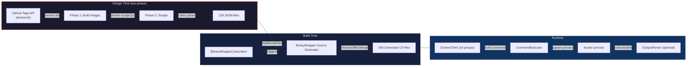

# FrenchExDev.Net.Docker

**Type-safe .NET wrapper for Docker, generated from help text across 129 versions.**

This package wraps the [Docker CLI](https://docs.docker.com/engine/reference/commandline/cli/) into a fully typed C# API using the [BinaryWrapper](../BinaryWrapper/) framework. A single `[BinaryWrapper("docker")]` attribute triggers Roslyn source generation of 350 files -- 174 command classes, 174 fluent builders, and a typed client with 16 nested command groups -- covering 170+ commands across 129 scraped versions (18.09.0 through 29.3.0).

---

## Why?

Docker has over 170 commands spread across 16 command groups, with options that appear, change, and disappear between versions. Manually maintaining typed wrappers for this surface area would be impractical. BinaryWrapper automates it entirely:

- **Compile-time safety** -- every command, flag, and argument is a typed property
- **IntelliSense everywhere** -- discover commands and options through your IDE, including nested groups like `client.Container.LsAsync()` or `client.Trust.Key.LoadAsync()`
- **Multi-version awareness** -- 129 versions merged into one API surface with `[SinceVersion]` / `[UntilVersion]` enforced at runtime
- **Cobra-aware parsing** -- custom parser handles Go/cobra help format (lowercase type hints, `Flags:` sections)
- **Zero runtime reflection** -- everything is source-generated
- **Minimal hand-written code** -- the library is a single 6-line descriptor class

## How It Works



## Quick Start

### 1. Create a binding and client

```csharp
using FrenchExDev.Net.BinaryWrapper;
using FrenchExDev.Net.Docker;

var binding = new BinaryBinding
{
    Identifier = new BinaryIdentifier("docker"),
    ExecutablePath = "/usr/local/bin/docker",
    DetectedVersion = SemanticVersion.Parse("27.0.0")
};

var client = Docker.Create(binding);
```

### 2. Build commands with full IntelliSense

```csharp
// Run a container
var runCmd = await client.Container.RunAsync(b => b
    .WithDetach(true)
    .WithName("my-app")
    .WithRm(true)
    .WithTty(true)
    .WithInteractive(true)
    .WithHostname("myhost")
    .WithWorkdir("/app")
    .WithUser("nobody"));

// List containers
var lsCmd = await client.Container.LsAsync(b => b
    .WithAll(true)
    .WithFormat("json")
    .WithQuiet(true)
    .WithNoTrunc(true));

// Build an image
var buildCmd = await client.Builder.BuildAsync(b => b
    .WithFile("Dockerfile.prod")
    .WithCacheFrom(["registry/image:latest", "local"]));

// Nested command groups
var networkLsCmd = await client.Network.LsAsync(b => b.WithQuiet(true));
var volumeLsCmd = await client.Volume.LsAsync(b => b.WithFormat("json"));
var trustKeyCmd = await client.Trust.Key.LoadAsync(b => { });
```

### 3. Execute commands

```csharp
var executor = new CommandExecutor(new SystemProcessRunner());
var output = await executor.ExecuteAsync(binding, runCmd, ct);
```

### 4. Inspect serialization

```csharp
var cmd = await client.Container.RunAsync(b => b
    .WithDetach(true)
    .WithName("test")
    .WithHostname("myhost"));

Console.WriteLine(string.Join(" ", cmd.CommandPath));
// Output: container run

Console.WriteLine(string.Join(" ", cmd.ToArguments()));
// Output: --detach --name test --hostname myhost
```

## Command Group Hierarchy

The `DockerClient` exposes 16 nested command groups mirroring Docker's CLI structure:

```
DockerClient
├── Top-level: attach, build*, commit, cp, create, deploy*, diff, events,
│   exec*, export, history, images*, import, inspect, kill, load, login*,
│   logout*, logs, pause, port, pull, push, rename, restart, rm, rmi,
│   run, save, search, start, stats, stop, tag, top, unpause, update,
│   version, wait, prune
│   (* = deprecated / removed in later versions)
│
├── Builder/       build, prune
├── Checkpoint/    create, ls, rm
├── Config/        create, inspect, ls, rm, update
├── Container/     attach, commit, cp, create, diff, exec, export, inspect,
│                  kill, logs, ls, pause, port, prune, rename, restart,
│                  rm, run, start, stats, stop, top, unpause, update, wait
├── Context/       create, export, import, inspect, ls, rm, show, update, use
├── Engine/        activate, check, ls, update
├── Image/         build, history, import, inspect, load, ls, prune, pull,
│                  push, rm, save, tag
├── Manifest/      annotate, create, inspect, push, rm
├── Network/       connect, create, disconnect, inspect, ls, prune, rm
├── Node/          demote, inspect, ls, promote, ps, rm, update
├── Plugin/        create, disable, enable, inspect, install, ls, push,
│                  rm, set, upgrade
├── Secret/        create, inspect, ls, rm
├── Service/       create, inspect, logs, ls, ps, rm, rollback, scale, update
├── Stack/         config, deploy, ls, ps, rm, services
├── Swarm/         ca, init, join, join-token, leave, unlock, unlock-key, update
├── System/        df, events, info, prune
├── Trust/         inspect, revoke, sign
│   ├── Key/       generate, load
│   └── Signer/    add, remove
└── Volume/        create, inspect, ls, prune, rm, update
```

## Generated API

### Statistics

| Metric | Value |
|--------|-------|
| Scraped versions | 129 (18.09.0 through 29.3.0) |
| Generated source files | 350 |
| Command classes | 174 sealed `ICliCommand` implementations |
| Builder classes | 174 `AbstractBuilder<T>` with fluent `With*()` API |
| Command groups | 16 top-level + 2 nested (Trust.Key, Trust.Signer) |
| Hand-written source | 6 lines (one descriptor class) |

### Generated types per command

| Type | Purpose |
|------|---------|
| `Docker{Cmd}Command` | Sealed `ICliCommand` with init-only typed properties and `ToArguments()` serialization |
| `Docker{Cmd}CommandBuilder` | Fluent `AbstractBuilder<T>` with `With*()` methods, validation hooks, and version checks |
| `DockerClient.{Cmd}Async()` | Client method with runtime `VersionGuard` enforcement |

### Property types

| CLI convention | Generated property type | Serialization |
|----------------|------------------------|---------------|
| Boolean flag (`--detach`) | `bool?` | `--detach` (presence = true) |
| Single value (`--name X`) | `string?` | `--name X` (space-separated) |
| Multi value (`--cache-from X`) | `IReadOnlyList<string>?` | `--cache-from X --cache-from Y` (repeated) |

### Version-gated options

Options and commands that appear or disappear across versions are annotated automatically:

```csharp
[SinceVersion("18.09.0")]
public sealed partial class DockerContainerRunCommand : ICliCommand
{
    // Available from the start
    public bool? Detach { get; init; }

    // Removed in a later version
    [UntilVersion("23.0.0")]
    public string? Isolation { get; init; }
}
```

At runtime, `VersionGuard.EnsureCommandSupported()` throws `CommandNotSupportedException` if the detected binary version is outside the supported range.

## Design Tool (Scraper)

The `FrenchExDev.Net.Docker.Design` project scrapes `docker --help` across versions using a two-phase pipeline.

### Two-phase scraping

```
Phase 1: Build Images
  For each version:
    alpine:3.19 + curl + tar
      -> download docker-{v}.tgz from download.docker.com/linux/static/stable/x86_64/
      -> install to /usr/local/bin/docker
      -> commit as docker-scrape:{version}

Phase 2: Scrape (parallel)
  For each version:
    start container from docker-scrape:{version}
      -> docker exec ... docker <cmd> --help (recursively)
      -> cobra parser -> JSON
      -> cleanup container

Finally:
  -> cleanup all containers
  -> cleanup all docker-scrape:* images
```

Phase 1 builds reusable images so Phase 2 can start containers instantly (~100ms) without repeating downloads. This makes parallel scraping highly efficient.

### Running the scraper

```bash
# Full scrape (all versions from 23.0.0+)
dotnet run --project src/FrenchExDev.Net.Docker.Design

# Specific version range
dotnet run --project src/FrenchExDev.Net.Docker.Design -- --min-version 27.0.0 --parallel 4

# List available versions
dotnet run --project src/FrenchExDev.Net.Docker.Design -- --list

# Build images only (pre-cache)
dotnet run --project src/FrenchExDev.Net.Docker.Design -- --build-images --min-version 23.0.0

# Re-parse from cached help text (no container rebuild)
dotnet run --project src/FrenchExDev.Net.Docker.Design -- --reparse

# Use docker instead of podman as container runtime
dotnet run --project src/FrenchExDev.Net.Docker.Design -- --runtime docker
```

### CLI options

| Flag | Default | Description |
|------|---------|-------------|
| `--parallel N` | `4` | Number of concurrent scrape workers |
| `--output DIR` | `../FrenchExDev.Net.Docker/scrape` | Output directory for JSON files |
| `--min-version VER` | `23.0.0` | Only process versions >= VER |
| `--runtime BIN` | `podman` | Container runtime binary (`podman` or `docker`) |
| `--list` | off | List versions and exit |
| `--build-images` | off | Build images and exit (skip scraping) |
| `--reparse` | off | Re-parse from cached help (no containers) |

### Version collector

Uses `GitHubTagsVersionCollector("docker", "cli")` -- reads tags from the `docker/cli` GitHub repository. Set `GITHUB_TOKEN` to avoid the 60 req/hour unauthenticated rate limit.

### Version coverage

- **129 JSON files** covering 18.09.0 through 29.3.0
- **DefaultMinVersion**: `23.0.0` (recommended starting point for new scrapes)
- **Legacy versions**: 18.09.x through 20.10.x are included for historical coverage
- **Deprecated top-level commands**: `build`, `exec`, `images`, `login`, `logout` are replaced by sub-group equivalents in 23.0.0+

## Testing

### Test suite

```bash
# Run all tests
dotnet test test/FrenchExDev.Net.Docker.Tests

# With code coverage (excludes generated code)
dotnet test test/FrenchExDev.Net.Docker.Tests \
    --settings coverage.runsettings \
    --collect:"XPlat Code Coverage"
```

### Test categories (56 tests)

| Category | Count | Description |
|----------|-------|-------------|
| Command serialization | 24 | Verifies `ToArguments()` output for each option type (flags, strings, lists) |
| Generated API shape | 28 | Verifies client API surface, command groups, builder chains, complex scenarios |
| Descriptor | 4 | Smoke test for `DockerDescriptor` instantiation |

## Project Structure

```
Docker/
├── FrenchExDev.Net.Docker.slnx              Solution file
├── README.md                                 This file
├── quality-gate.yml                          Quality gate configuration
├── coverage.runsettings                      Code coverage settings
├── doc/
│   ├── ARCHITECTURE.md                       System design, generator pipeline, version handling
│   ├── HOW-TO.md                             Usage guide, scraping instructions, troubleshooting
│   ├── COMPARISON-TABLE.md                   Comparison with sibling BinaryWrapper projects
│   └── PHILOSOPHY.md                         Design rationale and key decisions
├── src/
│   ├── FrenchExDev.Net.Docker/               Main library
│   │   ├── DockerDescriptor.cs               Single-line descriptor (triggers generation)
│   │   ├── FrenchExDev.Net.Docker.csproj     net10.0, references BinaryWrapper + Builder
│   │   ├── scrape/                           129 JSON command tree files
│   │   └── obj/Generated/                    350 generated .cs files
│   │
│   └── FrenchExDev.Net.Docker.Design/        Scraper console app
│       ├── Program.cs                        Two-phase pipeline (cobra parser, Alpine containers)
│       └── FrenchExDev.Net.Docker.Design.csproj
│
└── test/
    └── FrenchExDev.Net.Docker.Tests/         xUnit test suite (56 tests)
        ├── DockerTests.cs                    Serialization + API shape + descriptor tests
        └── FrenchExDev.Net.Docker.Tests.csproj
```

## Dependencies

### Runtime

| Package | Purpose |
|---------|---------|
| `FrenchExDev.Net.BinaryWrapper` | Core runtime: `ICliCommand`, `CommandExecutor`, `VersionGuard`, `IOutputParser` |
| `FrenchExDev.Net.BinaryWrapper.Attributes` | `[BinaryWrapper]` attribute |
| `FrenchExDev.Net.Builder` | `AbstractBuilder<T>` base class for fluent builders |
| `FrenchExDev.Net.Result` | `Result<T>` error handling |

### Build-time (analyzers)

| Package | Purpose |
|---------|---------|
| `FrenchExDev.Net.BinaryWrapper.SourceGenerator` | Roslyn incremental generator |
| `FrenchExDev.Net.Builder.SourceGenerator.Lib` | Shared builder emission logic |

### Design-time

| Package | Purpose |
|---------|---------|
| `FrenchExDev.Net.BinaryWrapper.Design` | Scraping orchestration, `DesignPipeline`, `DesignPipelineRunner` |
| `FrenchExDev.Net.BinaryWrapper.Design.Lib` | Help parsers (cobra), container runners, version collectors |

### Test

| Package | Purpose |
|---------|---------|
| `xunit` + `xunit.runner.visualstudio` | Test framework |
| `Shouldly` | Fluent assertions |
| `CsCheck` | Property-based testing |
| `coverlet.collector` | Code coverage |
| `FrenchExDev.Net.BinaryWrapper.Testing` | Test fakes and helpers |

## Key Design Decisions

### Cobra-aware parser over StandardHelpParser

Docker uses Go's cobra framework, which produces lowercase type hints (`string`, `int`, `stringArray`) rather than UPPERCASE placeholders. The `StandardHelpParser` would classify most options as boolean flags. The cobra parser correctly maps cobra types to CLR types, ensuring `string?` for single-value options, `IReadOnlyList<string>?` for multi-value options, and `bool?` for flags.

### Static binaries for scraping

Docker distributes static Linux binaries at `download.docker.com/linux/static/stable/x86_64/docker-{v}.tgz`. These are self-contained and require no dependencies, making Alpine 3.19 an ideal lightweight base. The binary is installed to `/usr/local/bin/docker` with `curl + tar` -- no package manager needed.

### GitHubTagsVersionCollector

Docker's `docker/cli` repository uses git tags (not GitHub Releases) to mark versions. `GitHubTagsVersionCollector` reads these tags via the GitHub API, which is more reliable than scraping the GitHub releases page.

### GNU-style defaults

Docker follows GNU CLI conventions (`--flag value`, `--flag` for booleans), which are the default for `[BinaryWrapper]`. No custom attribute parameters needed.

### Generated code only -- no custom parsers yet

The library intentionally contains no hand-written events, parsers, or collectors. The generated command/builder/client API is immediately useful for building CLI invocations. Output parsing can be added incrementally as specific use cases arise.

## Comparison with Sibling Projects

| | Docker | Podman | Vagrant | Packer | GitLab CLI |
|---|---|---|---|---|---|
| **Binary** | `docker` | `podman` | `vagrant` | `packer` | `glab` |
| **Language** | Go | Go | Ruby | Go | Go |
| **Help parser** | cobra | cobra | custom | standard | custom |
| **Versions scraped** | 129 | 58 | 7 | -- | -- |
| **Generated files** | 350 | 386 | -- | -- | -- |
| **Command groups** | 16 | 18 | 4 | -- | -- |
| **Scrape method** | Static binary in Alpine | Static binary in Alpine | Vagrant images | -- | tar.gz from GitLab |
| **Custom parsers** | No | No | Yes | Yes | No |

## Documentation

| Document | Description |
|----------|-------------|
| [Architecture](doc/ARCHITECTURE.md) | System design, generator pipeline, version handling, command hierarchy |
| [How-To Guide](doc/HOW-TO.md) | Usage examples, scraping instructions, CLI options, testing, troubleshooting |
| [Philosophy](doc/PHILOSOPHY.md) | Design rationale, key decisions, what the wrapper does and does not do |
| [Comparison Table](doc/COMPARISON-TABLE.md) | Detailed comparison with sibling BinaryWrapper projects |

## Troubleshooting

| Issue | Solution |
|-------|----------|
| `CommandNotSupportedException` at runtime | `BinaryBinding.DetectedVersion` is outside scraped range -- scrape the target version or update the binding |
| Generated code not updating | Ensure `<AdditionalFiles Include="scrape\docker-*.json" />` in `.csproj`, then `dotnet clean && dotnet build` |
| GitHub API rate limiting | Set `GITHUB_TOKEN` environment variable to increase the 60 req/hour unauthenticated limit |
| Scrape fails on older versions | Pre-23.0.0 versions may have different help format quirks -- use `--reparse` after fixing the cached help text |

## License

Proprietary. All rights reserved.
