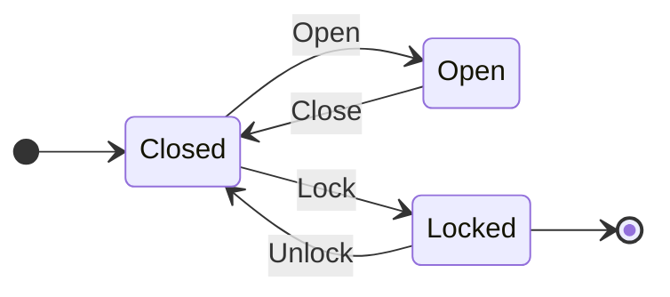

# FrenchExDev.Net.FiniteStateMachine

A comprehensive .NET finite state machine library with three tiers of usage, two source generators, hierarchical states, parallel regions, async-first design, and visualization support.

## Quick Start

### Tier 1 — Dynamic (string-based, runtime-defined)

```csharp
var definition = new DynamicStateMachineBuilder()
    .InitialState("Created")
    .FinalState("Delivered")
    .When("Created")
        .On("Submit").TransitionTo("Submitted")
    .When("Submitted")
        .On("Approve").TransitionTo("Approved")
    .When("Approved")
        .On("Ship").TransitionTo("Shipped")
    .When("Shipped")
        .On("Deliver").TransitionTo("Delivered")
    .Build();

var machine = definition.Value!.CreateMachine();
await machine.FireAsync("Submit");
```

### Tier 2 — Typed (enum-based, compile-time checked)

```csharp
public enum DoorState { Closed, Open, Locked }
public enum DoorEvent { Open, Close, Lock, Unlock }

var definition = new TypedStateMachineBuilder<DoorState, DoorEvent>()
    .InitialState(DoorState.Closed)
    .FinalState(DoorState.Locked)
    .When(DoorState.Closed)
        .On(DoorEvent.Open).TransitionTo(DoorState.Open)
        .On(DoorEvent.Lock).TransitionTo(DoorState.Locked)
    .When(DoorState.Open)
        .On(DoorEvent.Close).TransitionTo(DoorState.Closed)
    .When(DoorState.Locked)
        .On(DoorEvent.Unlock).TransitionTo(DoorState.Closed)
    .Build();

var machine = definition.Value!.CreateMachine();
await machine.FireAsync(DoorEvent.Open);
```

#### With source generation

```csharp
[StateMachine(typeof(DoorState), typeof(DoorEvent), InitialState = nameof(DoorState.Closed))]
public partial class DoorStateMachine
{
    [Transition(DoorState.Closed, DoorEvent.Open,   DoorState.Open)]
    [Transition(DoorState.Open,   DoorEvent.Close,  DoorState.Closed)]
    [Transition(DoorState.Closed, DoorEvent.Lock,   DoorState.Locked)]
    [Transition(DoorState.Locked, DoorEvent.Unlock, DoorState.Closed)]
    private static partial void DefineTransitions();
}

// Strongly-typed fire methods:
var machine = new DoorStateMachine();
await machine.FireOpenAsync();
await machine.FireLockAsync();
var permitted = await machine.PermittedEventsAsync();
```

### Tier 3 — Rich (interface-based, domain-driven)

```csharp
public interface IOrderState : IState { }
public interface IOrderEvent : IEvent { }

public record CreatedState() : IOrderState { public string Name => "Created"; }
public record SubmittedState(DateTime SubmittedAt) : IOrderState { public string Name => "Submitted"; }
public record DeliveredState(DateTime DeliveredAt) : IOrderState { public string Name => "Delivered"; }

public record SubmitEvent(List<string> Items) : IOrderEvent { public string Name => "Submit"; }

var definition = new RichStateMachineBuilder<IOrderState, IOrderEvent>()
    .InitialState(new CreatedState())
    .FinalState<DeliveredState>()
    .When<CreatedState>()
        .On<SubmitEvent>()
            .TransitionTo((evt, _) => new SubmittedState(DateTime.UtcNow))
    .Build();

var machine = definition.Value!;
await machine.FireAsync(new SubmitEvent(new List<string> { "item1" }));
```

## Features

| Feature | Description |
|---------|-------------|
| **3 Tiers** | Dynamic (strings), Typed (enums), Rich (interfaces) |
| **2 Source Generators** | Typed SG (`[StateMachine]`) and Rich SG (`[RichStateMachine]`) |
| **Async-First** | All APIs are `Task`-returning with `CancellationToken` support |
| **Guards** | Async guard evaluation; multiple guards per transition (AND logic) |
| **Actions** | Entry, exit, and transition actions — all async |
| **Listeners** | Observable lifecycle (8 hook points) via `IStateMachineListener` |
| **Hierarchy** | Parent-child state relationships with LCA resolution |
| **Parallel Regions** | `ICompositeStateMachine` for concurrent orthogonal regions |
| **Deferred Events** | Queue events for replay on state change |
| **Timer Transitions** | Auto-fire events after timeout |
| **History** | Optional ring-buffer transition recording via `HistoryListener` |
| **Concurrency** | `ConcurrencyMode.None` or `ConcurrencyMode.Semaphore` |
| **Visualization** | Export to Mermaid (`stateDiagram-v2`) and Graphviz DOT |
| **Testing** | `StateMachineAssert` + `StateMachinePathGenerator` (DFS path enumeration) |
| **Serialization** | JSON round-trip for Dynamic tier via `DynamicStateMachineSerializer` |
| **Result Integration** | `FireAsync` returns `Result<Transition<TState>>` (from `FrenchExDev.Net.Result`) |

## Solution Structure

```
FiniteStateMachine/
├── src/
│   ├── FrenchExDev.Net.FiniteStateMachine/                    Core library (netstandard2.0 + net10.0)
│   ├── FrenchExDev.Net.FiniteStateMachine.Attributes/         Marker attributes (netstandard2.0 + net10.0)
│   ├── FrenchExDev.Net.FiniteStateMachine.SourceGenerator/    Typed tier SG (netstandard2.0)
│   ├── FrenchExDev.Net.FiniteStateMachine.SourceGenerator.Lib/  Shared emission logic (netstandard2.0)
│   ├── FrenchExDev.Net.FiniteStateMachine.Design/             Rich tier SG (netstandard2.0)
│   └── FrenchExDev.Net.FiniteStateMachine.Testing/            Test utilities (netstandard2.0 + net10.0)
└── test/
    └── FrenchExDev.Net.FiniteStateMachine.Tests/              92 xUnit tests (net10.0)
```

### Dependency Graph

```
FiniteStateMachine (core) ← FrenchExDev.Net.Result
  Attributes ← (no deps)
  SourceGenerator ← Roslyn + SourceGenerator.Lib
  SourceGenerator.Lib ← (no deps)
  Design ← Roslyn + SourceGenerator.Lib
  Testing ← core
  Tests ← core + Attributes + SG + Design + Testing
```

## Documentation

| Document | Description |
|----------|-------------|
| [ARCHITECTURE.md](doc/ARCHITECTURE.md) | Internal architecture, namespace layout, engine lifecycle, tier comparison |
| [HOW-TO.md](doc/HOW-TO.md) | Recipes for guards, actions, listeners, hierarchy, regions, testing, visualization |
| [PHILOSOPHY.md](doc/PHILOSOPHY.md) | Design decisions, trade-offs, and rationale |
| [PLAN.md](doc/PLAN.md) | Implementation plan and progress tracking |

## Visualization

```csharp
// Mermaid export
var mermaid = MermaidExporter.Export(definition);

// Graphviz DOT export
var dot = DotExporter.Export(definition);
```

Output:



## Testing

```csharp
// Assert single transition
await StateMachineAssert.TransitionsToAsync(machine, DoorEvent.Open, DoorState.Open);

// Assert full path
await StateMachineAssert.PathReachesAsync(machine,
    new[] { DoorEvent.Open, DoorEvent.Close, DoorEvent.Lock },
    DoorState.Locked);

// Assert event is denied
await StateMachineAssert.IsDeniedAsync(machine, DoorEvent.Lock);

// Enumerate all paths (model-based testing)
var paths = StateMachinePathGenerator.AllPaths(definition, maxDepth: 50);
```

## Target Frameworks

- **Core + Attributes + Testing**: `netstandard2.0` + `net10.0`
- **Source Generators + Lib**: `netstandard2.0` (Roslyn analyzers)
- **Tests**: `net10.0`
