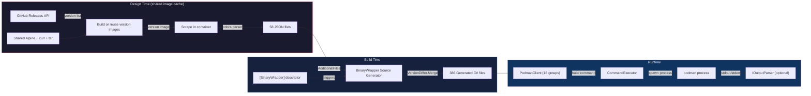

# FrenchExDev.Net.Podman

**Type-safe .NET wrapper for Podman, generated from help text across 58 versions.**

This package wraps the [Podman](https://podman.io/) container engine into a fully typed C# API using the [BinaryWrapper](../BinaryWrapper/) framework. A single `[BinaryWrapper("podman")]` attribute triggers Roslyn source generation of 386 files -- 192 command classes, 192 fluent builders, and a typed client with 18 nested command groups -- covering 180+ commands across 58 scraped versions (4.1.0 through 5.8.1).

---

## Why?

Podman has over 180 commands spread across 18 command groups, with options that appear, change, and disappear between versions. Manually maintaining typed wrappers for this surface area would be impractical. BinaryWrapper automates it entirely:

- **Compile-time safety** -- every command, flag, and argument is a typed property
- **IntelliSense everywhere** -- discover commands and options through your IDE, including nested groups like `client.Container.List()` or `client.System.Connection.Add()`
- **Multi-version awareness** -- 58 versions merged into one API surface with `[SinceVersion]` / `[UntilVersion]` enforced at runtime
- **Cobra-aware parsing** -- custom parser handles Go/cobra help format (lowercase type hints, `Flags:` sections)
- **Zero runtime reflection** -- everything is source-generated
- **Minimal hand-written code** -- the library is a single 6-line descriptor class

## How It Works



## Quick Start

### 1. Create a binding and client

```csharp
using FrenchExDev.Net.BinaryWrapper;
using FrenchExDev.Net.Podman;

var binding = new BinaryBinding
{
    Identifier = new BinaryIdentifier("podman"),
    ExecutablePath = "/usr/bin/podman",
    DetectedVersion = SemanticVersion.Parse("5.8.0")
};

var client = Podman.Create(binding);
```

### 2. Build commands with full IntelliSense

```csharp
// Run a container
var runCmd = await client.RunAsync(b => b
    .WithDetach(true)
    .WithName("my-app")
    .WithRm(true)
    .WithPublish(["8080:80"])
    .WithVolume(["/data:/app/data"])
    .WithEnv(["NODE_ENV=production"]));

// List containers
var psCmd = await client.PsAsync(b => b
    .WithAll(true)
    .WithFormat("json")
    .WithFilter(["status=running"]));

// Nested command groups
var imageListCmd = await client.Image.ListAsync(b => b
    .WithAll(true)
    .WithFormat("{{.Repository}}:{{.Tag}}"));

var networkLsCmd = await client.Network.LsAsync(b => b.WithQuiet(true));
var connListCmd = await client.System.Connection.ListAsync(b => { });
```

### 3. Execute commands

```csharp
var executor = new CommandExecutor(new SystemProcessRunner());
var output = await executor.ExecuteAsync(binding, runCmd, ct);
```

### 4. Inspect serialization

```csharp
var cmd = await client.RunAsync(b => b
    .WithDetach(true)
    .WithName("test")
    .WithEnv(["FOO=bar", "BAZ=qux"]));

Console.WriteLine(string.Join(" ", cmd.CommandPath));
// Output: run

Console.WriteLine(string.Join(" ", cmd.ToArguments()));
// Output: --detach --name test --env FOO=bar --env BAZ=qux
```

## Command Group Hierarchy

The `PodmanClient` exposes 18 nested command groups mirroring Podman's CLI structure:

```
PodmanClient
├── Top-level: attach, build, commit, compose, cp, create, diff, events,
│   exec, export, history, images, import, info, init, inspect, kill,
│   load, login, logout, logs, pause, port, ps, pull, push, rename,
│   restart, rm, rmi, run, save, search, start, stats, stop, tag, top,
│   unpause, untag, version, wait
├── Container/          attach, checkpoint, clone, commit, cp, create, ...
├── Image/              build, diff, exists, history, import, inspect, ...
├── Network/            connect, create, disconnect, exists, inspect, ls, ...
├── Volume/             create, exists, inspect, ls, prune, reload, rm
├── Pod/                clone, create, exists, inspect, kill, logs, ...
├── System/             df, info, migrate, prune, renumber, ...
│   └── Connection/     add, default, list, remove, rename
├── Machine/            info, init, inspect, list, reset, rm, ...
│   └── Os/             apply
├── Secret/             create, inspect, ls, rm, exists
├── Manifest/           add, annotate, create, exists, inspect, push, rm
├── Healthcheck/        run
├── Generate/           kube, spec, systemd
├── Play/               kube
├── Kube/               apply, down, generate, play
├── Farm/               build, create, list, remove, update
├── Artifact/           add, extract, inspect, ls, pull, push, rm
└── Quadlet/            info
```

## Generated API

### Statistics

| Metric | Value |
|--------|-------|
| Scraped versions | 58 (4.1.0 through 5.8.1) |
| Generated source files | 386 |
| Command classes | 192 sealed `ICliCommand` implementations |
| Builder classes | 192 `AbstractBuilder<T>` with fluent `With*()` API |
| Command groups | 18 nested groups |
| Hand-written source | 6 lines (one descriptor class) |

### Generated types per command

| Type | Purpose |
|------|---------|
| `Podman{Cmd}Command` | Sealed `ICliCommand` with init-only typed properties and `ToArguments()` serialization |
| `Podman{Cmd}CommandBuilder` | Fluent `AbstractBuilder<T>` with `With*()` methods, validation hooks, and version checks |
| `PodmanClient.{Cmd}Async()` | Client method with runtime `VersionGuard` enforcement |

### Property types

| CLI convention | Generated property type | Serialization |
|----------------|------------------------|---------------|
| Boolean flag (`--detach`) | `bool?` | `--detach` (presence = true) |
| Single value (`--name X`) | `string?` | `--name X` (space-separated) |
| Multi value (`--env X`) | `IReadOnlyList<string>?` | `--env X --env Y` (repeated) |

### Version-gated options

Options and commands that appear or disappear across versions are annotated automatically:

```csharp
[SinceVersion("4.1.1")]
public sealed partial class PodmanRunCommand : ICliCommand
{
    // Available from the start
    public bool? Detach { get; init; }

    // Added in a later version
    [SinceVersion("4.5.0")]
    public string? PasswdEntry { get; init; }
}
```

At runtime, `VersionGuard.EnsureCommandSupported()` throws `CommandNotSupportedException` if the detected binary version is outside the supported range.

## Design Tool (Scraper)

The `FrenchExDev.Net.Podman.Design` project scrapes `podman --help` across versions using shared dependency and per-version images.
`PodmanImagePlanResolver` selects `podman-remote-static.tar.gz` before 4.4.0 and
`podman-remote-static-linux_amd64.tar.gz` from 4.4.0. Both recipes reuse the same
Alpine dependency image.

### Image preparation and scraping

The runner prepares Alpine 3.19 with curl and tar before starting the version workers.
Each worker downloads and installs its CLI in an image derived from that base,
starts a container, collects help and removes the container and version image.
The dependency image remains cached. Use `--keep-images` to retain version images.

### Running the scraper

```bash
# Full scrape (all versions)
dotnet run --project src/FrenchExDev.Net.Podman.Design --framework net10.0

# Specific version range
dotnet run --project src/FrenchExDev.Net.Podman.Design --framework net10.0 -- --min-version 5.0.0 --parallel 4

# List available versions
dotnet run --project src/FrenchExDev.Net.Podman.Design --framework net10.0 -- --list

# Build images only (pre-cache)
dotnet run --project src/FrenchExDev.Net.Podman.Design --framework net10.0 -- --build-images --min-version 4.1.0

# Re-parse from cached help text (no container rebuild)
dotnet run --project src/FrenchExDev.Net.Podman.Design --framework net10.0 -- --reparse

# Use docker instead of podman as container runtime
dotnet run --project src/FrenchExDev.Net.Podman.Design --framework net10.0 -- --runtime docker
```

### CLI options

| Flag | Default | Description |
|------|---------|-------------|
| `--parallel N` | `4` | Number of concurrent scrape workers |
| `--output DIR` | `../FrenchExDev.Net.Podman/scrape` | Output directory for JSON files |
| `--min-version VER` | `4.1.0` | Only process versions >= VER |
| `--runtime BIN` | `podman` | Container runtime binary (`podman` or `docker`) |
| `--list` | off | List versions and exit |
| `--build-base` | off | Prepare only shared dependencies (no version discovery) |
| `--build-images` | off | Build selected images and keep them (skip scraping) |
| `--clean-images` | off | Remove this wrapper's version images, then its base |
| `--keep-images` | off | Retain version images after scraping |
| `--missing` | off | Select versions without an existing JSON |
| `--scrape-parallel N` | `4` | Concurrent help commands per container |
| `--reparse` | off | Re-parse from cached help (no containers) |

### Cobra-aware help parser

Podman uses Go's cobra CLI framework, which produces help output with lowercase type hints (`string`, `int`, `stringArray`) rather than UPPERCASE placeholders. The built-in cobra parser handles this:

| Cobra Type | Generated Property Type | Example |
|-----------|------------------------|---------|
| (none / bare flag) | `bool?` | `--detach` |
| `string` | `string?` | `--name string` |
| `int`, `int64`, `uint` | `string?` | `--count int` |
| `strings`, `stringArray`, `stringSlice` | `IReadOnlyList<string>?` | `--env stringArray` |
| `duration` | `string?` | `--timeout duration` |

### Version coverage

- **58 JSON files** covering 4.1.0 through 5.8.1
- **Broken versions**: 4.1.0 and 4.3.0 are included as JSON files but produce incomplete data (static binaries not truly static on Alpine)
- **Asset naming change**: pre-4.4.0 uses `podman-remote-static.tar.gz`, 4.4.0+ uses `podman-remote-static-linux_amd64.tar.gz` (handled automatically)
- **Executable validation**: archives are extracted into a separate temporary directory so the binary lookup cannot select the archive itself; the image build checks `podman --version` before collection.
- **Version collector**: `GitHubReleasesVersionCollector("containers", "podman")` -- standard GitHub releases, no custom collector needed

## Testing

### Test suite

```bash
# Run all tests
dotnet test test/FrenchExDev.Net.Podman.Tests

# With code coverage (excludes generated code)
dotnet test test/FrenchExDev.Net.Podman.Tests \
    --settings test/FrenchExDev.Net.Podman.Tests/coverage.runsettings \
    --collect:"XPlat Code Coverage"
```

### Test categories (62 tests)

| Category | Count | Description |
|----------|-------|-------------|
| Command serialization | 14 | Verifies `ToArguments()` output for each option type (flags, strings, lists) |
| Generated API shape | 47 | Verifies client API surface, command groups, builder chains, empty builders |
| Descriptor | 1 | Smoke test for `PodmanDescriptor` instantiation |

## Project Structure

```
Podman/
├── FrenchExDev.Net.Podman.slnx              Solution file
├── README.md                                 This file
├── doc/
│   ├── ARCHITECTURE.md                       System design, generator pipeline, version handling
│   ├── HOW-TO.md                             Usage guide, scraping instructions, troubleshooting
│   └── PHILOSOPHY.md                         Design rationale and key decisions
├── src/
│   ├── FrenchExDev.Net.Podman/               Main library
│   │   ├── PodmanDescriptor.cs               Single-line descriptor (triggers generation)
│   │   ├── FrenchExDev.Net.Podman.csproj     net10.0, references BinaryWrapper + Builder
│   │   ├── scrape/                           58 JSON command tree files
│   │   └── obj/Generated/                    386 generated .cs files
│   │
│   └── FrenchExDev.Net.Podman.Design/        Scraper console app
│       ├── Program.cs                        Two-phase pipeline (cobra parser, Alpine containers)
│       └── FrenchExDev.Net.Podman.Design.csproj
│
└── test/
    └── FrenchExDev.Net.Podman.Tests/         xUnit test suite (62 tests)
        ├── PodmanTests.cs                    Serialization + API shape + descriptor tests
        ├── coverage.runsettings              Excludes obj/Generated from coverage
        └── FrenchExDev.Net.Podman.Tests.csproj
```

## Dependencies

### Runtime

| Package | Purpose |
|---------|---------|
| `FrenchExDev.Net.BinaryWrapper` | Core runtime: `ICliCommand`, `CommandExecutor`, `VersionGuard`, `IOutputParser` |
| `FrenchExDev.Net.BinaryWrapper.Attributes` | `[BinaryWrapper]` attribute |
| `FrenchExDev.Net.Builder` | `AbstractBuilder<T>` base class for fluent builders |
| `FrenchExDev.Net.Result` | `Result<T>` error handling |

### Build-time (analyzers)

| Package | Purpose |
|---------|---------|
| `FrenchExDev.Net.BinaryWrapper.SourceGenerator` | Roslyn incremental generator |
| `FrenchExDev.Net.Builder.SourceGenerator.Lib` | Shared builder emission logic |

### Design-time

| Package | Purpose |
|---------|---------|
| `FrenchExDev.Net.BinaryWrapper.Design` | Scraping orchestration, `DesignPipeline`, `DesignPipelineRunner` |
| `FrenchExDev.Net.BinaryWrapper.Design.Lib` | Help parsers (cobra), container runners, version collectors |

### Test

| Package | Purpose |
|---------|---------|
| `xunit` + `xunit.runner.visualstudio` | Test framework |
| `Shouldly` | Fluent assertions |
| `CsCheck` | Property-based testing |
| `coverlet.collector` | Code coverage |
| `FrenchExDev.Net.BinaryWrapper.Testing` | Test fakes and helpers |

## Key Design Decisions

### Cobra-aware parser over StandardHelpParser

Podman uses Go's cobra framework, which produces lowercase type hints (`string`, `int`, `stringArray`) rather than UPPERCASE placeholders. The `StandardHelpParser` would classify most options as boolean flags. The cobra parser correctly maps cobra types to CLR types, ensuring `string?` for single-value options, `IReadOnlyList<string>?` for multi-value options, and `bool?` for flags.

### Two-phase scraping for performance

Downloading 58 static binaries (~20MB each) sequentially would be slow. The two-phase approach (Phase 1: build images once, Phase 2: parallel scrape from pre-built images) dramatically reduces total scrape time. Container startup from a local image is ~100ms.

### Podman as its own container runtime

The scraper uses podman to run containers for scraping podman. Podman is daemonless and works in rootless mode with no Docker dependency. The `--runtime docker` flag provides a fallback.

### GNU-style defaults

Podman follows GNU CLI conventions (`--flag value`, `--flag` for booleans), which are the default for `[BinaryWrapper]`. No custom attribute parameters needed, unlike Packer which requires `FlagPrefix="-"`, `FlagValueSeparator="="`, and `UseBoolEqualsFormat=true`.

### Generated code only -- no custom parsers yet

The library intentionally contains no hand-written events, parsers, or collectors. The generated command/builder/client API is immediately useful for building CLI invocations. Output parsing can be added incrementally as specific use cases arise.

## Comparison with Sibling Projects

| | Podman | Docker | PodmanCompose | Vagrant | Packer |
|---|---|---|---|---|---|
| **Binary** | `podman` | `docker` | `podman-compose` | `vagrant` | `packer` |
| **Language** | Go | Go | Python | Ruby | Go |
| **Help parser** | cobra | cobra | argparse | custom | standard |
| **Versions scraped** | 58 | 57 | 6 | 7 | -- |
| **Generated files** | 386 | -- | 54 | -- | -- |
| **Command groups** | 18 | -- | 0 (flat) | -- | -- |
| **Scrape method** | Static binary in Alpine | Standalone binary | pip install | Vagrant images | -- |
| **Custom parsers** | No | No | No | Yes | Yes |

## Documentation

| Document | Description |
|----------|-------------|
| [Architecture](doc/ARCHITECTURE.md) | System design, generator pipeline, cobra parser, command hierarchy, known quirks |
| [How-To Guide](doc/HOW-TO.md) | Usage examples, scraping instructions, CLI options, testing, extending, troubleshooting |
| [Philosophy](doc/PHILOSOPHY.md) | Design rationale, key decisions, what the wrapper does and does not do |

## Troubleshooting

| Issue | Solution |
|-------|----------|
| `CommandNotSupportedException` at runtime | `BinaryBinding.DetectedVersion` is outside scraped range -- scrape the target version or update the binding |
| Generated code not updating | Ensure `<AdditionalFiles Include="scrape\podman-*.json" />` in `.csproj`, then `dotnet clean && dotnet build` |
| Broken versions 4.1.0 / 4.3.0 | Known issue -- static binaries not truly static on Alpine. `VersionDiffer` fills gaps from adjacent versions |
| `Cannot change ownership to uid ...` during scraping | Rootless podman issue -- scraper uses `--no-same-owner`, or switch to `--runtime docker` |
| GitHub API rate limiting | Set `GITHUB_TOKEN` environment variable to increase the 60 req/hour unauthenticated limit |

## License

Proprietary. All rights reserved.

## Shared dependency and version images

The Design runner prepares the shared system dependencies once, then installs each
software version in an image derived from that base. `UseVersionImage().UseContainer()`
builds or reuses the image before collecting help. After collection, the container
and version image are removed; `--keep-images` retains the version image. The
shared base remains cached.

From the wrapper directory, with Podman running (or add `--runtime docker`):

```powershell
$design = './src/FrenchExDev.Net.Podman.Design/FrenchExDev.Net.Podman.Design.csproj'
dotnet run --project $design --framework net10.0 -- --help
dotnet run --project $design --framework net10.0 -- --build-base
dotnet run --project $design --framework net10.0 -- --list --missing
# Review the selection; optionally narrow it with --min-version.
dotnet run --project $design --framework net10.0 -- --build-images --missing --parallel 2
dotnet run --project $design --framework net10.0 -- --missing --parallel 2
dotnet run --project $design --framework net10.0 -- --reparse
dotnet run --project $design --framework net10.0 -- --clean-images
```

`--build-base` prepares only dependencies. `--build-images` installs selected versions
without scraping and keeps their images. `--clean-images` removes this wrapper's
version images before its base, without forcing removal. Base preparation and cleanup
do not query the version collector; `--list` and `--reparse` do not build images.
With `--missing`, selection is based on missing JSON files.

The three image operations are mutually exclusive and cannot be combined with
`--reparse` or known-missing management. `--build-base` and `--clean-images` also
reject `--list` and `--missing`.

The PowerShell launcher exposes `-BuildBase`, `-BuildImages`, `-CleanImages`,
`-KeepImages`, `-Reparse`, `-Missing`, `-List`, `-MinVersion`, `-Parallel`,
`-ScrapeParallel`, `-Runtime`, `-Output` and `-Framework`. It resolves its project
relative to the script, so it also works from another directory:

```powershell
./scripts/Find-Missing.ps1 -BuildBase -Framework net10.0
./scripts/Find-Missing.ps1 -BuildImages -Missing -Parallel 2 -Framework net10.0
```

See the [BinaryWrapper image pipeline guide](../BinaryWrapper/doc/UPGRADE-IMAGE-PIPELINES.md)
for each client's dependencies, cache identities, build logs, reuse and cleanup.
