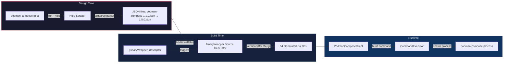

# FrenchExDev.Net.PodmanCompose

**Type-safe .NET wrapper for `podman-compose`, generated from help text.**

PodmanCompose wraps the [podman-compose](https://github.com/containers/podman-compose) Python CLI tool into a fully typed C# API using the [BinaryWrapper](../BinaryWrapper/) framework. A single `[BinaryWrapper("podman-compose")]` attribute triggers Roslyn source generation of 25 command classes, fluent builders, and a typed client -- complete with multi-version support and runtime version guards.

---

## Why?

Orchestrating podman-compose from .NET typically involves hand-crafted argument strings and fragile `Process.Start` calls. This package eliminates that:

- **Compile-time safety** -- every command, flag, and argument is a typed property
- **IntelliSense everywhere** -- discover commands and options through your IDE
- **Multi-version awareness** -- 6 versions (1.1.0 through 1.5.0) merged into a single API surface with `[SinceVersion]` / `[UntilVersion]` annotations enforced at runtime
- **Zero runtime reflection** -- everything is source-generated
- **Minimal hand-written code** -- the entire library is a single 6-line descriptor class

## How It Works



## Quick Start

### 1. Create a binding and client

```csharp
using FrenchExDev.Net.BinaryWrapper;
using FrenchExDev.Net.PodmanCompose;

var binding = new BinaryBinding(
    new BinaryIdentifier("podman-compose"),
    executablePath: "/usr/bin/podman-compose");

var client = PodmanCompose.Create(binding);
```

### 2. Build and execute commands

```csharp
// Bring services up in detached mode, force-rebuilding images
var upCmd = await client.UpAsync(b => b
    .WithDetach(true)
    .WithBuild(true)
    .WithForceRecreate(true)
    .WithRemoveOrphans(true));

var executor = new CommandExecutor(new SystemProcessRunner());
var output = await executor.ExecuteAsync(binding, upCmd, ct);
```

```csharp
// Tail logs for specific services
var logsCmd = await client.LogsAsync(b => b
    .WithFollow(true)
    .WithTail("100"));

// Tear down the stack, removing volumes
var downCmd = await client.DownAsync(b => b
    .WithVolumes(true)
    .WithRemoveOrphans(true));
```

## Generated API

### Commands (25)

| Command | Since | Until | Description |
|---------|-------|-------|-------------|
| `build` | 1.1.0 | -- | Build or rebuild services |
| `config` | 1.1.0 | -- | Validate and view the Compose file |
| `down` | 1.1.0 | -- | Stop and remove containers, networks |
| `exec` | 1.1.0 | -- | Execute a command in a running container |
| `images` | 1.2.0 | -- | List images used by created containers |
| `kill` | 1.1.0 | -- | Force stop service containers |
| `later` | 1.1.0 | 1.5.0 | Systemd registration helper (removed) |
| `logs` | 1.1.0 | -- | View output from containers |
| `pause` | 1.1.0 | -- | Pause services |
| `port` | 1.1.0 | -- | Print the public port for a port binding |
| `ps` | 1.1.0 | -- | List containers |
| `pull` | 1.1.0 | -- | Pull service images |
| `push` | 1.1.0 | -- | Push service images |
| `restart` | 1.1.0 | -- | Restart service containers |
| `run` | 1.1.0 | -- | Run a one-off command on a service |
| `start` | 1.1.0 | -- | Start services |
| `stats` | 1.1.0 | -- | Display resource usage statistics |
| `stop` | 1.1.0 | -- | Stop services |
| `systemd` | 1.1.0 | -- | Manage systemd units for a compose stack |
| `then` | 1.1.0 | 1.5.0 | Systemd registration helper (removed) |
| `unpause` | 1.1.0 | -- | Unpause services |
| `up` | 1.1.0 | -- | Create and start containers |
| `version` | 1.1.0 | -- | Show version information |
| `wait` | 1.1.0 | -- | Block until containers stop |
| `when` | 1.1.0 | 1.5.0 | Systemd registration helper (removed) |

### Generated types per command

Each command produces three types:

| Type | Purpose |
|------|---------|
| `PodmanCompose{Cmd}Command` | Sealed `ICliCommand` with typed properties and `ToArguments()` serialization |
| `PodmanCompose{Cmd}CommandBuilder` | Fluent `AbstractBuilder<T>` with `With*()` methods and validation hooks |
| `PodmanComposeClient.{Cmd}Async()` | Client method with runtime `VersionGuard` enforcement |

### Version-gated options

Options that were added or removed across versions are annotated automatically:

```csharp
// Available since 1.4.0 only
[SinceVersion("1.4.0")]
public bool? AbortOnContainerFailure { get; init; }
```

At runtime, `VersionGuard.EnsureCommandSupported()` throws if the detected binary version is outside the supported range.

## Design Tool (Scraper)

The `FrenchExDev.Net.PodmanCompose.Design` project scrapes `podman-compose --help` across versions to produce the JSON command trees.

### How it works

1. **Version discovery** -- `GitHubReleasesVersionCollector("containers", "podman-compose")` fetches release tags from GitHub
2. **Container build** -- Prepare Alpine 3.19 with Python, pip, yaml and dotenv once; install `podman-compose=={version}` in each derived image
3. **Scraping** -- Recursively invokes `podman-compose <command> --help` and parses output using the standard `argparse` help parser
4. **JSON output** -- Writes `podman-compose-{version}.json` to the `scrape/` directory

### Running the scraper

```bash
# Scrape all versions (requires podman or docker)
dotnet run --project src/FrenchExDev.Net.PodmanCompose.Design --framework net10.0

# Scrape specific version range
dotnet run --project src/FrenchExDev.Net.PodmanCompose.Design --framework net10.0 -- --min-version 1.3.0 --max-version 1.5.0

# Re-parse from cached help text (no container rebuild)
dotnet run --project src/FrenchExDev.Net.PodmanCompose.Design --framework net10.0 -- --reparse
```

### Scraped versions

| Version | File | Notes |
|---------|------|-------|
| 1.1.0 | `podman-compose-1.1.0.json` | Baseline (25 commands) |
| 1.2.0 | `podman-compose-1.2.0.json` | Adds `images` command |
| 1.3.0 | `podman-compose-1.3.0.json` | |
| 1.4.0 | `podman-compose-1.4.0.json` | Adds `--abort-on-container-failure` to `up` |
| 1.4.1 | `podman-compose-1.4.1.json` | |
| 1.5.0 | `podman-compose-1.5.0.json` | Removes `when`, `then`, `later` commands |

## Project Structure

```
PodmanCompose/
├── FrenchExDev.Net.PodmanCompose.slnx           Solution file
├── README.md                                     This file
├── src/
│   ├── FrenchExDev.Net.PodmanCompose/            Main library
│   │   ├── PodmanComposeDescriptor.cs            Single-line descriptor (triggers generation)
│   │   ├── FrenchExDev.Net.PodmanCompose.csproj  net10.0, references BinaryWrapper + Builder
│   │   ├── scrape/                               6 JSON command tree files
│   │   └── obj/Generated/                        54 generated .cs files
│   │
│   └── FrenchExDev.Net.PodmanCompose.Design/     Scraper console app
│       ├── Program.cs                            Pipeline config (argparse parser, Alpine containers)
│       └── FrenchExDev.Net.PodmanCompose.Design.csproj
│
└── test/
    └── FrenchExDev.Net.PodmanCompose.Tests/      xUnit test suite
        ├── DescriptorTests.cs                    Smoke tests
        └── FrenchExDev.Net.PodmanCompose.Tests.csproj
```

## Dependencies

### Runtime

| Package | Purpose |
|---------|---------|
| `FrenchExDev.Net.BinaryWrapper` | Core runtime: process execution, version resolution |
| `FrenchExDev.Net.BinaryWrapper.Attributes` | `[BinaryWrapper]` attribute |
| `FrenchExDev.Net.Builder` | `AbstractBuilder<T>` base class for fluent builders |
| `FrenchExDev.Net.Result` | `Result<T>` error handling |

### Build-time (analyzers)

| Package | Purpose |
|---------|---------|
| `FrenchExDev.Net.BinaryWrapper.SourceGenerator` | Roslyn incremental generator |
| `FrenchExDev.Net.Builder.SourceGenerator.Lib` | Shared builder emission logic |

### Design-time

| Package | Purpose |
|---------|---------|
| `FrenchExDev.Net.BinaryWrapper.Design` | Scraping orchestration |
| `FrenchExDev.Net.BinaryWrapper.Design.Lib` | Help parsers, container runners |

## Key Design Decisions

### argparse parser (not cobra)

Unlike Podman and Docker (which use Go's cobra library), `podman-compose` is a Python tool using `argparse`. The standard `HelpParsers.Create("argparse")` parser handles its help output format correctly.

### pip-based container scraping

Instead of downloading static binaries (like Podman), versions are installed via `pip install podman-compose=={version}` inside Alpine containers. This is simpler because podman-compose is a pure Python package with no compiled dependencies.

### Minimal hand-written code

The entire library consists of a single 6-line descriptor class. All 54 generated files (commands, builders, client) are produced entirely by the BinaryWrapper source generator from the scraped JSON files. This is the BinaryWrapper pattern at its purest.

## Comparison with Sibling Projects

| | PodmanCompose | Podman | Docker | Vagrant |
|---|---|---|---|---|
| **Binary** | `podman-compose` | `podman` | `docker` | `vagrant` |
| **Language** | Python | Go | Go | Ruby |
| **Help parser** | `argparse` | `PodmanHelpParser` (cobra) | `CobraHelpParser` | `VagrantHelpParser` |
| **Versions scraped** | 6 | 55 | 57 | 7 |
| **Commands** | 25 | 374 | -- | -- |
| **Scrape method** | pip install in Alpine | Static binary download | Standalone binary | Vagrant images |
| **Custom parsers** | No | Yes | Yes | Yes |

## License

Proprietary. All rights reserved.

## Shared dependency and version images

The Design runner prepares the shared system dependencies once, then installs each
software version in an image derived from that base. `UseVersionImage().UseContainer()`
builds or reuses the image before collecting help. After collection, the container
and version image are removed; `--keep-images` retains the version image. The
shared base remains cached.

From the wrapper directory, with Podman running (or add `--runtime docker`):

```powershell
$design = './src/FrenchExDev.Net.PodmanCompose.Design/FrenchExDev.Net.PodmanCompose.Design.csproj'
dotnet run --project $design --framework net10.0 -- --help
dotnet run --project $design --framework net10.0 -- --build-base
dotnet run --project $design --framework net10.0 -- --list --missing
# Review the selection; optionally narrow it with --min-version.
dotnet run --project $design --framework net10.0 -- --build-images --missing --parallel 2
dotnet run --project $design --framework net10.0 -- --missing --parallel 2
dotnet run --project $design --framework net10.0 -- --reparse
dotnet run --project $design --framework net10.0 -- --clean-images
```

`--build-base` prepares only dependencies. `--build-images` installs selected versions
without scraping and keeps their images. `--clean-images` removes this wrapper's
version images before its base, without forcing removal. Base preparation and cleanup
do not query the version collector; `--list` and `--reparse` do not build images.
With `--missing`, selection is based on missing JSON files.

The three image operations are mutually exclusive and cannot be combined with
`--reparse` or known-missing management. `--build-base` and `--clean-images` also
reject `--list` and `--missing`.

The PowerShell launcher exposes `-BuildBase`, `-BuildImages`, `-CleanImages`,
`-KeepImages`, `-Reparse`, `-Missing`, `-List`, `-MinVersion`, `-Parallel`,
`-ScrapeParallel`, `-Runtime`, `-Output` and `-Framework`. It resolves its project
relative to the script, so it also works from another directory:

```powershell
./scripts/Find-Missing.ps1 -BuildBase -Framework net10.0
./scripts/Find-Missing.ps1 -BuildImages -Missing -Parallel 2 -Framework net10.0
```

See the [BinaryWrapper image pipeline guide](../BinaryWrapper/doc/UPGRADE-IMAGE-PIPELINES.md)
for each client's dependencies, cache identities, build logs, reuse and cleanup.
