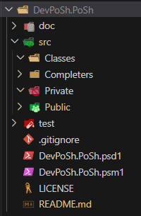
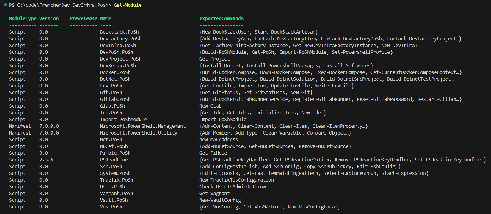

## Table of Contents

- [Introduction](#introduction)
- [Philosophy](#philosophy)
  - [`FrenchExDev.PoSh` Powershell Module anatomy](#frenchexdevposh-powershell-module-anatomy)
    - [`.psm1` anatomy](#psm1-anatomy)
- [Cloning](#cloning)
  - [Via SSH](#via-ssh)
  - [Via HTTPS](#via-https)
- [Installing](#installing)
- [Import Posh Modules](#import-posh-modules)
  - [Force import](#force-import)
  - [Force import specific Acme](#force-import-specific-acme)
  - [Force import specific Acme's Module](#force-import-specific-acmes-module)
- [Cleaning caches](#cleaning-caches)
  - [Cleaning caches for Acme](#cleaning-caches-for-acme)
  - [Cleaning caches for Acme' module](#cleaning-caches-for-acme-module)
- [Compile a Module](#compile-a-module)
- [How do we write Modules](#how-do-we-write-modules)
  - [Common main `Get-*` pattern](#common-main-get--pattern)

# Introduction

A `very opinionated` set of `PowerShell` `cmdlets` to support `PoSh` `module` development.

It is meant to be plugged into a [`FrenchExDev.MyDevInfra.PoSh`](https://gitlab.frenchexdev.lab/FrenchExDev/MyDevInfra.PoSh) instance.

`FrenchExDev.DevPosh.Posh` `Powershell` modules uses a defined setup to work.

They also use a defined `.psm1` which compiles data on first use to faster the loading of profiles.

It also means that while developing, we must be aware of this cache. 

Thus a specific `cmdlet` is available to handle this case.

# Philosophy

It should be easy to start a new module.

In a `very opinionated` world, this is something easy. Start off the shelf, rince, repeat, when you get something good enough, generalize it and template it.

This is why `FrenchExDev.DevPoSh.PoSh`-made `Powershell`' `modules` are all following the very same pattern and use the very same `.psm1` to load module.

## `FrenchExDev.PoSh` Powershell Module anatomy



| Folder                                          | Purpose                                                                           |
|-------------------------------------------------|-----------------------------------------------------------------------------------|
| `doc`                                             | documentation items such as markdown files, images, gifs                        |
| `src`                                             | source folder                                                                   |
| `test`                                            | test folder                                                                     |
| `.psd1`                                           | `Powershell Module Definition` file, declarative                                |
| `.psm1`                                           | `Powershell Module` file, module loader                                         |
| `src/Classes/**.ps1`                              | `Powershell Classes`, these files are dot sourced by `.psm1`                    |
| `src/Completers/**.ps1`                           | `Powershell Completers` registering, these files are dot sourced by `.psm1`     |
| `src/Private/**.ps1`                              | Private `functions`, these files are dot sourced by `.psm1`                     |
| `src/Public/**.ps1`                               | `this Module` public and exported `cmdlets`                                     |

### `.psm1` anatomy

[See source file](https://gitlab.frenchexdev.lab/FrenchExDev/DevPoSh.PoSh/-/blob/main/DevPoSh.PoSh.psm1?ref_type=heads)

# Cloning

_Adapt to your setup and will._

```powershell
$MyDevInfraClonePath = "c:/code/MyAcme.MyDevInfra.PoSh"
```

```powershell
$clonePath = "$MyDevInfraClonePath/PoSh/FrenchExDev/DevPoSh.PoSh"
```

## Via SSH

```powershell
git clone "ssh://git@gitlab.frenchexdev.lab:2222/FrenchExDev/FrenchExDev.PoSh.PoSh.git" $clonePath
```

## Via HTTPS

```powershell
git clone https://gitlab.frenchexdev.lab/FrenchExDev/FrenchExDev.PoSh.PoSh.git $clonePath
```

# Installing 

* In an `Administrator`-privileged `Terminal`, run the following :

```powershell
Import-Module "$clonePath/DevPoSh.PoSh.psm1"
Set-DevPoShPowershellProfile -MyDevInfraClonePath $MyDevInfraClonePath
```

`PoShPowershellProfile` will inject `Powershell` code into your $profile to load your `MyAcme.MyDevInfra.PoSh`' `Powershell`' `modules`

# Import Posh Modules

```powershell
Import-PoShModule
```



## Force import

```powershell
Import-PoShModule -Force
```

## Force import specific Acme

```powershell
Import-PoShModule -Force -Acme FrenchExDev
```

## Force import specific Acme's Module

```powershell
Import-PoShModule -Force -Acme FrenchExDev -Module DevSetup.PoSh
```

# Cleaning caches

```powershell
Clean-PoShModuleCache
```

## Cleaning caches for Acme

```powershell
Clean-PoShModuleCache -Acme FrenchExDev
```

## Cleaning caches for Acme' module

```powershell
Clean-PoShModuleCache -Acme FrenchExDev -Module DevPoSh.PoSh
```

# Compile a Module

```powershell
Set-Location $MyFrenchExDevInfraClonePath
Get-PoSh FrenchExDev DevSetup.PoSh -Action Compile
```

  * _Then_ reload your session


# How do we write Modules

`FrenchExDev`-made `Powershell`' modules are written in such a special way.

We don't make lot of `Cmdlets`, instead we want to control objects in a given sequence of operations.

Thus `Get-*` `cmdlets` in `singular form` are made to control an object.

For example, `FrenchExDev.DevPoSh.PoSh` provides the `Get-PoSh` `cmdlet` which let you execute a controlled sequence of operations on the same object in one single call.

## Common main `Get-*` pattern

Whatever the verb is (it could be `Control-*` instead of `Get-*`), the way the main `cmdlet` is coded follows a pattern which is used widely accross `FrenchExDev.PoSh`-made modules:

We iterate over the given -Action, giving user opportunity to control order of execution of Actions.
Then we switch on the current action to actually execute current operation.

```powershell
# this is the Enum used so we get tab-completion over available Actions for Get-PoSh
enum PoShAction {
    Pwsh
    Command
    Ide
    Compile
}

# we name the cmdlet according to the module
function Get-PoSh {
    [CmdletBinding()]
    param(
        [parameter(Mandatory = $true, Position = 0, ValueFromPipelineByPropertyName = $true)] [string] $Acme,
        [parameter(Mandatory = $true, Position = 1, ValueFromPipelineByPropertyName = $true)] [string] $Name,
        [parameter(Mandatory = $true, Position = 2, ValueFromPipelineByPropertyName = $true)] [PoShAction[]] $Action, # here we declare the -Action parameter as using the `PoShAction` enum array 
        [string] $Command,
        [string] $Ide,
        [string] $Path
    )

    $projectDir = "./PoSh/$Acme/$Name/$Path"

    # we loop over the given -Action in given order
    foreach ($currentAction in $Action) {
      # casting as we cannot cast into switch statement
        [PoShAction] $currentActionEnum = $currentAction
        # switching over enum value
        switch ($currentActionEnum) {
            # case block for ::Pwsh enum value
            ([PoShAction]::Pwsh) {
                # implementation here
                pwsh -Login -WorkingDirectory $projectDir
            }
            # other cases...
        }
    }
}
```
