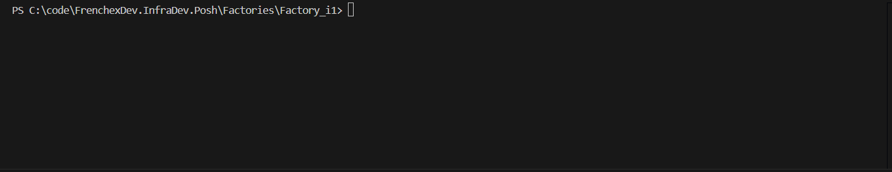

## Table of Contents

- [Introduction](#introduction)
- [Cmdlets](#cmdlets)
  - [Get-VosMachine](#get-vosmachine)
    - [Up](#up)
    - [Ssh](#ssh)
  - [New-Vos](#new-vos)

# Introduction

A `very opinionated` set of `PowerShell` scripts to support `Vos` use.

`Vos` stands for `Vagrant on Steroid`.

It basically wraps and empowers `vagrant` CLI.

# Cmdlets

## Get-VosMachine

### Up


### Ssh



## New-Vos

```powershell

$VagrantPlugins = {
  @{
                "vagrant-hostmanager" = New-VosConfigVagrantPlugin -enable $false -Config {
                    @{
                        enabled                    = $false
                        "hostmanager.enabled"      = $false
                        "hostmanager.manage_host"  = $false
                        "hostmanager.manage_guest" = $false
                    }
                }
                "vagrant-vbguest"     = New-VosConfigVagrantPlugin -Enable $false -Config { 
                    @{
                        enabled                      = $false
                        "vbguest.auto_update"        = $false
                        "vbguest.auto_reboot"        = $false
                        "vbguest.installer_argumens" = @("--no-x11")
                    } 
                }
                "vagrant-env"         = [pscustomobject] @{
                    enabled = $false
                }
  }
}

$VagrantVirtualBoxManage = {
            @{
                cpuexecutioncap    = 100
                nicpromisc1        = "allow-all"
                nicpromisc2        = "allow-all"
                nicpromisc3        = "allow-all"
                natdnsresolver1    = "on"
                natdnsproxy1       = "on"
                ioapic             = "on"
                hwvirtex           = "on"
                hpet               = "on"
                largepages         = "on"
                vtxvpid            = "on"
                vtxux              = "on"
                pae                = "on"
                chpiset            = "ich9"
                bios2apic          = "x2apic"
                vrde               = "off"
                usb                = "off"
                "nested-hw-virt"   = "on"
                nestedpaging       = "on"
                ostype             = "Linux_64"
                vram               = 32
                accelerate3d       = "off"
                graphicscontroller = "vboxsvga"
            }
        }

New-VosConfig -Zeroes 4 `
              -NamingPatternPrefix "fex-dev" `
              -VagrantPlugins $VagrantPlugins `
              -VagrantVirtualBoxManage $VagrantVirtualBoxManage `
              
}
```